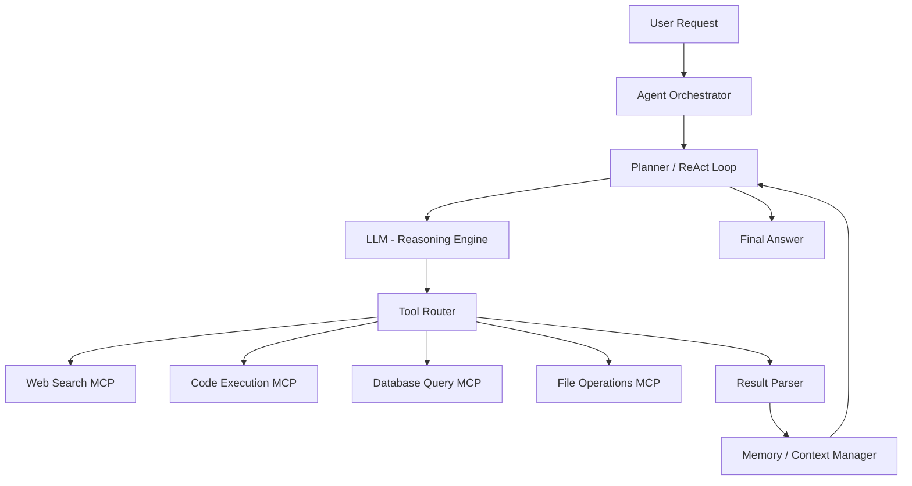

# Design an Agentic AI System (MCP / Tool Use)

## 1. Requirements

### Functional
- LLM-powered agent that can reason, plan, and execute multi-step tasks
- Tool calling: web search, database queries, code execution, API calls
- MCP (Model Context Protocol) for standardized tool integration
- Conversation memory and context management across long sessions

### Non-Functional
- Total task completion within 60 seconds for typical workflows
- Graceful handling of tool failures (retry, fallback)
- Token budget management (stay within context window limits)
- Observability: trace every thought, tool call, and result

### Clarifying Questions
- What tools does the agent have access to? (Read-only or can it write/mutate?)
- Is human-in-the-loop approval needed for certain actions?
- What is the context window budget? (128K tokens? 200K?)

## 2. High-Level Architecture



## 3. Core Algorithm: ReAct Loop

```python
class AgenticOrchestrator:
    def __init__(self, llm, tools, max_steps=10, max_tokens=100000):
        self.llm = llm
        self.tools = {t.name: t for t in tools}
        self.max_steps = max_steps
        self.max_tokens = max_tokens

    def run(self, user_query):
        messages = [
            {"role": "system", "content": self._system_prompt()},
            {"role": "user", "content": user_query}
        ]
        
        for step in range(self.max_steps):
            # Check token budget
            token_count = self._count_tokens(messages)
            if token_count > self.max_tokens * 0.8:
                messages = self._compress_context(messages)

            # LLM decides: think, use a tool, or give final answer
            response = self.llm.chat(messages, tools=self._tool_schemas())

            if response.finish_reason == "tool_calls":
                for tool_call in response.tool_calls:
                    result = self._execute_tool(
                        tool_call.name, tool_call.arguments)
                    messages.append({
                        "role": "tool",
                        "tool_call_id": tool_call.id,
                        "content": self._truncate(result, max_chars=5000)
                    })
            elif response.finish_reason == "stop":
                return response.content  # final answer
            
            messages.append({"role": "assistant", "content": response.content})
        
        return "Reached maximum steps without a final answer."

    def _execute_tool(self, name, args):
        tool = self.tools.get(name)
        if not tool:
            return f"Error: Unknown tool '{name}'"
        try:
            return tool.execute(**args)
        except Exception as e:
            return f"Tool execution failed: {str(e)}"

    def _compress_context(self, messages):
        """Summarize older messages to free up context window."""
        mid = len(messages) // 2
        old_messages = messages[1:mid]  # keep system prompt
        summary = self.llm.chat([
            {"role": "system", "content": "Summarize this conversation concisely."},
            *old_messages
        ]).content
        return [
            messages[0],  # system prompt
            {"role": "assistant", "content": f"[Summary of earlier steps]: {summary}"},
            *messages[mid:]
        ]

    def _truncate(self, text, max_chars=5000):
        if len(text) <= max_chars:
            return text
        return text[:max_chars] + "\n...[truncated]"
```

## 4. MCP Tool Schema Example

```python
class MCPTool:
    """Model Context Protocol tool definition."""
    def __init__(self, name, description, input_schema, execute_fn):
        self.name = name
        self.description = description
        self.input_schema = input_schema
        self.execute = execute_fn

web_search = MCPTool(
    name="web_search",
    description="Search the web for real-time information",
    input_schema={
        "type": "object",
        "properties": {
            "query": {"type": "string", "description": "Search query"}
        },
        "required": ["query"]
    },
    execute_fn=lambda query: search_api.search(query)
)
```

## 5. Design Choices

| Decision | Choice | Why |
|----------|--------|-----|
| Reasoning | ReAct (Reason + Act) loop | LLM alternates between reasoning ("I need to find X") and acting (calling a tool), producing interpretable traces |
| Context management | Sliding window + summarization | Compress older steps into a summary when approaching token limit; keeps recent steps verbatim for accuracy |
| Tool results | Truncate to 5K chars | Large tool outputs (e.g., web pages) blow up the context. Truncate or extract relevant sections |
| Error handling | Retry once, then report error to LLM | Let the LLM reason about the failure and choose an alternative approach |

## 6. Scope for Improvement
- Tree-of-thought: explore multiple reasoning branches in parallel
- Self-reflection: agent reviews its own answer and iterates
- Human-in-the-loop: pause for approval before destructive actions
- Sub-agent delegation: spawn specialized agents for complex sub-tasks

---

## Quiz

import MCQ from '@/components/mcq/MCQ'

<MCQ
  question="What is the ReAct pattern in agentic AI?"
  options={[
    "A JavaScript framework for building AI agents.",
    "A loop where the LLM alternates between Reasoning (thinking about what to do) and Acting (calling tools), using observations from tools to inform the next reasoning step.",
    "A technique to reduce model latency.",
    "A method to train LLMs on tool-use data."
  ]}
  correctAnswerIndex={1}
  explanation="ReAct (Reason + Act) interleaves chain-of-thought reasoning with tool actions. The LLM thinks: 'I need the user's order history' -> calls database tool -> observes results -> reasons: 'The last order was 3 days ago, so...' -> produces final answer. This produces interpretable, auditable traces."
/>

<MCQ
  question="An agent is processing a complex 20-step task and hits the 128K token context window limit at step 12. What should happen?"
  options={[
    "The agent crashes.",
    "The orchestrator summarizes steps 1-6 into a concise paragraph, freeing ~50K tokens, and continues with the summary + steps 7-12 intact.",
    "All previous tool results are deleted.",
    "The agent starts over from scratch."
  ]}
  correctAnswerIndex={1}
  explanation="Context compression via summarization preserves the essential information from earlier steps while freeing token budget for more tool calls. The most recent steps are kept verbatim for accuracy, while older steps are compressed."
/>

<MCQ
  question="What is MCP (Model Context Protocol) and why is it significant?"
  options={[
    "A new model architecture that replaces transformers.",
    "A standardized protocol for connecting LLMs to external tools and data sources, allowing any MCP-compatible tool to work with any MCP-compatible LLM client without custom integration code.",
    "A compression algorithm for model weights.",
    "A protocol for training models in parallel."
  ]}
  correctAnswerIndex={1}
  explanation="MCP standardizes the interface between AI agents and tools (databases, APIs, file systems). Instead of each tool requiring a custom integration, MCP defines a universal schema for tool discovery, invocation, and result handling — analogous to USB for AI tools."
/>
