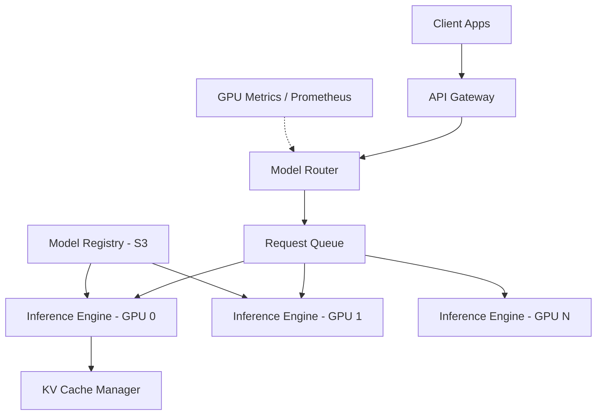

# Design an LLM Serving Platform

## 1. Requirements

### Functional
- Serve multiple LLM models (7B to 70B+ parameters)
- Support chat completions, embeddings, and function-calling APIs
- Streaming token-by-token responses (Server-Sent Events)
- Model versioning and A/B testing

### Non-Functional
- p50 Time-to-First-Token (TTFT) < 500ms
- Throughput: 1000+ concurrent requests
- GPU utilization > 80%
- Graceful degradation under load (queue, don't drop)

### Clarifying Questions
- What models and sizes? (7B fits on 1 GPU, 70B requires tensor parallelism across 4-8 GPUs)
- Latency SLA for streaming vs batch?
- Do we need fine-tuned model hosting or only foundation models?

## 2. High-Level Architecture



## 3. Data Model

```sql
CREATE TABLE models (
    model_id    UUID PRIMARY KEY,
    name        VARCHAR(128) NOT NULL,
    version     INT DEFAULT 1,
    size_params BIGINT,            -- e.g., 7000000000 for 7B
    gpu_count   INT DEFAULT 1,     -- GPUs needed for tensor parallelism
    status      VARCHAR(20) DEFAULT 'active',
    s3_path     TEXT NOT NULL
);

CREATE TABLE inference_requests (
    request_id  UUID PRIMARY KEY,
    model_id    UUID REFERENCES models(model_id),
    prompt_tokens   INT,
    output_tokens   INT,
    ttft_ms     INT,               -- time to first token
    total_ms    INT,
    status      VARCHAR(20) DEFAULT 'queued',
    created_at  TIMESTAMP DEFAULT NOW()
);
```

## 4. Core Algorithm: Continuous Batching

```python
class ContinuousBatcher:
    """Instead of waiting for a full batch, dynamically add/remove
    requests from the GPU batch as they arrive/complete."""

    def __init__(self, max_batch_size=32, max_seq_len=4096):
        self.active_requests = {}   # req_id -> RequestState
        self.max_batch = max_batch_size
        self.max_seq_len = max_seq_len

    def add_request(self, req_id, prompt_tokens):
        if len(self.active_requests) >= self.max_batch:
            return False  # queue externally
        self.active_requests[req_id] = RequestState(
            prompt_tokens=prompt_tokens,
            generated_tokens=[],
            kv_cache_slot=self._allocate_kv_slot()
        )
        return True

    def step(self):
        """Run one forward pass for ALL active requests simultaneously."""
        batch_input = self._prepare_batch()
        # Single GPU forward pass produces one token per request
        next_tokens = self.model.forward(batch_input)

        completed = []
        for req_id, token in zip(self.active_requests, next_tokens):
            state = self.active_requests[req_id]
            state.generated_tokens.append(token)
            if token == EOS or len(state.generated_tokens) >= self.max_seq_len:
                completed.append(req_id)
                self._free_kv_slot(state.kv_cache_slot)

        for req_id in completed:
            del self.active_requests[req_id]
        return completed

    def _allocate_kv_slot(self):
        # PagedAttention: allocate non-contiguous memory blocks
        return self.kv_pool.allocate()
```

## 5. Design Choices

| Decision | Choice | Why |
|----------|--------|-----|
| Batching | Continuous (iteration-level) batching | Static batching wastes GPU cycles waiting for the slowest request. Continuous batching lets new requests join mid-generation, improving throughput by 2-5x |
| KV Cache | PagedAttention (vLLM) | Traditional KV cache pre-allocates contiguous memory per request, wasting ~60% of GPU memory. PagedAttention uses virtual memory paging — allocate small blocks on demand |
| Model parallelism | Tensor parallelism across GPUs | A 70B model is ~140GB in FP16. One A100 has 80GB. Split weight matrices across 2+ GPUs; each GPU computes a portion of every layer |
| Quantization | INT8 / INT4 (GPTQ, AWQ) | Reduces memory by 2-4x with < 1% quality loss, allowing larger models on fewer GPUs |

## 6. Scope for Improvement
- Speculative decoding (draft model generates candidate tokens, large model verifies in batch)
- Prefix caching (share KV cache across requests with the same system prompt)
- Multi-LoRA serving (load multiple fine-tuned adapters on the same base model)

---

## Quiz

import MCQ from '@/components/mcq/MCQ'

<MCQ
  question="Why does continuous batching improve GPU throughput compared to static batching?"
  options={[
    "It uses more GPUs.",
    "In static batching, the GPU idles after short requests finish while waiting for the longest request. Continuous batching fills those slots with new requests immediately, keeping GPU utilization near 100%.",
    "It reduces model size.",
    "It sends fewer tokens to the model."
  ]}
  correctAnswerIndex={1}
  explanation="Static batching groups N requests and waits for ALL to finish. If one generates 10 tokens and another generates 500, the GPU is idle for the short request's slot during 490 iterations. Continuous batching evicts completed requests and admits waiting ones every iteration."
/>

<MCQ
  question="A 70B parameter model in FP16 requires approximately how much GPU memory just for the weights?"
  options={[
    "7GB",
    "35GB",
    "140GB",
    "700GB"
  ]}
  correctAnswerIndex={2}
  explanation="Each parameter in FP16 (float16) uses 2 bytes. 70 billion * 2 bytes = 140 GB. This is why 70B models require tensor parallelism across at least 2 A100-80GB GPUs."
/>

<MCQ
  question="What is PagedAttention and what problem does it solve?"
  options={[
    "A new attention mechanism that replaces transformers.",
    "A memory management technique that allocates KV cache in small, non-contiguous blocks (like OS virtual memory pages), eliminating the ~60% memory waste from pre-allocated contiguous buffers.",
    "A method to page model weights in and out of GPU memory.",
    "A technique to split attention heads across multiple GPUs."
  ]}
  correctAnswerIndex={1}
  explanation="Traditional KV cache allocates the maximum possible sequence length for each request upfront. Most requests use far less, wasting memory. PagedAttention allocates small blocks on-demand and can even share blocks across requests with common prefixes."
/>
