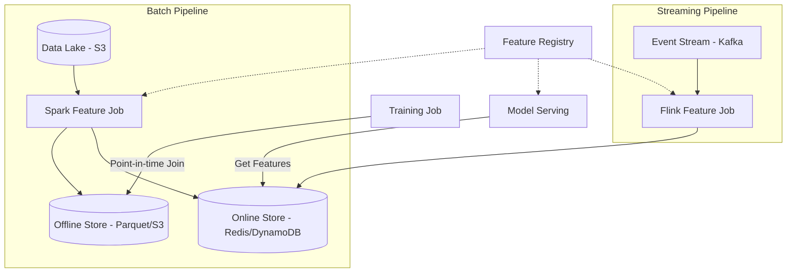

# Design a Feature Store for ML

## 1. Requirements

### Functional
- **Online store**: serve features at low latency (< 10ms) for real-time model inference
- **Offline store**: compute and store features in batch for model training
- **Feature registry**: catalog of all features with metadata, lineage, and ownership
- **Point-in-time correct joins**: for training data, join features as they existed at prediction time (avoid data leakage)

### Non-Functional
- Online store: p99 latency < 5ms
- Offline store: process terabytes of historical data
- Feature freshness: online features updated within minutes of source data change

### Clarifying Questions
- How many features? (100s to 10,000s?)
- What is the entity key? (user_id, item_id, session_id?)
- Are streaming (real-time) features needed or only batch?

## 2. High-Level Architecture



## 3. Data Model

```sql
-- Feature Registry (metadata catalog)
CREATE TABLE feature_definitions (
    feature_name    VARCHAR(128) PRIMARY KEY,
    entity_key      VARCHAR(64) NOT NULL,     -- e.g., 'user_id', 'item_id'
    value_type      VARCHAR(20) NOT NULL,     -- float, int, string, embedding
    description     TEXT,
    owner           VARCHAR(64),
    source_table    VARCHAR(255),
    freshness_sla   INTERVAL DEFAULT '1 hour',
    created_at      TIMESTAMP DEFAULT NOW()
);

-- Online Store (Redis schema - conceptual)
-- Key:   feature_store:{entity_key}:{entity_value}
-- Value: Hash { feature_name -> feature_value, ..., _ts -> timestamp }

-- Offline Store (Parquet schema)
-- Columns: entity_key, event_timestamp, feature_1, feature_2, ..., feature_N
-- Partitioned by: date, entity_key_prefix
```

## 4. Core Implementation

```python
class FeatureStore:
    def __init__(self, redis_client, s3_client, registry_db):
        self.online = redis_client
        self.offline = s3_client
        self.registry = registry_db

    # --- Online Serving (real-time inference) ---
    def get_online_features(self, entity_key, entity_value, features):
        """Retrieve features for a single entity at serving time."""
        key = f"feature_store:{entity_key}:{entity_value}"
        result = self.online.hmget(key, *features)
        return dict(zip(features, result))

    def set_online_features(self, entity_key, entity_value, feature_values):
        """Write features to online store (called by batch/stream jobs)."""
        import time
        key = f"feature_store:{entity_key}:{entity_value}"
        feature_values["_ts"] = str(time.time())
        self.online.hset(key, mapping=feature_values)

    # --- Offline Training (batch) ---
    def get_training_data(self, entity_key, features,
                          start_date, end_date):
        """Point-in-time correct join for training data."""
        # Read entity events with timestamps
        events = self._read_events(entity_key, start_date, end_date)
        # For each event, join features as they existed AT that time
        training_rows = []
        for event in events:
            row = {"entity": event["entity_value"],
                   "timestamp": event["timestamp"],
                   "label": event["label"]}
            for feat in features:
                row[feat] = self._pit_lookup(
                    feat, event["entity_value"], event["timestamp"])
            training_rows.append(row)
        return training_rows

    def _pit_lookup(self, feature_name, entity_value, as_of_timestamp):
        """Point-in-time lookup: feature value as it existed at as_of_timestamp."""
        # Query offline store for the latest feature value <= as_of_timestamp
        return self.offline.query(
            f"SELECT value FROM {feature_name} "
            f"WHERE entity = '{entity_value}' "
            f"AND event_timestamp <= '{as_of_timestamp}' "
            f"ORDER BY event_timestamp DESC LIMIT 1"
        )


class FeatureComputeJob:
    """Example batch feature computation."""
    def compute_user_features(self, spark, date):
        orders = spark.read.parquet(f"s3://data/orders/date={date}")
        features = orders.groupBy("user_id").agg(
            count("order_id").alias("order_count_30d"),
            avg("order_total").alias("avg_order_value_30d"),
            max("order_date").alias("last_order_date")
        )
        # Write to offline store (Parquet)
        features.write.parquet(f"s3://features/user/{date}")
        # Sync to online store (Redis)
        for row in features.collect():
            store.set_online_features("user_id", row["user_id"], {
                "order_count_30d": row["order_count_30d"],
                "avg_order_value_30d": row["avg_order_value_30d"]
            })
```

## 5. Design Choices

| Decision | Choice | Why |
|----------|--------|-----|
| Online store | Redis (Hash per entity) | O(1) HMGET for any subset of features; sub-millisecond latency |
| Offline store | Parquet on S3 | Columnar format = fast analytical queries; cheap, durable storage |
| Compute | Spark (batch) + Flink (streaming) | Spark for daily/hourly feature recomputation; Flink for real-time features from event streams |
| Point-in-time | Temporal join on event_timestamp | Prevents data leakage: training data only uses features that were available at prediction time |

## 6. Scope for Improvement
- Feature monitoring: detect distribution drift between training and serving
- Feature versioning: A/B test new feature definitions
- On-demand features: compute features at request time for cold-start entities

---

## Quiz

import MCQ from '@/components/mcq/MCQ'

<MCQ
  question="What is 'data leakage' in the context of a feature store, and how does point-in-time join prevent it?"
  options={[
    "Data leakage means unauthorized access to the database.",
    "Data leakage occurs when training data includes feature values from the future (after the prediction timestamp), making the model appear more accurate than it actually is in production. Point-in-time join only uses feature values that existed at or before the event timestamp.",
    "Data leakage is when features are missing from the online store.",
    "Data leakage means the model weights are exposed."
  ]}
  correctAnswerIndex={1}
  explanation="If you train a fraud detection model and accidentally include 'account_closed=True' (which happens AFTER the fraud), the model learns to cheat. Point-in-time join ensures each training example only sees features available at the moment of prediction."
/>

<MCQ
  question="Why use Redis Hashes (HSET/HMGET) for the online feature store rather than individual keys per feature?"
  options={[
    "Redis Hashes are slower but more reliable.",
    "A Hash groups all features for one entity under a single key. HMGET retrieves any subset of features in a single O(N) network round trip, rather than N separate GET calls.",
    "Redis doesn't support individual keys.",
    "Hashes use more memory than individual keys."
  ]}
  correctAnswerIndex={1}
  explanation="A model might need 50 features for one user. With individual keys, that's 50 network round trips. With a Hash, it's 1 HMGET call that returns all 50 values. The memory overhead is also lower because Redis amortizes the per-key metadata."
/>

<MCQ
  question="A streaming feature (e.g., 'clicks in last 5 minutes') is computed by Flink and written to Redis. How does Flink handle late-arriving events?"
  options={[
    "Late events are dropped.",
    "Flink uses event-time processing with watermarks. Events arriving after the watermark trigger late-event handling (e.g., update the window result and re-emit the corrected feature value).",
    "Flink stores all events forever.",
    "Late events are sent to a separate database."
  ]}
  correctAnswerIndex={1}
  explanation="Flink's event-time semantics use watermarks to track progress. When a late event arrives (timestamp before the watermark), Flink can be configured to update the affected window and emit a corrected result, ensuring the online feature store reflects accurate aggregations."
/>
