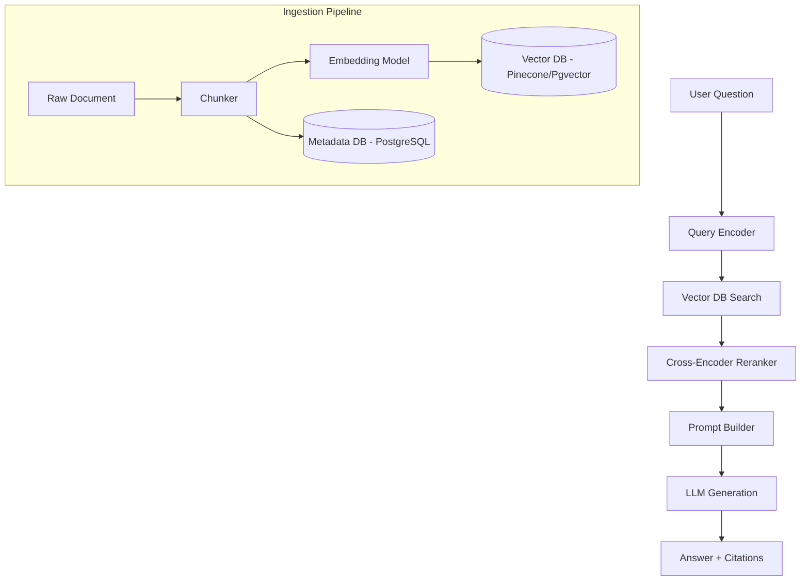

# Design a RAG Pipeline

## 1. Requirements

### Functional
- Ingest documents (PDFs, web pages, Slack messages) into a searchable knowledge base
- Given a user question, retrieve relevant context and generate an answer using an LLM
- Support citations (link back to source documents)
- Handle document updates and deletions

### Non-Functional
- End-to-end latency < 3 seconds (retrieval + generation)
- Support 10M+ document chunks
- Relevance: retrieved chunks must be topically related to the query

### Clarifying Questions
- What document formats? (PDF, HTML, Markdown?)
- Is real-time ingestion required or batch-only?
- What LLM? (Hosted API like GPT-4 vs self-hosted?)

## 2. High-Level Architecture



## 3. Data Model

```sql
CREATE TABLE documents (
    doc_id      UUID PRIMARY KEY,
    source_url  TEXT,
    title       TEXT,
    doc_type    VARCHAR(20),    -- pdf, html, markdown
    ingested_at TIMESTAMP DEFAULT NOW(),
    updated_at  TIMESTAMP
);

CREATE TABLE chunks (
    chunk_id    UUID PRIMARY KEY,
    doc_id      UUID REFERENCES documents(doc_id) ON DELETE CASCADE,
    chunk_index INT,
    content     TEXT NOT NULL,
    token_count INT,
    embedding   VECTOR(1536),   -- pgvector column for OpenAI ada-002
    metadata    JSONB           -- page_number, section_title, etc.
);

CREATE INDEX idx_chunks_embedding ON chunks
    USING ivfflat (embedding vector_cosine_ops) WITH (lists = 100);
```

## 4. Core Algorithm: Chunking and Retrieval

```python
import tiktoken

class RAGPipeline:
    def __init__(self, embed_model, vector_db, llm, reranker):
        self.embed = embed_model
        self.vdb = vector_db
        self.llm = llm
        self.reranker = reranker
        self.tokenizer = tiktoken.get_encoding("cl100k_base")

    def ingest(self, doc_id, text, chunk_size=512, overlap=64):
        tokens = self.tokenizer.encode(text)
        chunks = []
        start = 0
        while start < len(tokens):
            end = min(start + chunk_size, len(tokens))
            chunk_text = self.tokenizer.decode(tokens[start:end])
            embedding = self.embed.encode(chunk_text)
            self.vdb.upsert(
                id=f"{doc_id}:{len(chunks)}",
                vector=embedding,
                metadata={"doc_id": doc_id, "text": chunk_text}
            )
            chunks.append(chunk_text)
            start += chunk_size - overlap
        return len(chunks)

    def query(self, question, top_k=10, rerank_top_k=3):
        q_embedding = self.embed.encode(question)

        # Stage 1: ANN search (fast, approximate)
        candidates = self.vdb.search(q_embedding, top_k=top_k)

        # Stage 2: Rerank with cross-encoder (slow, accurate)
        scored = self.reranker.score(
            question, [c["text"] for c in candidates])
        top_chunks = sorted(
            zip(candidates, scored), key=lambda x: -x[1]
        )[:rerank_top_k]

        # Stage 3: Generate answer with context
        context = "\n\n".join(c["text"] for c, _ in top_chunks)
        prompt = (
            f"Answer based on the context below.\n\n"
            f"Context:\n{context}\n\n"
            f"Question: {question}\nAnswer:"
        )
        answer = self.llm.generate(prompt)
        citations = [c["doc_id"] for c, _ in top_chunks]
        return {"answer": answer, "citations": citations}
```

## 5. Design Choices

| Decision | Choice | Why |
|----------|--------|-----|
| Chunk size | 512 tokens with 64-token overlap | Too small = fragments lose context. Too large = dilutes relevance signal. Overlap prevents splitting a key sentence across chunks |
| Embedding model | OpenAI text-embedding-3-small (1536d) | Good quality-to-cost ratio; Matryoshka embeddings allow dimension reduction |
| Vector index | IVF (Inverted File) with pgvector | Sub-linear search; recall > 95% with 100 clusters on 10M chunks |
| Reranking | Cross-encoder (e.g., ColBERT, bge-reranker) | Bi-encoder embedding search is fast but imprecise. Cross-encoder scores query-document pairs jointly, dramatically improving relevance |

## 6. Scope for Improvement
- Hybrid search: combine vector similarity with BM25 keyword match (reciprocal rank fusion)
- Query decomposition: break complex questions into sub-queries
- Contextual chunking: use an LLM to summarize each chunk with its section context

---

## Quiz

import MCQ from '@/components/mcq/MCQ'

<MCQ
  question="Why is a reranker used after the initial vector search, rather than relying solely on embedding similarity?"
  options={[
    "Rerankers are faster than vector search.",
    "Bi-encoder embeddings encode query and document independently, missing fine-grained interactions. A cross-encoder reranker jointly processes the query-document pair, capturing token-level relevance that embeddings miss.",
    "Rerankers reduce the number of API calls to the LLM.",
    "Vector search doesn't return any results."
  ]}
  correctAnswerIndex={1}
  explanation="Bi-encoder search is a fast approximation — it compresses entire documents into a single vector. A cross-encoder sees both the query and document tokens together, allowing it to model word-level interactions (e.g., 'not relevant' vs 'relevant'). This dramatically improves precision on the top-K results."
/>

<MCQ
  question="You set chunk_size=512 with overlap=64. A 10,000-token document will produce approximately how many chunks?"
  options={[
    "20 chunks",
    "23 chunks (10000 / (512 - 64) = 22.3, rounded up)",
    "10 chunks",
    "50 chunks"
  ]}
  correctAnswerIndex={1}
  explanation="With overlap, the step size is chunk_size - overlap = 448 tokens. 10000 / 448 = 22.3, so approximately 23 chunks. The overlap ensures no sentence is split without context on both sides."
/>

<MCQ
  question="What is the 'Lost in the Middle' problem in RAG?"
  options={[
    "Documents in the middle of the database are harder to find.",
    "LLMs tend to pay most attention to the beginning and end of the context window, often ignoring information placed in the middle of a long prompt.",
    "The middle chunk of a document is always the most relevant.",
    "Vector databases lose accuracy for the median results."
  ]}
  correctAnswerIndex={1}
  explanation="Research shows LLMs exhibit a U-shaped attention pattern — they attend strongly to the first and last parts of the context but poorly to the middle. This means placing the most relevant chunk in the middle of 10 retrieved chunks can cause the LLM to ignore it. Mitigation: use fewer, higher-quality chunks or place the best chunk at the start."
/>
