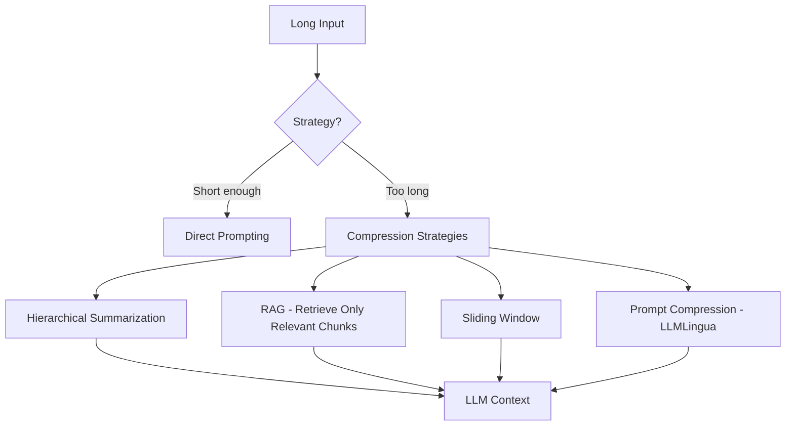

# Token & Context Window Optimization

## 1. The Problem

Modern LLMs have finite context windows (4K to 200K tokens). Every token in the context window costs money and increases latency. The challenge: fit the most relevant information into the smallest number of tokens.

### Why It Matters
- **Cost**: GPT-4 charges ~$30 per million input tokens. A 100K-token prompt costs $3 per request.
- **Latency**: TTFT (Time to First Token) scales linearly with prompt length. 100K tokens = ~5 seconds TTFT.
- **Quality**: LLMs attend poorly to the "middle" of long contexts (Lost-in-the-Middle problem).

## 2. Techniques Overview



## 3. Core Techniques with Code

### A. Token Counting and Budget Management

```python
import tiktoken

class TokenBudget:
    def __init__(self, model="gpt-4", max_context=128000):
        self.enc = tiktoken.encoding_for_model(model)
        self.max_context = max_context
        self.reserved_output = 4096  # reserve for generation

    def available(self):
        return self.max_context - self.reserved_output

    def count(self, text):
        return len(self.enc.encode(text))

    def fits(self, system_prompt, user_msg, context_chunks):
        total = (self.count(system_prompt) +
                 self.count(user_msg) +
                 sum(self.count(c) for c in context_chunks))
        return total <= self.available()

    def trim_to_budget(self, chunks, system_prompt, user_msg):
        budget = (self.available() -
                  self.count(system_prompt) -
                  self.count(user_msg))
        selected = []
        used = 0
        for chunk in chunks:
            chunk_tokens = self.count(chunk)
            if used + chunk_tokens > budget:
                break
            selected.append(chunk)
            used += chunk_tokens
        return selected
```

### B. Hierarchical Summarization (Map-Reduce)

```python
class MapReduceSummarizer:
    def __init__(self, llm, chunk_size=3000):
        self.llm = llm
        self.chunk_size = chunk_size

    def summarize(self, long_text):
        # MAP: summarize each chunk independently
        chunks = self._split(long_text, self.chunk_size)
        summaries = [
            self.llm.generate(
                f"Summarize this concisely:\n{chunk}")
            for chunk in chunks
        ]

        # REDUCE: combine summaries into a final summary
        combined = "\n\n".join(summaries)
        if self._token_count(combined) > self.chunk_size:
            return self.summarize(combined)  # recursive
        return self.llm.generate(
            f"Create a final comprehensive summary:\n{combined}")
```

### C. Sliding Window for Conversations

```python
class SlidingWindowMemory:
    def __init__(self, max_tokens=8000):
        self.messages = []
        self.max_tokens = max_tokens

    def add(self, message):
        self.messages.append(message)
        self._evict()

    def get_context(self):
        return self.messages

    def _evict(self):
        while self._total_tokens() > self.max_tokens and len(self.messages) > 2:
            # Remove oldest non-system message
            for i, msg in enumerate(self.messages):
                if msg["role"] != "system":
                    self.messages.pop(i)
                    break
```

## 4. Design Choices

| Decision | Choice | Why |
|----------|--------|-----|
| RAG vs Stuffing | RAG for large knowledge bases, stuffing for small docs | RAG retrieves only the 3-5 most relevant chunks; stuffing sends everything but only works for < 10K tokens |
| Summarization | Map-Reduce for documents > 10 pages | Processes chunks in parallel (map) then combines (reduce); handles arbitrarily long documents |
| Conversation | Sliding window + summary of evicted messages | Recent messages stay verbatim; old messages are summarized and prepended as context |
| Prompt compression | LLMLingua-style token pruning | Remove low-information tokens (articles, filler words) from the prompt, preserving meaning in ~50% fewer tokens |

## 5. When to Use Each Strategy

| Scenario | Strategy | Token Reduction |
|----------|----------|-----------------|
| Chat with 200+ messages | Sliding window + periodic summary | ~90% |
| Analyze a 100-page PDF | RAG (retrieve top 5 chunks only) | ~95% |
| Summarize a long article | Map-Reduce summarization | ~80% |
| System prompt optimization | Prompt compression / rewriting | ~30-50% |
| Real-time agent with tools | Truncate tool outputs + summarize old steps | ~70% |

---

## Quiz

import MCQ from '@/components/mcq/MCQ'

<MCQ
  question="An LLM processes a 50,000-token prompt. Compared to a 5,000-token prompt, roughly how much more does it cost and how much slower is TTFT?"
  options={[
    "Same cost and speed.",
    "10x the cost and approximately 10x slower TTFT, because both scale linearly with input token count.",
    "2x the cost and same speed.",
    "10x the cost but same speed."
  ]}
  correctAnswerIndex={1}
  explanation="LLM inference cost is proportional to input tokens (charged per token). TTFT is dominated by the prefill phase, which processes all input tokens in parallel on the GPU — more tokens = more compute = longer TTFT. Both scale roughly linearly."
/>

<MCQ
  question="You need an AI assistant to answer questions about a 500-page technical manual. Which approach is most appropriate?"
  options={[
    "Stuff the entire 500-page manual into every prompt.",
    "Fine-tune the LLM on the manual.",
    "Use RAG: chunk the manual, embed chunks into a vector DB, and retrieve only the 3-5 most relevant chunks per question.",
    "Summarize the entire manual into 1 page and use that."
  ]}
  correctAnswerIndex={2}
  explanation="500 pages = ~250K tokens, exceeding most context windows and costing ~$7.50 per query. RAG retrieves only the relevant sections (~2K tokens), reducing cost by 99% and improving accuracy by avoiding the Lost-in-the-Middle problem. Fine-tuning teaches style, not facts."
/>

<MCQ
  question="What is the 'Map-Reduce' summarization pattern?"
  options={[
    "A Hadoop data processing framework.",
    "Split a long document into chunks, summarize each chunk independently (map), then combine the summaries into a final summary (reduce). This handles documents of any length.",
    "A technique to distribute LLM inference across multiple GPUs.",
    "A method to compress model weights."
  ]}
  correctAnswerIndex={1}
  explanation="Map-Reduce summarization parallels the MapReduce programming model. Each chunk is summarized independently (parallelizable), then summaries are combined. If the combined summaries are still too long, the process recurses until the result fits the desired token budget."
/>
