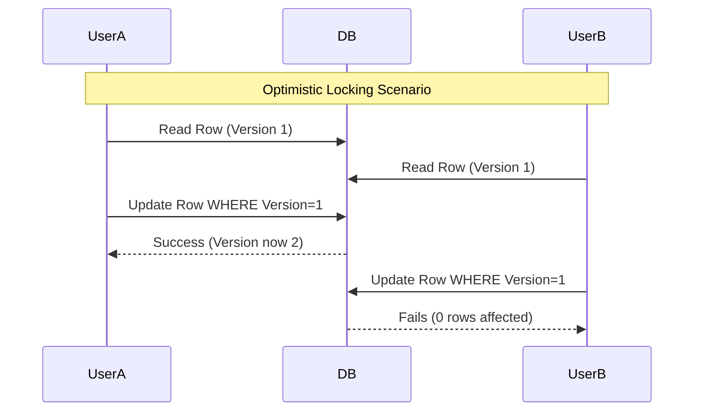

# Locking Mechanisms: Optimistic vs Pessimistic

When multiple users or processes try to access and modify the same data concurrently, we need locking mechanisms to maintain data integrity and prevent race conditions.

## Pessimistic Locking

Pessimistic locking assumes that conflicts *will* happen. It locks the record for your exclusive use until you have finished with it.

- **How it works:** When User A reads a record with the intent to update it, the database places a lock on that row. If User B tries to read/update that same row, they are blocked and must wait until User A commits their transaction.
- **Use case:** High-contention environments where collisions are frequent (e.g., booking the last seat on a flight).
- **Pros:** Guarantees data consistency.
- **Cons:** Can cause severe performance bottlenecks and deadlocks.

## Optimistic Locking

Optimistic locking assumes that conflicts are *rare*. It doesn't lock the data when reading it. Instead, it checks if the data has been modified by someone else before committing the update.

- **How it works:** Usually implemented using a `version` column. 
  1. User A reads a record (version = 1).
  2. User B reads the same record (version = 1).
  3. User A updates the record and increments the version (version = 2).
  4. User B tries to update the record, but the database sees the version is now 2 (not the 1 that User B originally read). The update fails, and User B must retry.
- **Use case:** Low-contention environments (e.g., editing a wiki page).
- **Pros:** High performance, no deadlocks.
- **Cons:** Application logic must handle retries when updates fail.

import MCQ from '@/components/mcq/MCQ'

<MCQ 
  question="Which locking strategy is generally preferred for a system where data collisions are expected to be very rare, in order to maximize read/write throughput?"
  options={[
    "Pessimistic Locking",
    "Optimistic Locking",
    "Table-level Locking",
    "Two-Phase Commit"
  ]}
  correctAnswerIndex={1}
  explanation="Optimistic locking is preferred when collisions are rare. It avoids the overhead of managing database locks, thereby increasing throughput, and only pays the penalty of rolling back/retrying when a collision actually occurs."
/>

<MCQ
  question="Two users simultaneously try to book the last available seat on a flight. Which locking strategy should be used?"
  options={[
    "Optimistic Locking — let both read and retry on conflict.",
    "Pessimistic Locking — lock the seat row when the first user starts the booking process so the second user must wait.",
    "No locking — first write wins.",
    "Distributed lock with a 24-hour timeout."
  ]}
  correctAnswerIndex={1}
  explanation="For the last seat on a flight, conflict is virtually guaranteed. Pessimistic locking ensures exactly one user can proceed with the booking while the other waits or is told the seat is taken. Optimistic locking would cause unnecessary retry loops here."
/>

<MCQ
  question="What is a deadlock, and how can it occur with pessimistic locking?"
  options={[
    "A deadlock is when a process runs forever. It cannot happen with databases.",
    "Transaction A locks Row 1 and waits for Row 2. Transaction B locks Row 2 and waits for Row 1. Neither can proceed.",
    "A deadlock is when too many reads happen simultaneously.",
    "A deadlock only occurs with optimistic locking."
  ]}
  correctAnswerIndex={1}
  explanation="Deadlock occurs when two or more transactions form a circular wait for resources held by each other. Databases detect deadlocks via wait-for graphs and resolve them by aborting one transaction."
/>
