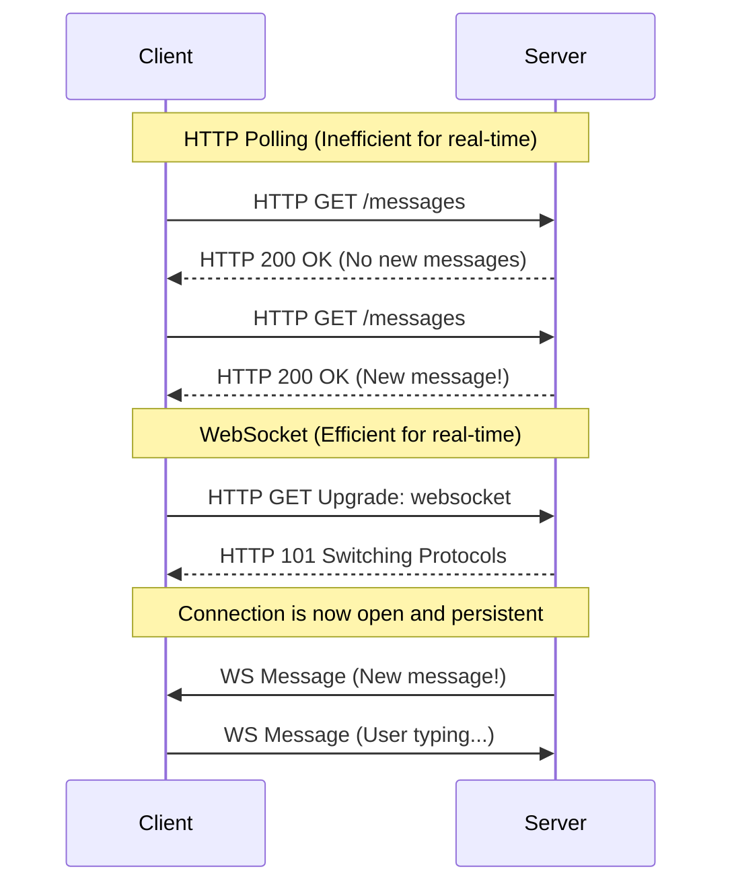

# WebSockets and HTTP Servers

Understanding the communication protocols between clients and servers is fundamental to system design.

## HTTP (Hypertext Transfer Protocol)

HTTP is a **stateless, request-response** protocol. 
1. The client opens a connection.
2. The client sends a request.
3. The server processes the request and sends a response.
4. The connection is closed (though HTTP/1.1 introduced keep-alive to reuse connections for multiple requests).

**When to use HTTP:**
- Fetching static assets (HTML, CSS, JS, Images).
- Standard RESTful API calls where the client initiates the action (e.g., submitting a form, fetching a user profile).

## WebSockets

WebSockets provide a **stateful, full-duplex, persistent** connection over a single TCP connection.
1. The client sends a standard HTTP request asking to "upgrade" the connection to a WebSocket.
2. If the server agrees, the connection remains open.
3. Both the client and the server can send messages to each other independently at any time.

**When to use WebSockets:**
- Real-time chat applications (WhatsApp, Slack).
- Live sports commentary or stock tickers.
- Collaborative editing tools (Google Docs).
- Multiplayer online games.

import MCQ from '@/components/mcq/MCQ'

<MCQ 
  question="Which of the following scenarios is the LEAST appropriate use case for WebSockets?"
  options={[
    "A live collaborative whiteboard application.",
    "A real-time multiplayer game.",
    "Fetching the daily weather forecast once every morning.",
    "A live cryptocurrency trading dashboard."
  ]}
  correctAnswerIndex={2}
  explanation="Fetching weather data once a day is a perfect use case for a standard, stateless HTTP GET request. WebSockets are designed for continuous, high-frequency, bi-directional data flow and keeping a connection open all day for a single daily update is a waste of server resources."
/>

<MCQ
  question="What is Server-Sent Events (SSE), and when would you choose it over WebSockets?"
  options={[
    "SSE is a binary protocol for file transfers.",
    "SSE is a uni-directional protocol (server to client only) over HTTP. Choose it when the client only needs to receive updates (e.g., live news feed) without sending data back.",
    "SSE is identical to WebSockets but faster.",
    "SSE requires a dedicated TCP port different from HTTP."
  ]}
  correctAnswerIndex={1}
  explanation="SSE provides a simple, HTTP-based, uni-directional stream from server to client. It's lighter than WebSockets for use cases where the client only receives data (dashboards, live feeds). It also auto-reconnects and works through HTTP proxies more easily."
/>

<MCQ
  question="Long Polling is a technique where the client makes an HTTP request and the server holds it open until new data is available. What is the main disadvantage compared to WebSockets?"
  options={[
    "Long polling cannot transmit JSON data.",
    "Each response requires a new HTTP connection with full headers, wasting bandwidth. Also, the server must hold many open connections consuming resources.",
    "Long polling only works on localhost.",
    "Long polling is not supported by modern browsers."
  ]}
  correctAnswerIndex={1}
  explanation="Long polling creates a new HTTP request for every message, each with full headers. WebSockets maintain a single persistent connection with minimal framing overhead, making them far more efficient for high-frequency data."
/>
