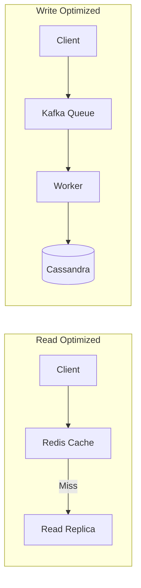

# Read Optimized vs Write Optimized Systems

When designing a system, understanding the ratio of reads to writes is crucial for choosing the right architecture and database.

## Read-Optimized Systems

These systems handle significantly more read requests than write requests (e.g., Twitter timeline, Instagram feed, news websites).

**Strategies:**
1.  **Caching:** Aggressive use of Redis/Memcached to serve data from memory.
2.  **Read Replicas:** Multiple database replicas that only serve read queries.
3.  **Denormalization:** Storing redundant data to avoid complex JOINs during reads.
4.  **Pre-computation:** Computing feeds/timelines in advance and storing them (Fan-out on write).

## Write-Optimized Systems

These systems handle a massive volume of incoming data (e.g., IoT sensor data, logging systems, chat applications).

**Strategies:**
1.  **LSM Trees:** Databases like Cassandra or RocksDB use Log-Structured Merge-trees, which turn random writes into sequential writes.
2.  **Message Queues:** Using Kafka or RabbitMQ to buffer incoming writes and process them asynchronously.
3.  **Batching:** Grouping multiple writes together before committing them to the database.

---

## Quiz

import MCQ from '@/components/mcq/MCQ'

<MCQ 
  question="Which database storage engine structure is typically best suited for a highly write-optimized system?"
  options={[
    "B-Tree",
    "LSM Tree (Log-Structured Merge-tree)",
    "Hash Table",
    "Linked List"
  ]}
  correctAnswerIndex={1}
  explanation="LSM Trees are highly optimized for write-heavy workloads because they buffer writes in memory and flush them sequentially to disk, avoiding the expensive disk seeks required by B-Trees during random writes."
/>

<MCQ
  question="Twitter's home timeline is a read-heavy feature (users check their feed constantly). Twitter chose 'Fan-out on write' — pre-computing each user's timeline when a tweet is posted. What is the main trade-off?"
  options={[
    "Writes become slower and more expensive because each tweet must be written to all followers' timelines.",
    "Reads become slower because the timeline must be assembled from multiple sources.",
    "It increases memory usage on the client device.",
    "It requires the user to manually refresh the page."
  ]}
  correctAnswerIndex={0}
  explanation="Fan-out on write trades write-time cost for read-time speed. When a user with 10M followers posts a tweet, it must be fanned out to 10M timelines, which is very expensive. Twitter actually uses a hybrid approach — fan-out on write for most users, but fan-out on read for celebrities."
/>

<MCQ
  question="An IoT platform receives 500,000 sensor readings per second. Which combination of strategies would be most effective?"
  options={[
    "B-Tree database + Read replicas",
    "Message Queue (Kafka) + LSM Tree database (Cassandra) + Batching",
    "Single MySQL instance + Strong consistency",
    "Redis cache + CDN"
  ]}
  correctAnswerIndex={1}
  explanation="For extreme write throughput: Kafka buffers the writes and handles spikes, Cassandra's LSM tree engine handles massive sequential writes, and batching amortizes the per-write overhead."
/>
