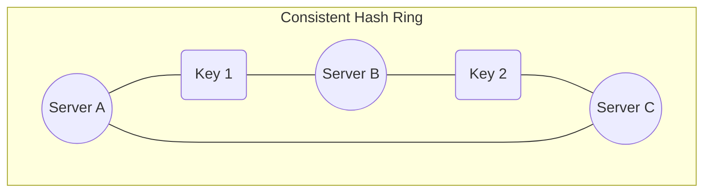

# Sharding vs Consistent Hashing

As databases grow beyond the capacity of a single machine, we must distribute the data across multiple machines.

## Sharding (Partitioning)

Sharding is the process of breaking up large tables into smaller chunks called shards that are spread across multiple servers.

**Sharding Strategies:**
1.  **Range Based:** E.g., Users A-M on Server 1, N-Z on Server 2. (Can lead to uneven distribution).
2.  **Hash Based:** `hash(user_id) % N` where N is the number of servers.

**The Problem with Simple Hashing:**
If you add or remove a server (N changes), almost all keys will map to a different server, requiring a massive data migration.

## Consistent Hashing

Consistent hashing solves the rehashing problem. It maps both data keys and servers to a conceptual "hash ring" (a circle).

1.  Hash the server IPs and place them on the ring.
2.  Hash the data key and place it on the ring.
3.  To find the server for a key, move clockwise on the ring until you find a server.

When a server is added or removed, only the keys immediately adjacent to it on the ring are affected.

---

## Quiz

import MCQ from '@/components/mcq/MCQ'

<MCQ 
  question="In consistent hashing, if a new server is added to the ring, how much data needs to be remapped (assuming N is the total number of servers)?"
  options={[
    "All of the data",
    "Roughly 1/N of the data",
    "Half of the data",
    "None of the data"
  ]}
  correctAnswerIndex={1}
  explanation="Consistent hashing ensures that when a node is added or removed, only the keys that fall into the newly created or merged segment of the hash ring are reassigned, which averages out to roughly 1/N of the total keys."
/>

<MCQ
  question="You have 4 database shards using hash(user_id) % 4. You add a 5th shard. With simple modular hashing, roughly what percentage of keys must be remigrated?"
  options={[
    "20%",
    "25%",
    "80%",
    "100%"
  ]}
  correctAnswerIndex={2}
  explanation="With simple mod hashing, changing N from 4 to 5 remaps approximately 80% of keys because hash(key) % 4 differs from hash(key) % 5 for most keys. This is exactly the problem consistent hashing solves."
/>

<MCQ
  question="What is the purpose of 'virtual nodes' in consistent hashing?"
  options={[
    "To encrypt data on the hash ring.",
    "To create multiple positions for each physical server on the ring, ensuring more even data distribution.",
    "To allow clients to connect without knowing the server IP.",
    "To replicate data across all servers automatically."
  ]}
  correctAnswerIndex={1}
  explanation="Without virtual nodes, uneven spacing of servers on the ring leads to hotspots. Virtual nodes give each physical server many points on the ring, smoothing out the distribution."
/>
