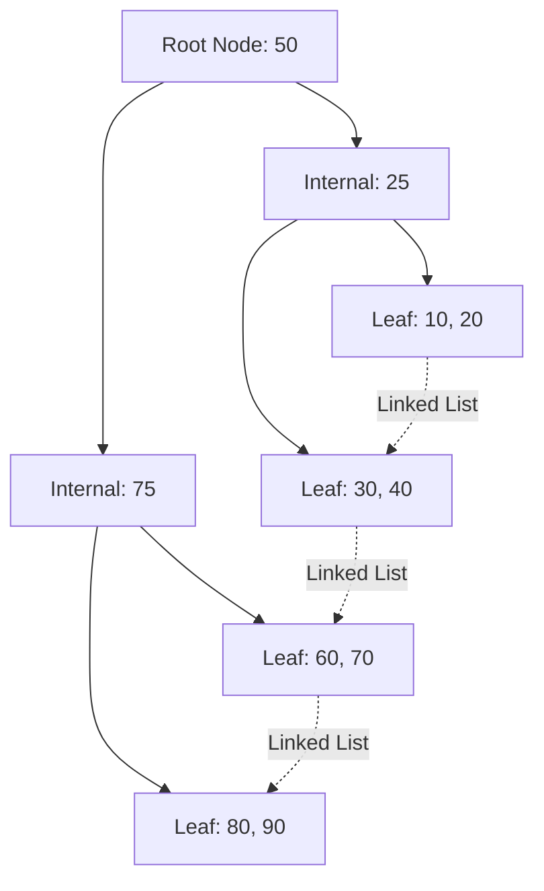

# B+ Trees in Databases

B+ Trees are the standard data structure used for indexing in almost all relational databases (like MySQL, PostgreSQL) and many NoSQL databases.

## What is a B-Tree?
A B-Tree (Balanced Tree) is a self-balancing tree data structure that maintains sorted data and allows searches, sequential access, insertions, and deletions in logarithmic time. Unlike binary trees, B-Tree nodes can have more than two children.

## Why B+ Trees instead of B-Trees?

Databases specifically use **B+ Trees**, which are a variation of B-Trees with two key differences:

1.  **Data only at the leaves:** In a B+ Tree, internal (non-leaf) nodes only store keys for routing. The actual data records (or pointers to the records) are *only* stored in the leaf nodes.
    - *Benefit:* Because internal nodes don't hold data, they can hold many more routing keys. This makes the tree "wider" and "flatter" (lower height). A lower height means fewer disk I/O operations to reach the data.
2.  **Linked Leaves:** All leaf nodes are linked together in a linked list.
    - *Benefit:* This makes range queries (e.g., `SELECT * FROM users WHERE age BETWEEN 20 AND 30`) incredibly fast. Once you find the leaf node for '20', you just follow the pointers sequentially across the leaves until you hit '30'.

## How Indexes Make Reads Faster

Without an index, finding a specific row requires a **Full Table Scan** (O(N) time), reading every single row from disk.

With a B+ Tree index, the database traverses the tree from root to leaf. Because the tree is highly branched, even a table with a billion rows might only have a B+ Tree of height 3 or 4. This means finding any row takes only 3 or 4 disk reads (O(log N) time).

import MCQ from '@/components/mcq/MCQ'

<MCQ 
  question="What is the primary advantage of the linked list connecting the leaf nodes in a B+ Tree?"
  options={[
    "It allows the tree to balance itself faster during insertions.",
    "It drastically speeds up range queries (e.g., BETWEEN clauses).",
    "It prevents the need for a root node.",
    "It allows the database to store unstructured JSON data."
  ]}
  correctAnswerIndex={1}
  explanation="The linked leaves allow the database to perform sequential scans for range queries. Once the starting point is found via tree traversal, the database simply walks the linked list across the leaves to get the rest of the range, rather than traversing the tree repeatedly."
/>

<MCQ
  question="A MySQL table has 1 billion rows. Without any index, looking up a row by its primary key requires a full table scan. With a B+ Tree index (branching factor 500), approximately how many disk reads are needed?"
  options={[
    "1 billion",
    "About 4 (log base 500 of 1 billion is approximately 3.3)",
    "About 30 (log base 2 of 1 billion)",
    "About 500"
  ]}
  correctAnswerIndex={1}
  explanation="With a branching factor of 500, a B+ Tree of height 4 can index 500^4 = 62.5 billion rows. So 1 billion rows needs at most 4 levels of traversal = 4 disk reads, compared to potentially 1 billion for a full scan."
/>

<MCQ
  question="Why do databases store only keys (not data) in the internal nodes of a B+ Tree?"
  options={[
    "To make the tree taller for more precise lookups.",
    "So that each internal node can hold more keys/pointers, making the tree wider and shorter (fewer levels = fewer disk reads).",
    "Because data is too large to fit in memory.",
    "Internal nodes are read-only and cannot store mutable data."
  ]}
  correctAnswerIndex={1}
  explanation="Each disk read fetches one node (one disk page, typically 4-16KB). If internal nodes only contain keys and child pointers (no data), more keys fit per node, increasing the branching factor and reducing tree height."
/>
