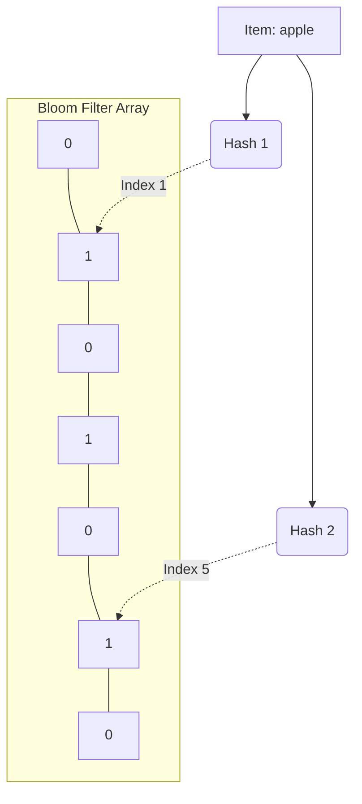

# Bloom Filters

A Bloom filter is a space-efficient probabilistic data structure that is used to test whether an element is a member of a set.

## The Core Concept

- **False Positives are possible**: It might tell you an item *is* in the set when it actually *isn't*.
- **False Negatives are impossible**: It will *never* tell you an item is not in the set if it actually is.

Therefore, a Bloom filter essentially tells you: **"Possibly in set"** or **"Definitely not in set"**.

## How it works

1.  **The Array:** It starts as a bit array of $m$ bits, all set to 0.
2.  **The Hash Functions:** You have $k$ different hash functions.
3.  **Adding an item:** Feed the item to all $k$ hash functions to get $k$ array positions. Set the bits at all these positions to 1.
4.  **Checking an item:** Feed the item to all $k$ hash functions. 
    - If *any* of the bits at those positions is 0, the item is **definitely not** in the set.
    - If *all* of the bits are 1, the item is **probably** in the set (another item, or combination of items, might have flipped those exact same bits).

## System Design Use Cases

- **Databases (LSM Trees / Cassandra):** Before doing an expensive disk read to check if a key exists in an SSTable, check the Bloom filter. If it says "no", you save a disk read.
- **CDNs / Caches:** To prevent "one-hit wonders" from polluting the cache. Only cache an item if it has been seen before (using a Bloom filter to track what has been seen).
- **Malicious URL checking:** Browsers use them to quickly check if a URL is in a massive list of malicious sites.

import MCQ from '@/components/mcq/MCQ'

<MCQ 
  question="If a Bloom Filter is queried for a specific username and returns 'False', what does this mean?"
  options={[
    "The username is definitely in the system.",
    "The username is probably in the system, but we need to check the database to be sure.",
    "The username is definitely NOT in the system.",
    "The username might or might not be in the system; a false negative has occurred."
  ]}
  correctAnswerIndex={2}
  explanation="A Bloom filter guarantees no false negatives. If it says an item is not present (because at least one of its hashed bit positions is 0), then it is absolutely, 100% not in the set."
/>

<MCQ
  question="Increasing the number of hash functions (k) in a Bloom filter has what trade-off?"
  options={[
    "More hash functions always decrease the false positive rate.",
    "More hash functions initially decrease the false positive rate, but too many fill up the bit array faster, eventually increasing the false positive rate.",
    "More hash functions increase memory usage proportionally.",
    "The number of hash functions has no effect on accuracy."
  ]}
  correctAnswerIndex={1}
  explanation="There is an optimal k for a given bit array size m and number of elements n. Too few hash functions produce false positives from insufficient discrimination. Too many hash functions fill the bit array with 1s, also producing false positives."
/>

<MCQ
  question="Cassandra uses Bloom filters to speed up reads. How exactly does this help?"
  options={[
    "The Bloom filter replaces the need for an index.",
    "Before reading an SSTable from disk, Cassandra checks the SSTable's Bloom filter. If it says the key is definitely not there, the expensive disk read is skipped entirely.",
    "Bloom filters compress the SSTable data.",
    "Bloom filters sort the keys alphabetically."
  ]}
  correctAnswerIndex={1}
  explanation="Each SSTable has an associated Bloom filter in memory. When looking up a key, Cassandra checks the filter for each SSTable. If the filter says 'no', that SSTable is skipped without any disk I/O, dramatically reducing read latency."
/>
