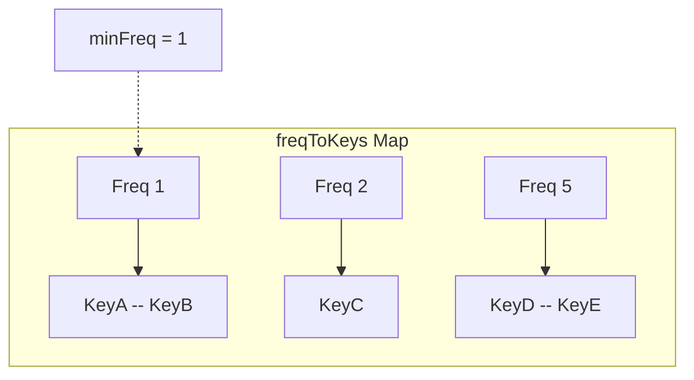

# Constant Time LFU (Least Frequently Used) Cache

Designing an LFU cache with `O(1)` time complexity for both `get` and `put` operations is a classic hard interview question.

## The Challenge

A standard LRU (Least Recently Used) cache can be implemented in `O(1)` using a Hash Map + Doubly Linked List. 
However, LFU requires us to track the *frequency* of accesses. If we just use a min-heap or a balanced BST, finding the minimum frequency takes `O(log N)`.

## The O(1) Solution

To achieve `O(1)`, we need three data structures:
1.  **`keyToVal`**: A Hash Map storing `Key -> Value`.
2.  **`keyToFreq`**: A Hash Map storing `Key -> Frequency`.
3.  **`freqToKeys`**: A Hash Map storing `Frequency -> Doubly Linked List of Keys`.
4.  **`minFreq`**: An integer tracking the current minimum frequency in the cache.

### How it works:

- **`get(key)`**: 
  - If key exists, get its current frequency `f` from `keyToFreq`.
  - Update `keyToFreq` to `f + 1`.
  - Remove the key from the Doubly Linked List at `freqToKeys[f]`.
  - Add the key to the Doubly Linked List at `freqToKeys[f + 1]`.
  - If `freqToKeys[f]` becomes empty and `minFreq == f`, increment `minFreq`.
  - Return the value from `keyToVal`.

- **`put(key, value)`**:
  - If cache is full, look at `freqToKeys[minFreq]`. Remove the *least recently used* key from that specific Doubly Linked List (usually the tail). Remove it from `keyToVal` and `keyToFreq`.
  - Insert the new key into `keyToVal`, set its frequency to 1 in `keyToFreq`.
  - Add it to `freqToKeys[1]`.
  - Reset `minFreq = 1`.

import MCQ from '@/components/mcq/MCQ'

<MCQ 
  question="In the O(1) LFU cache implementation described above, what happens when multiple keys have the exact same lowest frequency, and the cache is full?"
  options={[
    "The cache throws an error.",
    "A random key among those with the lowest frequency is evicted.",
    "The least recently used (LRU) key among those with the lowest frequency is evicted.",
    "All keys with the lowest frequency are evicted simultaneously."
  ]}
  correctAnswerIndex={2}
  explanation="Because freqToKeys maps a frequency to a Doubly Linked List, we maintain the insertion order within that specific frequency bucket. Therefore, we can easily evict the Least Recently Used (LRU) item among those that share the Least Frequently Used (LFU) count."
/>

<MCQ
  question="Why do we need three separate hash maps (keyToVal, keyToFreq, freqToKeys) instead of a single data structure?"
  options={[
    "A single data structure would use too much memory.",
    "Each map serves a different O(1) operation: keyToVal for value lookup, keyToFreq for frequency update, freqToKeys for eviction — together they achieve O(1) for all operations.",
    "Python dictionaries can only store one type of value.",
    "Three maps are required for thread safety."
  ]}
  correctAnswerIndex={1}
  explanation="The three-map design separates concerns: keyToVal handles get(), keyToFreq tracks access frequency, and freqToKeys groups keys by frequency for O(1) eviction of the LFU+LRU key."
/>

<MCQ
  question="After a put() operation inserts a new key into the LFU cache, what should minFreq be set to?"
  options={[
    "0",
    "1",
    "The frequency of the most recently accessed key.",
    "The average of all frequencies."
  ]}
  correctAnswerIndex={1}
  explanation="A newly inserted key has been accessed exactly once, so its frequency is 1. Since no key can have a frequency lower than 1, minFreq must be reset to 1 after every new insertion."
/>
