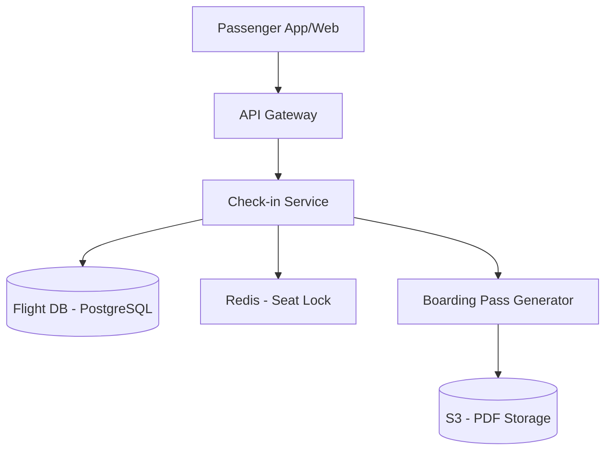

# Designing Airline Check-in

## 1. Requirements

### Functional
- Passengers check in online 24 hours before departure
- Select or change seats
- Generate boarding pass (PDF / QR code)
- Handle overbooking (waitlist management)

### Non-Functional
- Strong consistency for seat assignment (no double booking)
- Handle spikes when check-in opens (thousands of concurrent requests)
- High availability (airline cannot go down)

## 2. High-Level Architecture



## 3. Core Implementation

```python
class AirlineCheckin:
    def __init__(self, db, lock_service):
        self.db = db
        self.lock = lock_service

    def check_in(self, passenger_id, flight_id, preferred_seat=None):
        # Step 1: Verify eligibility
        booking = self.db.get_booking(passenger_id, flight_id)
        if not booking or booking['checked_in']:
            raise Exception("Not eligible for check-in")

        # Step 2: Assign seat with pessimistic lock
        seat = self._assign_seat(flight_id, preferred_seat)

        # Step 3: Update booking
        self.db.execute("""
            UPDATE bookings
            SET checked_in = TRUE, seat = %s, checked_in_at = NOW()
            WHERE passenger_id = %s AND flight_id = %s
        """, seat, passenger_id, flight_id)

        # Step 4: Generate boarding pass
        boarding_pass = self._generate_boarding_pass(
            passenger_id, flight_id, seat)
        return boarding_pass

    def _assign_seat(self, flight_id, preferred_seat):
        if preferred_seat:
            # Try to claim the preferred seat
            result = self.db.execute("""
                UPDATE seats
                SET status = 'occupied', updated_at = NOW()
                WHERE flight_id = %s AND seat_number = %s
                  AND status = 'available'
                RETURNING seat_number
            """, flight_id, preferred_seat)
            if result:
                return result['seat_number']

        # Auto-assign next available seat
        result = self.db.execute("""
            UPDATE seats
            SET status = 'occupied', updated_at = NOW()
            WHERE id = (
                SELECT id FROM seats
                WHERE flight_id = %s AND status = 'available'
                ORDER BY seat_number ASC
                LIMIT 1
                FOR UPDATE
            )
            RETURNING seat_number
        """, flight_id)
        if not result:
            raise Exception("No seats available")
        return result['seat_number']
```

## 4. Design Choices

| Decision | Choice | Why |
|----------|--------|-----|
| Seat locking | Pessimistic locking (SELECT FOR UPDATE) | Seats are a scarce, high-contention resource; optimistic locking would cause excessive retries |
| Consistency | Strong consistency (single PostgreSQL) | Double-booking a seat is unacceptable |
| Boarding pass | Async generation via queue | PDF generation is slow; return confirmation immediately, email boarding pass later |
| Overbooking | Waitlist queue per flight | When a checked-in passenger cancels, next person on waitlist is auto-checked in |

---

## Quiz

import MCQ from '@/components/mcq/MCQ'

<MCQ
  question="Why is pessimistic locking preferred over optimistic locking for seat assignment?"
  options={[
    "Pessimistic locking is faster.",
    "When 300 passengers try to check in simultaneously for a flight with limited window seats, contention is very high. Optimistic locking would cause most transactions to fail and retry, wasting resources. Pessimistic locking queues them.",
    "Optimistic locking doesn't work with PostgreSQL.",
    "Pessimistic locking uses less memory."
  ]}
  correctAnswerIndex={1}
  explanation="Seat selection during check-in opening is a high-contention scenario. Pessimistic locking ensures orderly processing. Optimistic locking with version checks would cause massive retry storms."
/>

<MCQ
  question="How would you handle the check-in spike when 300 passengers for a flight all try to check in at exactly the 24-hour mark?"
  options={[
    "Add more database servers.",
    "Use a queue: when check-in opens, requests are placed in a FIFO queue processed by workers. Passengers see 'Processing...' and get notified when complete.",
    "Block all requests after the first 10.",
    "Use eventual consistency."
  ]}
  correctAnswerIndex={1}
  explanation="A queue absorbs the spike and processes requests serially. Combined with the pessimistic lock pattern, each seat assignment is conflict-free. Passengers get a near-instant 'Confirmed' response once their turn is processed."
/>
