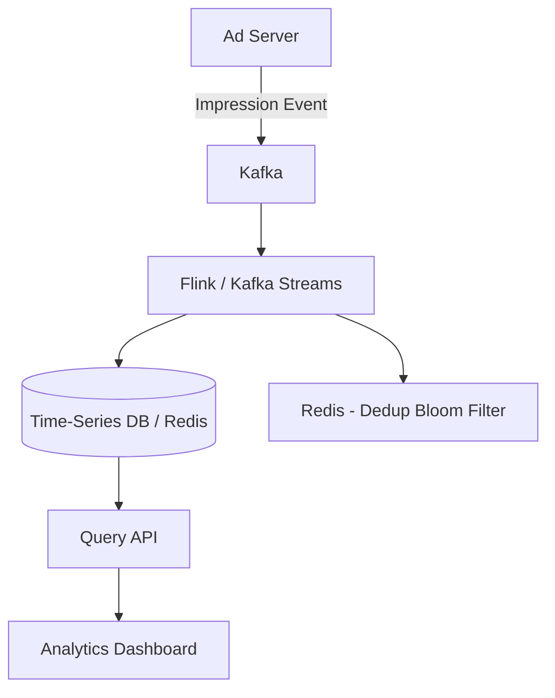

# Design Counting Impressions at Scale

## 1. Requirements

### Functional
- Count ad/content impressions in real-time
- Query impression counts by ad_id, time range, and dimensions (country, device)
- Support deduplication (don't count the same user viewing the same ad twice)

### Non-Functional
- Handle 1M+ impression events per second
- Counts must be queryable within 5 seconds of the event
- System must be fault-tolerant (never lose counts)

### Clarifying Questions
- Is approximate counting acceptable? (e.g., HyperLogLog for unique counts)
- What time granularity is needed? (per-second, per-minute, per-hour?)
- Do we need exact deduplication or probabilistic?

## 2. High-Level Architecture



## 3. Core Algorithm

```python
import time
from collections import defaultdict

class ImpressionCounter:
    def __init__(self):
        self.counts = defaultdict(lambda: defaultdict(int))
        self.seen = set()  # deduplication (use Bloom filter at scale)

    def record(self, ad_id, user_id, timestamp):
        dedup_key = f"{ad_id}:{user_id}:{self._minute_bucket(timestamp)}"
        if dedup_key in self.seen:
            return  # duplicate, skip
        self.seen.add(dedup_key)

        minute_key = self._minute_bucket(timestamp)
        self.counts[ad_id][minute_key] += 1

    def query(self, ad_id, start_time, end_time):
        total = 0
        t = self._minute_bucket(start_time)
        end_bucket = self._minute_bucket(end_time)
        while t <= end_bucket:
            total += self.counts[ad_id].get(t, 0)
            t += 60
        return total

    def _minute_bucket(self, ts):
        return int(ts) // 60 * 60
```

## 4. Design Choices

| Decision | Choice | Why |
|----------|--------|-----|
| Ingestion | Kafka | Handles 1M+ events/sec; decouples ad servers from counters |
| Processing | Stream processing (Flink) | Real-time aggregation with windowing and exactly-once semantics |
| Deduplication | Bloom filter per time window | Probabilistic dedup with minimal memory; acceptable false positive rate < 0.1% |
| Storage | Time-series DB (ClickHouse) | Optimized for append-heavy, time-bucketed aggregation queries |

## 5. Scope for Improvement
- Lambda architecture: combine real-time stream with batch correction
- HyperLogLog for unique impression counts (memory: 12KB per counter vs unbounded sets)
- Pre-aggregation at multiple granularities (minute, hour, day)

---

## Quiz

import MCQ from '@/components/mcq/MCQ'

<MCQ
  question="Why use a Bloom filter for deduplication instead of a hash set?"
  options={[
    "Bloom filters are more accurate.",
    "A hash set storing 1 billion user-ad pairs would consume ~64GB of RAM. A Bloom filter achieves < 0.1% false positive rate in ~1.2GB.",
    "Bloom filters support range queries.",
    "Hash sets are not supported in distributed systems."
  ]}
  correctAnswerIndex={1}
  explanation="At scale (billions of events), exact deduplication with hash sets is impractical due to memory. Bloom filters provide a massive memory reduction with a tiny, tunable false positive rate."
/>

<MCQ
  question="If the stream processing job crashes and restarts, how do we avoid losing or double-counting impressions?"
  options={[
    "We can't — some impressions will always be lost.",
    "Kafka retains messages and the processor commits offsets after successfully aggregating. On restart, it replays from the last committed offset, achieving exactly-once processing with idempotent writes.",
    "The ad server re-sends all impressions.",
    "We use a backup MySQL database."
  ]}
  correctAnswerIndex={1}
  explanation="Kafka's consumer offset mechanism combined with exactly-once semantics (idempotent producers + transactional consumers) ensures that even after a crash, every impression is counted exactly once."
/>

<MCQ
  question="Why use time-bucketed aggregation (per-minute counts) instead of storing every raw impression event?"
  options={[
    "Raw events are too large to display on a dashboard.",
    "Pre-aggregating into time buckets reduces storage by 1000x+ and makes queries instantaneous (read one row per minute instead of scanning millions of raw events).",
    "Time buckets are required by advertising regulations.",
    "Raw events cannot be stored in databases."
  ]}
  correctAnswerIndex={1}
  explanation="1M events/sec = 86B events/day. Storing each one is expensive. Pre-aggregating into per-minute buckets reduces this to ~1440 rows per ad per day, making queries fast and storage manageable."
/>
