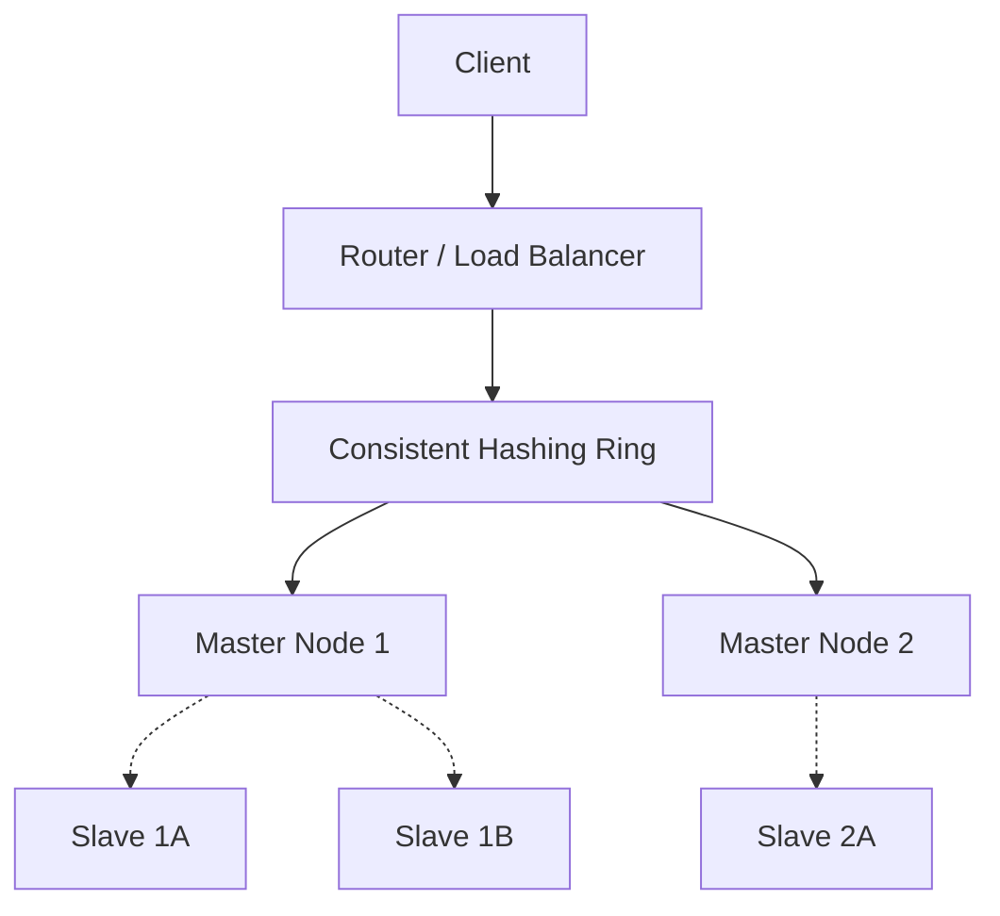

# Designing a Distributed Cache

A distributed cache (like Redis or Memcached) is a system that pools the RAM of multiple networked computers into a single in-memory data store.

## 1. Requirements Collection
**Functional:**
- `put(key, value)`
- `get(key)`
- Eviction policy (LRU)
- TTL (Time to Live)

**Non-Functional:**
- High availability
- Low latency (< 2ms)
- Scalability (ability to add/remove nodes easily)

## 2. Data Partitioning (Consistent Hashing)
To distribute the data across multiple cache servers, we use **Consistent Hashing**. 
This ensures that when a cache server is added or removed, only a minimal number of keys need to be remapped, preventing a massive "cache stampede" on the underlying database.

## 3. Internal Node Architecture (LRU Implementation)
Inside a single cache node, how do we achieve O(1) reads and writes with LRU eviction?
- **Hash Map:** `Key -> Pointer to Node in Linked List`. Provides O(1) access.
- **Doubly Linked List:** Maintains the order of access. The Most Recently Used (MRU) item is at the head, and the Least Recently Used (LRU) item is at the tail.
- When an item is accessed, it is moved to the head.
- When the cache is full, the item at the tail is dropped.

## 4. High Availability (Replication)
If a cache node dies, all its data is lost. To prevent this, we use **Master-Slave replication**.
- Each Hash Ring node actually represents a Master server.
- Each Master has 1 or more Read Replicas (Slaves).
- Writes go to the Master and are asynchronously replicated to the Slaves.
- If the Master dies, a consensus algorithm (like Raft or ZooKeeper) promotes a Slave to Master.



## 5. Database Schema (Cache Metadata)

```sql
CREATE TABLE cache_nodes (
    node_id     UUID PRIMARY KEY,
    host        VARCHAR(255) NOT NULL,
    port        INT NOT NULL,
    role        VARCHAR(10) DEFAULT 'master',  -- master | slave
    master_id   UUID REFERENCES cache_nodes(node_id),
    hash_start  BIGINT,   -- token range start on hash ring
    hash_end    BIGINT,   -- token range end on hash ring
    status      VARCHAR(10) DEFAULT 'active',
    last_heartbeat TIMESTAMP DEFAULT NOW()
);
```

## 6. Consistent Hashing Pseudocode

```python
import hashlib, bisect

class ConsistentHashRing:
    def __init__(self, virtual_nodes=150):
        self.ring = {}          # hash_value -> node_id
        self.sorted_keys = []
        self.vnodes = virtual_nodes

    def add_node(self, node_id):
        for i in range(self.vnodes):
            key = self._hash(f"{node_id}:{i}")
            self.ring[key] = node_id
            bisect.insort(self.sorted_keys, key)

    def remove_node(self, node_id):
        for i in range(self.vnodes):
            key = self._hash(f"{node_id}:{i}")
            self.ring.pop(key, None)
            self.sorted_keys.remove(key)

    def get_node(self, cache_key):
        h = self._hash(cache_key)
        idx = bisect.bisect_right(self.sorted_keys, h)
        if idx == len(self.sorted_keys):
            idx = 0
        return self.ring[self.sorted_keys[idx]]

    def _hash(self, key):
        return int(hashlib.md5(key.encode()).hexdigest(), 16)
```

## 7. Design Choices

| Decision | Choice | Why |
|----------|--------|-----|
| Partitioning | Consistent Hashing with virtual nodes | Minimizes key remapping when nodes join/leave; virtual nodes ensure even distribution |
| Eviction | LRU via HashMap + Doubly Linked List | O(1) for both get and put |
| Replication | Async master-slave | Low write latency; acceptable for cache (losing a few cached items on failure is OK) |
| Serialization | Protocol Buffers | Compact binary format reduces network transfer per cache entry |

---

## Quiz

import MCQ from '@/components/mcq/MCQ'

<MCQ 
  question="In a distributed cache using a Hash Map and Doubly Linked List for LRU, why must the linked list be 'Doubly' linked rather than 'Singly' linked?"
  options={[
    "Because doubly linked lists take up less memory.",
    "To allow O(1) removal of an arbitrary node from the middle of the list when it is accessed.",
    "Because singly linked lists cannot store string values.",
    "To allow the cache to be replicated to slave nodes."
  ]}
  correctAnswerIndex={1}
  explanation="When a key is accessed, we use the Hash Map to find its node in O(1) time. We then need to move this node to the head. To remove a node from a linked list, we need to connect its 'previous' node to its 'next' node. A doubly linked list gives us O(1) access to the 'previous' node, whereas a singly linked list would require an O(N) traversal from the head to find it."
/>

<MCQ
  question="Your distributed cache has 4 nodes and you add a 5th. With consistent hashing (150 virtual nodes each), roughly how much data is remapped?"
  options={[
    "100% — all keys must be rehashed.",
    "Roughly 20% (1/5 of the keys move to the new node).",
    "50% — half the keys change nodes.",
    "0% — no data moves."
  ]}
  correctAnswerIndex={1}
  explanation="With consistent hashing, adding a node only affects the keys in the portion of the ring that the new node now covers. On average, only K/N keys are remapped (where K is total keys and N is the new node count), which is roughly 20% when going from 4 to 5 nodes."
/>

<MCQ
  question="A cache node dies and its master promotes a slave. During the promotion, some recent writes to the old master may not have been replicated yet. What is this called?"
  options={[
    "Cache stampede",
    "Split brain",
    "Data loss due to asynchronous replication lag",
    "Consistent hashing collision"
  ]}
  correctAnswerIndex={2}
  explanation="Async replication means the slave may be slightly behind the master. Writes acknowledged by the master but not yet replicated to the slave are lost on failover. This is an accepted trade-off for caches — durability is less critical than latency."
/>
