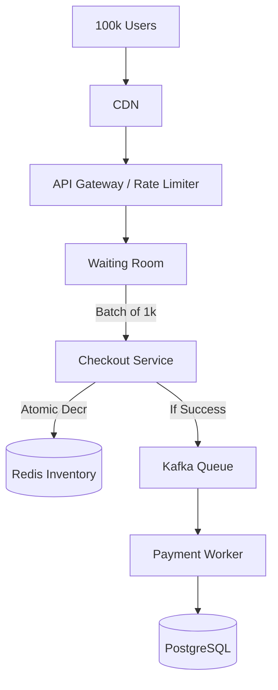

# Designing a Flash Sale System (Shopify)

A flash sale (like Black Friday or a limited sneaker drop) is one of the most challenging system design problems because it involves a massive, sudden spike in traffic combined with strict transactional requirements (you cannot oversell inventory).

## The Challenge
- **Traffic Spike:** 100x normal traffic in a matter of seconds.
- **Inventory Consistency:** If you have 1,000 shoes, exactly 1,000 people should be able to buy them. No double-spending.
- **Database Bottleneck:** A traditional relational database will lock up and crash if 100,000 users try to update the `inventory_count` row simultaneously (Pessimistic Locking contention).

## The Architecture

### 1. The Edge (CDN & Rate Limiting)
- Serve all static content (images, HTML) from a CDN.
- Implement strict **Rate Limiting** at the API Gateway to block bots and malicious actors.

### 2. The Waiting Room (Virtual Queue)
- Do not let all users hit the backend at once. 
- Place users in a virtual queue (e.g., using Redis or a dedicated service). Let them into the checkout flow in batches that the database can handle.

### 3. Inventory Management (Redis Lua Scripts)
- Do not use a SQL database for the initial inventory check. It's too slow.
- Pre-load the inventory count into **Redis**.
- Use **Redis EVAL (Lua Scripts)** to atomically check and decrement the inventory. Lua scripts in Redis are guaranteed to be atomic.

```lua
-- Redis Lua Script for Atomic Inventory Deduction
local inventory = tonumber(redis.call('get', KEYS[1]))
if inventory > 0 then
    redis.call('decr', KEYS[1])
    return 1 -- Success
else
    return 0 -- Sold out
end
```

### 4. Asynchronous Order Processing
- Once Redis confirms the user got the item, **do not** process the payment synchronously.
- Drop an `OrderEvent` into a **Message Queue (Kafka or SQS)**.
- Return a "Processing" status to the user.
- Background workers consume the queue, process the payment, and update the persistent SQL database.



## 5. Database Schema

```sql
CREATE TABLE products (
    id          UUID PRIMARY KEY,
    name        VARCHAR(255) NOT NULL,
    price       DECIMAL(10,2),
    total_stock INT NOT NULL,
    sale_start  TIMESTAMP NOT NULL
);

CREATE TABLE orders (
    id              UUID PRIMARY KEY,
    user_id         UUID NOT NULL,
    product_id      UUID REFERENCES products(id),
    quantity        INT DEFAULT 1,
    status          VARCHAR(20) DEFAULT 'pending', -- pending, paid, failed, refunded
    reservation_id  VARCHAR(64),
    created_at      TIMESTAMP DEFAULT NOW(),
    paid_at         TIMESTAMP
);

CREATE INDEX idx_orders_user ON orders (user_id, created_at DESC);
CREATE INDEX idx_orders_status ON orders (status) WHERE status = 'pending';
```

## 6. Waiting Room Pseudocode

```python
import time, uuid

class WaitingRoom:
    def __init__(self, redis, batch_size=1000, interval_sec=2):
        self.redis = redis
        self.batch_size = batch_size
        self.interval = interval_sec

    def enqueue(self, user_id, product_id):
        token = str(uuid.uuid4())
        self.redis.zadd(
            f"waitroom:{product_id}",
            {f"{user_id}:{token}": time.time()}
        )
        return token  # user polls with this token

    def release_batch(self, product_id):
        entries = self.redis.zpopmin(
            f"waitroom:{product_id}", self.batch_size)
        tokens = []
        for entry, score in entries:
            user_id, token = entry.split(":", 1)
            self.redis.set(f"checkout_token:{token}", user_id, ex=300)
            tokens.append(token)
        return tokens

    def validate_token(self, token):
        user_id = self.redis.get(f"checkout_token:{token}")
        if user_id:
            self.redis.delete(f"checkout_token:{token}")
            return user_id
        return None
```

## 7. Design Choices

| Decision | Choice | Why |
|----------|--------|-----|
| Inventory check | Redis Lua script | Atomic decrement in memory; no row-level locking |
| Queue | Redis Sorted Set (score = timestamp) | FIFO ordering by arrival time; O(log N) enqueue |
| Order processing | Async via Kafka | Decouple checkout from payment; handle payment gateway timeouts gracefully |
| Timeout | 5-min checkout token TTL | Prevents users from holding inventory indefinitely |

---

## Quiz

import MCQ from '@/components/mcq/MCQ'

<MCQ 
  question="Why is a Redis Lua script preferred over a standard SQL transaction for decrementing inventory during a massive flash sale?"
  options={[
    "SQL databases cannot store integer values.",
    "Redis Lua scripts execute atomically in memory, avoiding the massive disk I/O and row-locking contention that would crash a SQL database.",
    "Redis is a relational database.",
    "Lua is a faster programming language than SQL."
  ]}
  correctAnswerIndex={1}
  explanation="During a flash sale, thousands of requests try to update the exact same row. In SQL, this causes massive lock contention and deadlocks. Redis is single-threaded and executes Lua scripts atomically in RAM, allowing it to process tens of thousands of decrements per second without lock contention."
/>

<MCQ
  question="What happens if a user reserves an item via Redis DECR but never completes payment?"
  options={[
    "The item is lost forever.",
    "A background job detects expired checkout tokens (5-min TTL) and increments the Redis inventory count back, making the item available again.",
    "The user is charged automatically.",
    "The SQL database automatically rolls back."
  ]}
  correctAnswerIndex={1}
  explanation="Checkout tokens have a TTL. A reservation reaper job scans for expired tokens and runs INCR on the Redis inventory key to release the reserved item back to the pool. The order row in SQL is marked 'failed'."
/>

<MCQ
  question="Why use a virtual waiting room instead of letting all 100K users hit the checkout API directly?"
  options={[
    "Waiting rooms look nicer in the UI.",
    "Without a queue, 100K concurrent requests would overwhelm the database, cause lock contention, and likely crash the system. The waiting room meters traffic to a rate the backend can handle.",
    "Waiting rooms are required by payment processors.",
    "It reduces the number of items sold."
  ]}
  correctAnswerIndex={1}
  explanation="The waiting room is a traffic shaping mechanism. It absorbs the spike and releases users in controlled batches (e.g., 1000 every 2 seconds), keeping the backend within its capacity limits while providing a fair ordering."
/>
