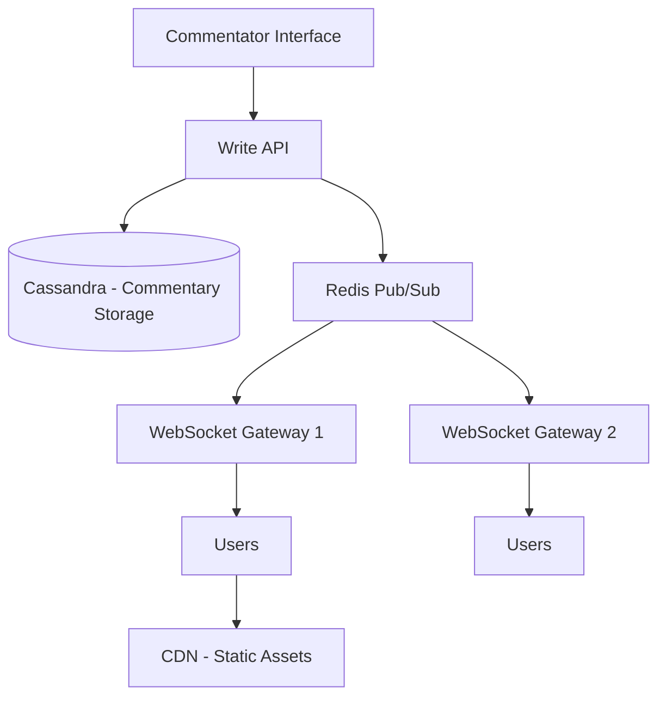

# Designing Text-based Live Commentary

## 1. Requirements

### Functional
- Commentators post text updates in real-time (e.g., ball-by-ball cricket, play-by-play football)
- Millions of users see updates within 1 second of posting
- Historical commentary browsable with pagination

### Non-Functional
- Extreme read-heavy ratio (1 writer : 1M+ readers)
- Low latency push (< 2 seconds)
- Handle traffic spikes during major events

## 2. High-Level Architecture



## 3. Core Design

```python
class CommentaryService:
    def __init__(self, db, pubsub):
        self.db = db
        self.pubsub = pubsub

    def post_update(self, match_id, update_text, timestamp):
        entry = {
            'match_id': match_id,
            'text': update_text,
            'timestamp': timestamp,
            'sequence': self._get_next_sequence(match_id)
        }
        # Persist to database
        self.db.insert('commentary', entry)
        # Push to all connected clients instantly
        self.pubsub.publish(f'match:{match_id}', entry)
        return entry

    def get_history(self, match_id, page=0, page_size=20):
        return self.db.query(
            'SELECT * FROM commentary WHERE match_id = ? '
            'ORDER BY sequence DESC LIMIT ? OFFSET ?',
            match_id, page_size, page * page_size
        )
```

### Cassandra Schema
```sql
CREATE TABLE commentary (
    match_id TEXT,
    sequence BIGINT,
    timestamp TIMESTAMP,
    text TEXT,
    PRIMARY KEY (match_id, sequence)
) WITH CLUSTERING ORDER BY (sequence DESC);
```

## 4. Design Choices

| Decision | Choice | Why |
|----------|--------|-----|
| Push mechanism | Redis Pub/Sub + WebSocket gateways | Instant fan-out to millions of connected clients |
| Storage | Cassandra | High write throughput, natural time-series ordering via clustering key |
| Scaling readers | Multiple WebSocket gateway instances behind LB | Each gateway handles ~100K connections; add more for scale |
| Fallback | HTTP polling with CDN cache | For clients that don't support WebSockets; CDN absorbs read load |

---

## Quiz

import MCQ from '@/components/mcq/MCQ'

<MCQ
  question="During a World Cup final, 50 million users are watching live commentary. Why can't we use a single WebSocket server?"
  options={[
    "WebSocket doesn't support that many users.",
    "Each WebSocket connection consumes server memory (~10KB). 50M connections = 500GB RAM. We must distribute across hundreds of gateway servers.",
    "WebSocket only supports 1000 connections per server.",
    "A single server can handle 50 million connections with enough CPU."
  ]}
  correctAnswerIndex={1}
  explanation="Each WebSocket connection holds state in server memory. At ~10KB per connection, 50M connections = ~500GB. This must be spread across many gateway servers, each handling 50K-100K connections."
/>

<MCQ
  question="Why use Redis Pub/Sub to distribute updates from the Write API to multiple WebSocket gateways?"
  options={[
    "Redis Pub/Sub guarantees message delivery.",
    "Each WebSocket gateway subscribes to the match channel. When the commentator posts, Redis fans out the message to ALL gateways simultaneously, which then push to their connected clients.",
    "Redis Pub/Sub compresses messages.",
    "It's the only way to use WebSockets."
  ]}
  correctAnswerIndex={1}
  explanation="Without Pub/Sub, the Write API would need to know about every gateway server and send messages to each one directly. Redis Pub/Sub decouples the writer from the gateways, providing clean one-to-many distribution."
/>
