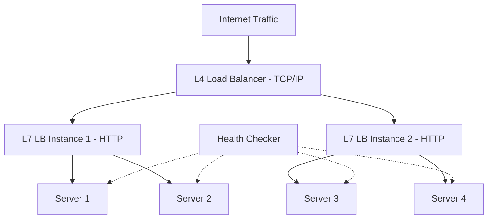

# Designing a Load Balancer

## 1. Requirements

### Functional
- Distribute incoming requests across a pool of backend servers
- Health checking (remove unhealthy servers from rotation)
- Support multiple algorithms (Round Robin, Least Connections, Weighted, IP Hash)
- SSL termination

### Non-Functional
- Add < 1ms latency to each request
- Handle 100K+ concurrent connections
- No single point of failure

## 2. High-Level Architecture



## 3. Core Implementation

```python
import random
import time
from collections import defaultdict

class LoadBalancer:
    def __init__(self, algorithm='round_robin'):
        self.servers = []
        self.healthy = set()
        self.algorithm = algorithm
        self.rr_index = 0
        self.connections = defaultdict(int)

    def add_server(self, server_addr, weight=1):
        self.servers.append({
            'addr': server_addr,
            'weight': weight
        })
        self.healthy.add(server_addr)

    def get_next_server(self, client_ip=None):
        available = [s for s in self.servers
                     if s['addr'] in self.healthy]
        if not available:
            raise Exception("No healthy servers")

        if self.algorithm == 'round_robin':
            server = available[self.rr_index % len(available)]
            self.rr_index += 1
            return server['addr']

        elif self.algorithm == 'least_connections':
            return min(available,
                key=lambda s: self.connections[s['addr']])['addr']

        elif self.algorithm == 'ip_hash':
            idx = hash(client_ip) % len(available)
            return available[idx]['addr']

        elif self.algorithm == 'weighted_round_robin':
            expanded = []
            for s in available:
                expanded.extend([s['addr']] * s['weight'])
            server = expanded[self.rr_index % len(expanded)]
            self.rr_index += 1
            return server

    def health_check(self):
        for server in self.servers:
            if self._ping(server['addr']):
                self.healthy.add(server['addr'])
            else:
                self.healthy.discard(server['addr'])

    def _ping(self, addr):
        # TCP connect or HTTP GET /health
        return True  # simplified
```

## 4. Design Choices

| Decision | Choice | Why |
|----------|--------|-----|
| L4 vs L7 | L4 for TCP distribution, L7 for HTTP routing | L4 is extremely fast (kernel-space, DPDK); L7 understands HTTP for path-based routing, header inspection, SSL |
| Algorithm | Least Connections (default) | Better than Round Robin when request processing times vary widely |
| Health checks | Active + Passive | Active: periodic pings. Passive: mark unhealthy after N consecutive failed requests |
| HA | Active-passive pair with VRRP/Keepalived | Standby LB takes over if primary fails, using a floating virtual IP |

## 5. Scope for Improvement
- Consistent hashing for session-aware routing
- Rate limiting per client IP
- Circuit breaker to stop sending traffic to degraded servers

---

## Quiz

import MCQ from '@/components/mcq/MCQ'

<MCQ
  question="What is the difference between L4 and L7 load balancing?"
  options={[
    "L4 is newer than L7.",
    "L4 operates at the transport layer (TCP/IP) and routes based on IP/port — very fast but cannot inspect HTTP content. L7 operates at the application layer and can route based on URL path, headers, cookies, etc.",
    "L7 is faster because it inspects fewer packets.",
    "L4 only works with UDP."
  ]}
  correctAnswerIndex={1}
  explanation="L4 LB (e.g., HAProxy in TCP mode, AWS NLB) makes routing decisions based only on TCP packet headers — ultra-fast. L7 LB (e.g., Nginx, AWS ALB) terminates the TCP connection, reads the HTTP request, and can make intelligent routing decisions."
/>

<MCQ
  question="Why is 'Least Connections' generally better than 'Round Robin' for API servers?"
  options={[
    "It uses less memory.",
    "If one server is processing a slow query (taking 10 seconds), Round Robin keeps sending it new requests equally, overloading it. Least Connections routes to the server with the fewest active connections, naturally avoiding slow servers.",
    "Round Robin doesn't support HTTPS.",
    "Least Connections is required by cloud providers."
  ]}
  correctAnswerIndex={1}
  explanation="Round Robin assumes all requests take equal time. In reality, some requests take 10ms and others take 10s. Least Connections adapts to real-world load by favoring servers that have finished their work."
/>

<MCQ
  question="The load balancer itself is a single point of failure. How is this solved?"
  options={[
    "Use a bigger server.",
    "Run an active-passive pair. Both LBs share a virtual IP (VIP) via VRRP/Keepalived. If the active LB fails, the passive one takes over the VIP within seconds.",
    "Put a second load balancer behind the first one.",
    "Load balancers never fail."
  ]}
  correctAnswerIndex={1}
  explanation="A floating VIP is owned by the active LB. Keepalived monitors the active LB and reassigns the VIP to the passive LB if the active one stops responding. DNS points to the VIP, so clients are unaffected by the failover."
/>
