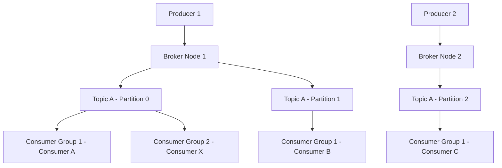

# Design a Message Broker

## 1. Requirements

### Functional
- Producers publish messages to named topics
- Consumers subscribe to topics and receive messages
- Message ordering guarantee within a partition
- At-least-once delivery semantics
- Consumer group support (each message processed by one consumer in a group)

### Non-Functional
- High throughput (millions of messages/sec)
- Durability (messages survive broker crashes)
- Horizontal scalability

### Clarifying Questions
- What delivery guarantee is needed? (At-most-once, at-least-once, exactly-once?)
- Is strict global ordering required, or per-partition ordering sufficient?
- What is the expected message retention period?

## 2. High-Level Architecture



## 3. Core Data Model

```python
class Partition:
    def __init__(self, partition_id):
        self.id = partition_id
        self.log = []           # append-only list of messages
        self.offset = 0         # next write position

    def append(self, message):
        self.log.append(message)
        assigned_offset = self.offset
        self.offset += 1
        return assigned_offset

    def read(self, consumer_offset, batch_size=10):
        return self.log[consumer_offset:consumer_offset + batch_size]


class Topic:
    def __init__(self, name, num_partitions=3):
        self.name = name
        self.partitions = [Partition(i) for i in range(num_partitions)]

    def get_partition(self, key):
        return self.partitions[hash(key) % len(self.partitions)]
```

## 4. Design Choices

| Decision | Choice | Why |
|----------|--------|-----|
| Storage | Append-only log per partition | Sequential disk writes are nearly as fast as memory; no random I/O |
| Ordering | Per-partition ordering | Global ordering across partitions would eliminate parallelism |
| Consumer tracking | Consumer-managed offsets | Broker doesn't track each consumer's position; consumers commit their own offset |
| Replication | ISR (In-Sync Replicas) | Each partition is replicated to N brokers; only replicas that are caught up are in the ISR |

## 5. Scope for Improvement
- Exactly-once semantics via idempotent producers + transactional writes
- Log compaction for key-based topics (keep only latest value per key)
- Tiered storage (move old segments to S3)

---

## Quiz

import MCQ from '@/components/mcq/MCQ'

<MCQ
  question="Why does Kafka use an append-only log on disk rather than a database for message storage?"
  options={[
    "Databases are too expensive.",
    "Sequential disk writes are extremely fast (600MB/s on modern SSDs). Append-only logs avoid random I/O and leverage OS page cache for reads.",
    "Kafka doesn't actually write to disk.",
    "Databases don't support byte arrays."
  ]}
  correctAnswerIndex={1}
  explanation="Kafka's append-only log turns all writes into sequential appends, which are nearly as fast as memory writes. The OS page cache keeps recent messages in RAM for fast consumer reads, achieving millions of messages per second per broker."
/>

<MCQ
  question="In a consumer group with 3 consumers and a topic with 6 partitions, how are partitions assigned?"
  options={[
    "All consumers read from all partitions.",
    "Each consumer is assigned 2 partitions. Each partition is read by exactly one consumer in the group.",
    "Partitions are assigned randomly on each read.",
    "Only the leader consumer reads; others are standby."
  ]}
  correctAnswerIndex={1}
  explanation="Consumer groups divide partitions among members for parallel processing. With 6 partitions and 3 consumers, each consumer handles 2 partitions. If a consumer crashes, its partitions are rebalanced to the remaining consumers."
/>

<MCQ
  question="What happens if a Kafka producer sends a message but the broker crashes before replicating it to followers?"
  options={[
    "The message is always lost.",
    "It depends on the 'acks' setting. With acks=all, the producer would not have received an acknowledgment and will retry. With acks=1, the message could be lost.",
    "Kafka guarantees zero data loss regardless of settings.",
    "The consumer re-sends the message."
  ]}
  correctAnswerIndex={1}
  explanation="acks=1 means the leader acknowledges without waiting for replicas — data loss possible. acks=all means the leader waits for all ISR replicas to confirm — durable but slower. The trade-off is latency vs durability."
/>
