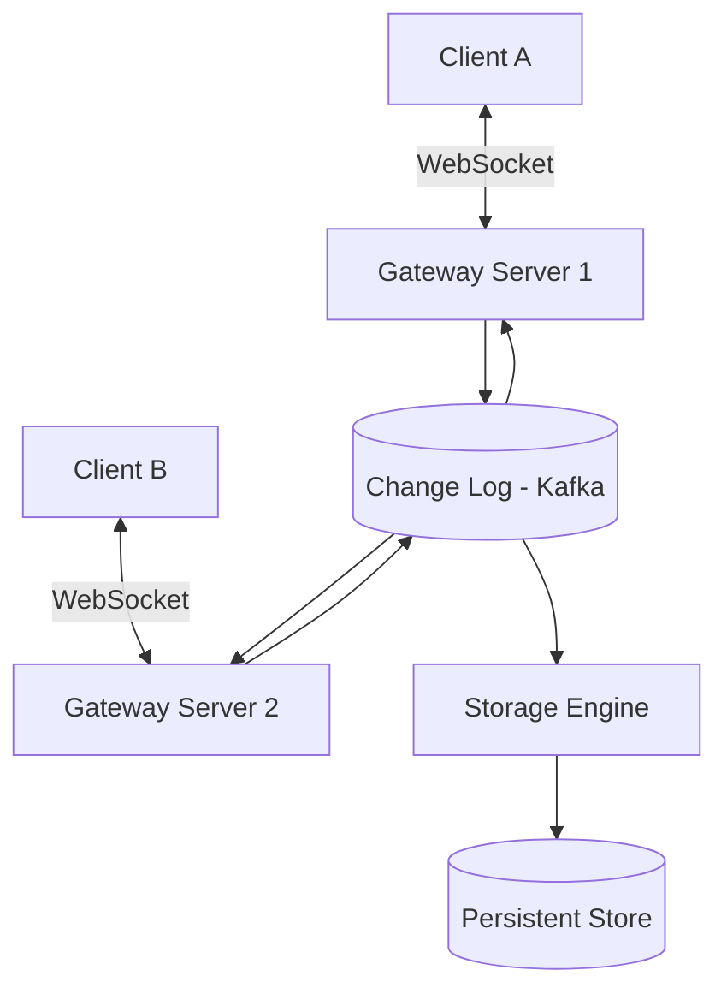

# Designing a Realtime Database (Firebase-like)

## 1. Requirements

### Functional
- Clients subscribe to a path in a JSON tree (e.g., `/chat/room1/messages`)
- Any write to that path instantly pushes the updated data to all subscribers
- Offline support: clients cache data locally and sync when reconnected
- Conflict resolution for concurrent offline edits

### Non-Functional
- End-to-end latency < 200ms for real-time sync
- Support millions of concurrent subscriptions
- Eventual consistency across replicas

## 2. High-Level Architecture



## 3. Core Design

```python
import json
from collections import defaultdict

class RealtimeDB:
    def __init__(self):
        self.data = {}                    # JSON tree
        self.subscribers = defaultdict(set)  # path -> set of callbacks
        self.version = 0

    def set(self, path, value, client_id=None):
        """Write a value at a path and notify subscribers."""
        keys = path.strip('/').split('/')
        node = self.data
        for key in keys[:-1]:
            if key not in node:
                node[key] = {}
            node = node[key]
        node[keys[-1]] = value
        self.version += 1

        # Notify all subscribers whose path is a prefix
        self._notify(path, value)

    def get(self, path):
        keys = path.strip('/').split('/')
        node = self.data
        for key in keys:
            if key not in node:
                return None
            node = node[key]
        return node

    def subscribe(self, path, callback):
        self.subscribers[path].add(callback)
        current = self.get(path)
        if current is not None:
            callback(path, current)

    def _notify(self, changed_path, value):
        for sub_path, callbacks in self.subscribers.items():
            if changed_path.startswith(sub_path) or \
               sub_path.startswith(changed_path):
                for cb in callbacks:
                    cb(changed_path, value)
```

## 4. Design Choices

| Decision | Choice | Why |
|----------|--------|-----|
| Data model | JSON tree with path-based addressing | Intuitive hierarchical model; natural for subscriptions |
| Change propagation | Change log (Kafka) as the source of truth | All writes go through the log; gateways consume and fan out to their clients |
| Offline sync | Operation log with vector clocks | Client records ops offline; on reconnect, syncs using last-known version |
| Conflict resolution | Last-Writer-Wins with timestamp tiebreaker | Simple and predictable; Firebase uses this approach |

## 5. Scope for Improvement
- Security rules engine (who can read/write which paths)
- Operational Transform or CRDTs for collaborative editing
- Query capabilities (filter, sort, paginate within a path)

---

## Quiz

import MCQ from '@/components/mcq/MCQ'

<MCQ
  question="Why use a change log (Kafka) as the central component rather than direct database writes?"
  options={[
    "Kafka is faster than databases.",
    "The change log serves as both the write-ahead log and the distribution channel. All gateways consume the same log, ensuring every connected client sees every change in order.",
    "Databases don't support JSON.",
    "Kafka provides authentication."
  ]}
  correctAnswerIndex={1}
  explanation="The change log is the single source of truth. Gateways subscribe to it and push updates to clients. This decouples write handling from notification delivery and ensures total ordering of changes."
/>

<MCQ
  question="A client subscribes to '/users/123/status'. Another client writes to '/users/123/status/online'. Should the first client be notified?"
  options={[
    "No — the paths are different.",
    "Yes — '/users/123/status/online' is a child of '/users/123/status'. Subscribers to a parent path should be notified of changes to any descendant.",
    "Only if the client explicitly subscribes to deep changes.",
    "Depends on the database engine."
  ]}
  correctAnswerIndex={1}
  explanation="In a hierarchical data model, subscribing to a path means you want to know about any changes within that subtree. A write to a child path changes the parent's subtree, so notifications must bubble up."
/>
