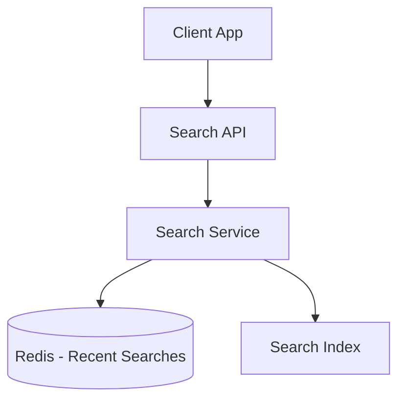

# Designing Recent Searches

## 1. Requirements

### Functional
- Store the last N searches per user
- Display recent searches when the user focuses on the search bar
- Delete individual or all recent searches
- Deduplicate (re-searching the same term moves it to the top)

### Non-Functional
- Sub-10ms read latency (shown on every search bar focus)
- Write on every search submission
- Data per user is small (< 100 entries)

## 2. High-Level Architecture



## 3. Core Implementation

```python
import redis
import time

class RecentSearches:
    def __init__(self, redis_client, max_items=20):
        self.redis = redis_client
        self.max_items = max_items

    def add_search(self, user_id, query):
        key = f"recent:{user_id}"
        score = time.time()
        # Remove existing entry (dedup), then add with new timestamp
        self.redis.zrem(key, query)
        self.redis.zadd(key, {query: score})
        # Trim to max_items (remove oldest)
        self.redis.zremrangebyrank(key, 0, -(self.max_items + 1))

    def get_recent(self, user_id, limit=10):
        key = f"recent:{user_id}"
        # Get most recent searches (highest score = most recent)
        return self.redis.zrevrange(key, 0, limit - 1)

    def delete_search(self, user_id, query):
        key = f"recent:{user_id}"
        self.redis.zrem(key, query)

    def clear_all(self, user_id):
        key = f"recent:{user_id}"
        self.redis.delete(key)
```

## 4. Design Choices

| Decision | Choice | Why |
|----------|--------|-----|
| Data Structure | Redis Sorted Set (ZSET) | Score = timestamp; automatic ordering, O(log N) add/remove, O(log N + K) range query |
| Deduplication | ZREM + ZADD | Remove old entry, add with new timestamp — moves it to the top |
| Size limit | ZREMRANGEBYRANK after each add | Keeps only the most recent N entries |
| Persistence | Redis with AOF | Survives restarts; acceptable to lose a few recent searches |

---

## Quiz

import MCQ from '@/components/mcq/MCQ'

<MCQ
  question="Why is a Redis Sorted Set better than a List for recent searches?"
  options={[
    "Sorted Sets use less memory.",
    "A List requires O(N) scan to check for duplicates before re-adding. A Sorted Set provides O(log N) deduplication via ZREM and automatic ordering by timestamp score.",
    "Lists don't support deletion.",
    "Sorted Sets are faster to iterate."
  ]}
  correctAnswerIndex={1}
  explanation="Deduplication is the key differentiator. With a List, you'd need to scan for an existing entry before moving it to the top. A Sorted Set handles this in O(log N) with ZREM + ZADD."
/>

<MCQ
  question="If we have 100 million users and each has up to 20 recent searches averaging 30 bytes each, how much Redis memory is needed?"
  options={[
    "~600MB",
    "~60GB",
    "~600GB",
    "~6TB"
  ]}
  correctAnswerIndex={1}
  explanation="100M users * 20 entries * ~30 bytes = 60GB. With Redis overhead (pointers, sorted set metadata), the actual usage would be ~80-100GB, which fits comfortably in a single large Redis instance or a small cluster."
/>
