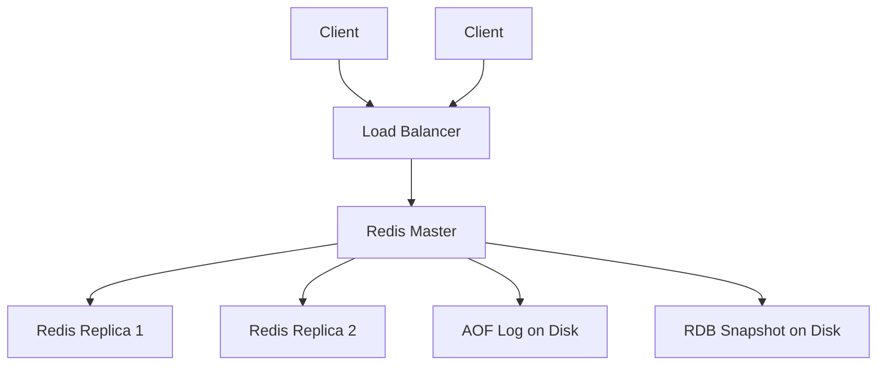

# Design an In-Memory Database (Redis)

## 1. Requirements

### Functional
- `GET key`, `SET key value`, `DEL key`
- TTL (Time-to-Live) expiration
- Data structures: Strings, Lists, Sets, Sorted Sets, Hashes
- Pub/Sub messaging
- Atomic operations via single-threaded execution

### Non-Functional
- Sub-millisecond latency for reads and writes
- Persistence options (survive restarts)
- Replication for high availability

### Clarifying Questions
- Do we need persistence or is pure in-memory acceptable?
- What is the expected data size relative to available RAM?
- Do we need clustering (data > single machine RAM)?

## 2. High-Level Architecture



## 3. Core Data Model

```python
class RedisServer:
    def __init__(self):
        self.store = {}          # key -> value
        self.expires = {}        # key -> expiry_timestamp

    def set(self, key, value, ttl=None):
        self.store[key] = value
        if ttl:
            self.expires[key] = time.time() + ttl

    def get(self, key):
        if key in self.expires and time.time() > self.expires[key]:
            del self.store[key]
            del self.expires[key]
            return None
        return self.store.get(key)

    def delete(self, key):
        self.store.pop(key, None)
        self.expires.pop(key, None)
```

## 4. Design Choices

| Decision | Choice | Why |
|----------|--------|-----|
| Threading | Single-threaded event loop | Eliminates lock contention; CPU is rarely the bottleneck for in-memory ops |
| Persistence | AOF (Append-Only File) + RDB snapshots | AOF logs every write for durability; RDB creates periodic point-in-time snapshots for fast recovery |
| Expiration | Lazy expiration + periodic sampling | Lazy: check TTL on access. Periodic: randomly sample 20 keys with TTL, delete expired ones. Avoids scanning all keys |
| Replication | Async master-slave | Slaves receive a stream of write commands from master |

## 5. Scope for Improvement
- Redis Cluster for horizontal sharding across machines
- Redis Sentinel for automated failover
- Memory optimization with ziplist encoding for small collections

---

## Quiz

import MCQ from '@/components/mcq/MCQ'

<MCQ
  question="Why is Redis single-threaded, and how can it still handle 100,000+ operations per second?"
  options={[
    "It uses a very fast CPU.",
    "All data is in RAM, so each operation takes microseconds. The bottleneck is network I/O, not CPU. A single thread avoids lock overhead and context switching.",
    "It processes requests in batches of 1000.",
    "It offloads computation to the operating system kernel."
  ]}
  correctAnswerIndex={1}
  explanation="In-memory hash table lookups take ~100 nanoseconds. At this speed, a single thread can process millions of operations per second. The real bottleneck is network round-trip time, not CPU, so multi-threading would add lock overhead without meaningful speedup."
/>

<MCQ
  question="What is the difference between AOF and RDB persistence in Redis?"
  options={[
    "AOF stores data in binary; RDB stores data in text.",
    "AOF logs every write command (like a WAL) for minimal data loss; RDB takes periodic full snapshots which are faster to load but may lose recent writes.",
    "RDB is append-only; AOF is snapshot-based.",
    "There is no difference; they are aliases."
  ]}
  correctAnswerIndex={1}
  explanation="AOF appends every write operation to a log file — on crash, Redis replays the log to recover. RDB forks a child process to write a full binary dump at intervals. Best practice: use both. RDB for fast restart, AOF for minimal data loss."
/>

<MCQ
  question="Redis uses lazy expiration for keys with TTL. What does this mean?"
  options={[
    "Redis deletes all expired keys every second.",
    "Redis only checks if a key is expired when that specific key is accessed. If it is expired, it is deleted on the spot.",
    "Redis sends expired keys to a garbage collection queue.",
    "The client is responsible for checking TTL."
  ]}
  correctAnswerIndex={1}
  explanation="Lazy expiration avoids the cost of scanning all keys. A key is only checked and deleted when accessed. To prevent memory leaks from unaccessed expired keys, Redis also runs a periodic job that randomly samples keys and deletes expired ones."
/>
