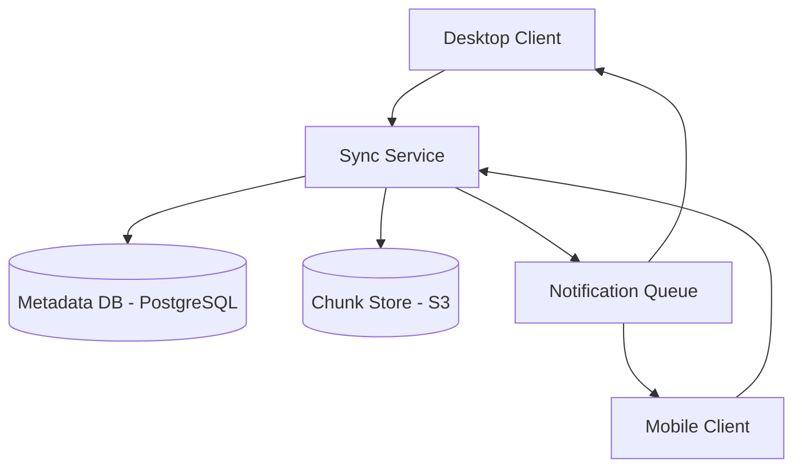

# Designing a Remote File Sync Service (Dropbox)

## 1. Requirements

### Functional
- Upload, download, and delete files
- Automatic sync across devices
- File versioning and conflict resolution
- Share files/folders with other users

### Non-Functional
- Efficient bandwidth usage (only sync changed portions)
- Support files up to 10GB
- Offline support (sync when reconnected)

### Clarifying Questions
- How many active users and average files per user?
- Do we need real-time sync or periodic polling?
- What conflict resolution strategy? (Last-write-wins or manual merge?)

## 2. High-Level Architecture



## 3. Core Algorithm: Chunked Sync

```python
import hashlib

CHUNK_SIZE = 4 * 1024 * 1024  # 4MB chunks

def chunk_file(filepath):
    """Split file into fixed-size chunks and compute hashes."""
    chunks = []
    with open(filepath, 'rb') as f:
        index = 0
        while True:
            data = f.read(CHUNK_SIZE)
            if not data:
                break
            chunk_hash = hashlib.sha256(data).hexdigest()
            chunks.append({
                'index': index,
                'hash': chunk_hash,
                'data': data
            })
            index += 1
    return chunks

def compute_diff(local_chunks, remote_chunk_hashes):
    """Find chunks that differ between local and remote."""
    chunks_to_upload = []
    for chunk in local_chunks:
        if chunk['index'] >= len(remote_chunk_hashes) or \
           chunk['hash'] != remote_chunk_hashes[chunk['index']]:
            chunks_to_upload.append(chunk)
    return chunks_to_upload
```

## 4. Design Choices

| Decision | Choice | Why |
|----------|--------|-----|
| Chunking | Fixed 4MB chunks with SHA-256 hashes | Only changed chunks are uploaded; deduplication across files |
| Storage | S3 for chunks, PostgreSQL for metadata | S3 provides durability; metadata is relational (users, files, versions) |
| Sync notification | Long polling / WebSocket | Client is notified immediately when another device modifies a file |
| Conflict resolution | Last-write-wins + version history | Simple default; users can manually restore older versions |

## 5. Scope for Improvement
- Content-defined chunking (Rabin fingerprinting) for better dedup when content shifts
- Delta sync (rsync-like) for even smaller transfers
- Client-side encryption for zero-knowledge privacy

---

## Quiz

import MCQ from '@/components/mcq/MCQ'

<MCQ
  question="A 100MB file has 1 byte changed in the middle. With chunked sync, how much data is uploaded?"
  options={[
    "100MB (the entire file)",
    "Only the 4MB chunk containing the changed byte",
    "1 byte",
    "50MB (half the file)"
  ]}
  correctAnswerIndex={1}
  explanation="The file is divided into 4MB chunks. Only the chunk where the byte changed has a different hash. The client compares chunk hashes with the server and uploads only the one modified chunk — a 96% bandwidth saving."
/>

<MCQ
  question="Why use content-addressable storage (hash as the key) for file chunks in S3?"
  options={[
    "Hashes are shorter than filenames.",
    "If two different users upload files with identical chunks, those chunks are stored only once (deduplication), saving storage costs significantly.",
    "S3 requires hash-based keys.",
    "It makes files more secure."
  ]}
  correctAnswerIndex={1}
  explanation="Content-addressable storage means identical data is stored once regardless of how many files or users reference it. If 1000 users have the same PDF, only one copy of each chunk exists in S3."
/>

<MCQ
  question="User A edits a file on their laptop (offline). User B edits the same file on their phone. Both come online. How should the system handle this?"
  options={[
    "Silently overwrite with the latest change.",
    "Detect the conflict via version vectors, keep both versions, and prompt the user to resolve manually.",
    "Reject both changes.",
    "Merge the files automatically like git merge."
  ]}
  correctAnswerIndex={1}
  explanation="Each file has a version number or vector clock. When two devices submit changes based on the same version, a conflict is detected. The system keeps both versions and lets the user choose, since automatic merging of binary files is unreliable."
/>
