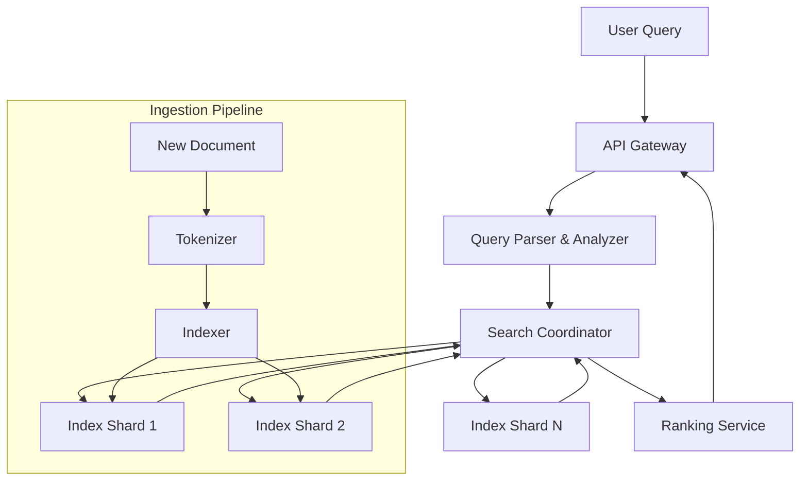

# Designing a Text-based Search Engine

A text-based search engine (like the search bar in Gmail, Slack, or an e-commerce site) is a common system design problem that tests your knowledge of indexing, ranking, and distributed systems.

## 1. Requirements

### Functional
- Given a text query, return a ranked list of matching documents.
- Support multi-word queries, partial matches, and typo tolerance.

### Non-Functional
- **Low latency**: Results in under 200ms.
- **Scalability**: Index billions of documents across many machines.
- **Freshness**: Newly added documents should be searchable within seconds.

## 2. Core Concept: Inverted Index

The heart of every search engine is the **Inverted Index**. Instead of mapping `Document -> Words`, it maps `Word -> List of Documents`.

| Term       | Posting List (Document IDs) |
|------------|-----------------------------|
| distributed| [1, 5, 42, 99]              |
| cache      | [1, 12, 42]                 |
| design     | [1, 5, 12, 42, 99, 150]    |

**Query "distributed cache"**: Intersect posting lists for "distributed" and "cache" -> `[1, 42]`.

## 3. Architecture



## 4. Key Components

### Query Analyzer
- **Tokenization**: Split "Hello World" into ["hello", "world"].
- **Lowercasing, Stemming**: "Running" -> "run".
- **Stop Word Removal**: Remove "the", "is", "a".

### Sharding the Index
- The inverted index is too large for one machine. Shard by **document ID** (each shard holds a complete inverted index for a subset of documents) or by **term** (each shard is responsible for certain terms).
- Document-based sharding is more common because it allows each shard to independently score documents.

### Ranking (TF-IDF / BM25)
- **TF (Term Frequency)**: How often does the term appear in this specific document? More = more relevant.
- **IDF (Inverse Document Frequency)**: How rare is this term across all documents? Rarer terms are more significant.
- **BM25**: The industry-standard ranking formula that combines TF and IDF with document length normalization.

## 5. Optimizations
- **Bloom Filters** on each shard: Quickly reject shards that definitely don't contain the query terms, saving network hops.
- **Caching**: Cache results for the most popular queries in Redis.
- **Prefix Tries / N-grams**: For autocomplete and typo-tolerance features.

## 6. Data Model / Schema

```sql
CREATE TABLE documents (
    doc_id      BIGSERIAL PRIMARY KEY,
    title       TEXT,
    body        TEXT,
    url         VARCHAR(2048),
    created_at  TIMESTAMP DEFAULT NOW(),
    word_count  INT
);

CREATE TABLE inverted_index (
    term        VARCHAR(128) NOT NULL,
    doc_id      BIGINT NOT NULL REFERENCES documents(doc_id),
    tf          FLOAT NOT NULL,      -- term frequency in this doc
    positions   INT[],               -- positions of term in doc body
    PRIMARY KEY (term, doc_id)
);

CREATE TABLE term_stats (
    term        VARCHAR(128) PRIMARY KEY,
    doc_freq    INT NOT NULL         -- number of docs containing this term
);
```

## 7. Design Choices

| Decision | Choice | Why |
|----------|--------|-----|
| Index sharding | By document ID | Each shard has a complete inverted index for its docs; can independently compute BM25 scores |
| Ranking | BM25 | Industry standard; better than raw TF-IDF because it saturates TF and normalizes for document length |
| Real-time indexing | Async pipeline via Kafka | Decouples document ingestion from index updates; handles spikes gracefully |
| Typo tolerance | Edit distance with BK-Tree | Finds candidate corrections within edit distance 2 efficiently |

---

## Quiz

import MCQ from '@/components/mcq/MCQ'

<MCQ
  question="In a text-based search engine, what is the primary data structure that enables fast full-text search?"
  options={[
    "B+ Tree",
    "Hash Table",
    "Inverted Index",
    "Red-Black Tree"
  ]}
  correctAnswerIndex={2}
  explanation="An Inverted Index maps each unique term to the list of documents containing that term. This allows the search engine to quickly find all documents matching a query term without scanning every document."
/>

<MCQ
  question="Why is IDF (Inverse Document Frequency) important in ranking search results?"
  options={[
    "It measures how fast the search query was processed.",
    "It penalizes common words (like 'the') and boosts rare, more discriminative terms.",
    "It counts how many shards contain the term.",
    "It determines how many results to return."
  ]}
  correctAnswerIndex={1}
  explanation="IDF gives higher weight to terms that appear in fewer documents, because they are more discriminative. The word 'the' appears in almost every document and provides no ranking signal, while a rare term like 'kubernetes' is very specific and should boost the relevance of documents containing it."
/>

<MCQ
  question="A search engine shards its index by document ID across 10 nodes. When a user searches for 'distributed cache', what happens?"
  options={[
    "Only one shard processes the query.",
    "The coordinator sends the query to all 10 shards in parallel, each returns its top-K results, and the coordinator merges and re-ranks them globally.",
    "The coordinator looks up which shard owns the term 'distributed' and queries only that shard.",
    "The query is processed sequentially across all 10 shards."
  ]}
  correctAnswerIndex={1}
  explanation="With document-based sharding, every shard has a portion of the documents. The coordinator fans out the query to all shards, each independently scores its documents using BM25, returns top-K, and the coordinator merges results using a global top-K merge."
/>
