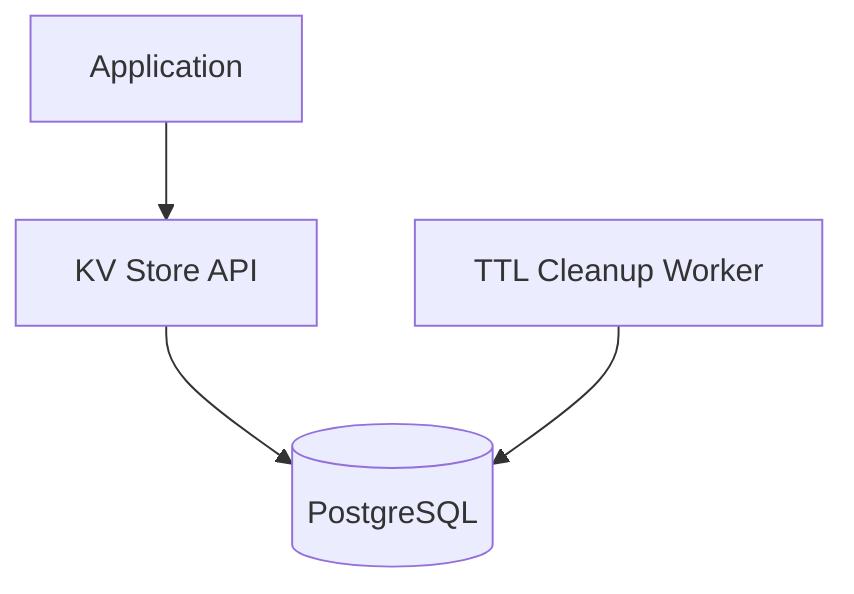

# Designing a SQL-backed KV Store

## 1. Requirements

### Functional
- `GET(key)` — retrieve value by key
- `PUT(key, value)` — insert or update
- `DELETE(key)` — remove a key
- Optional: TTL (auto-expiry), namespace/prefix support

### Non-Functional
- ACID guarantees
- 10K-50K ops/sec (moderate throughput)
- Leverage existing PostgreSQL infrastructure

## 2. High-Level Architecture



## 3. Core Implementation

### Schema

```sql
CREATE TABLE kv_store (
    namespace   VARCHAR(64) NOT NULL DEFAULT 'default',
    key         VARCHAR(512) NOT NULL,
    value       BYTEA,
    version     BIGINT DEFAULT 1,
    expires_at  TIMESTAMP,
    created_at  TIMESTAMP DEFAULT NOW(),
    updated_at  TIMESTAMP DEFAULT NOW(),
    PRIMARY KEY (namespace, key)
);

CREATE INDEX idx_kv_expires ON kv_store (expires_at)
    WHERE expires_at IS NOT NULL;
```

### API Implementation

```python
class SQLKVStore:
    def __init__(self, db):
        self.db = db

    def get(self, key, namespace='default'):
        row = self.db.execute("""
            SELECT value, version FROM kv_store
            WHERE namespace = %s AND key = %s
              AND (expires_at IS NULL OR expires_at > NOW())
        """, namespace, key)
        return row if row else None

    def put(self, key, value, namespace='default', ttl_seconds=None):
        expires = None
        if ttl_seconds:
            expires = f"NOW() + INTERVAL '{ttl_seconds} seconds'"
        self.db.execute(f"""
            INSERT INTO kv_store (namespace, key, value, expires_at)
            VALUES (%s, %s, %s, {expires or 'NULL'})
            ON CONFLICT (namespace, key) DO UPDATE SET
                value = EXCLUDED.value,
                version = kv_store.version + 1,
                updated_at = NOW(),
                expires_at = EXCLUDED.expires_at
        """, namespace, key, value)

    def delete(self, key, namespace='default'):
        self.db.execute("""
            DELETE FROM kv_store
            WHERE namespace = %s AND key = %s
        """, namespace, key)

    def compare_and_swap(self, key, expected_version, new_value,
                         namespace='default'):
        result = self.db.execute("""
            UPDATE kv_store
            SET value = %s, version = version + 1, updated_at = NOW()
            WHERE namespace = %s AND key = %s AND version = %s
            RETURNING version
        """, new_value, namespace, key, expected_version)
        return result is not None  # True if CAS succeeded
```

## 4. Design Choices

| Decision | Choice | Why |
|----------|--------|-----|
| Upsert | `INSERT ... ON CONFLICT DO UPDATE` | Atomic PUT without needing separate INSERT/UPDATE logic |
| Versioning | Auto-incrementing `version` column | Enables CAS (Compare-and-Swap) for optimistic concurrency |
| TTL cleanup | Background worker runs `DELETE WHERE expires_at < NOW()` | Lazy deletion on GET + periodic batch cleanup |
| Namespaces | Composite primary key (namespace, key) | Multi-tenant isolation without separate tables |

## 5. Scope for Improvement
- Partitioning by namespace for multi-tenant scale
- Read replicas for read-heavy workloads
- Caching hot keys in Redis as a write-through cache

---

## Quiz

import MCQ from '@/components/mcq/MCQ'

<MCQ
  question="Why use `ON CONFLICT DO UPDATE` instead of a separate SELECT + INSERT/UPDATE?"
  options={[
    "It is syntactically shorter.",
    "It is atomic — there is no race condition window between checking if the key exists and inserting/updating it. A separate SELECT then INSERT could fail under concurrent writes.",
    "It is faster because it skips the WHERE clause.",
    "PostgreSQL requires it for primary key tables."
  ]}
  correctAnswerIndex={1}
  explanation="Without upsert, two concurrent PUT operations for the same key could both SELECT (find nothing) and both INSERT, causing a primary key violation. The atomic upsert eliminates this race condition."
/>

<MCQ
  question="What is Compare-and-Swap (CAS) and when would you use it in the KV store?"
  options={[
    "CAS encrypts the value before storing.",
    "CAS updates the value only if the current version matches the expected version. It prevents lost updates when two clients read the same key, modify it, and write back — only the first write succeeds.",
    "CAS swaps keys between two namespaces.",
    "CAS compresses the value."
  ]}
  correctAnswerIndex={1}
  explanation="CAS is optimistic concurrency control. Client A reads key='config' at version 5, modifies it, and writes with expected_version=5. If Client B wrote in between (bumping version to 6), Client A's CAS fails and must re-read and retry."
/>
