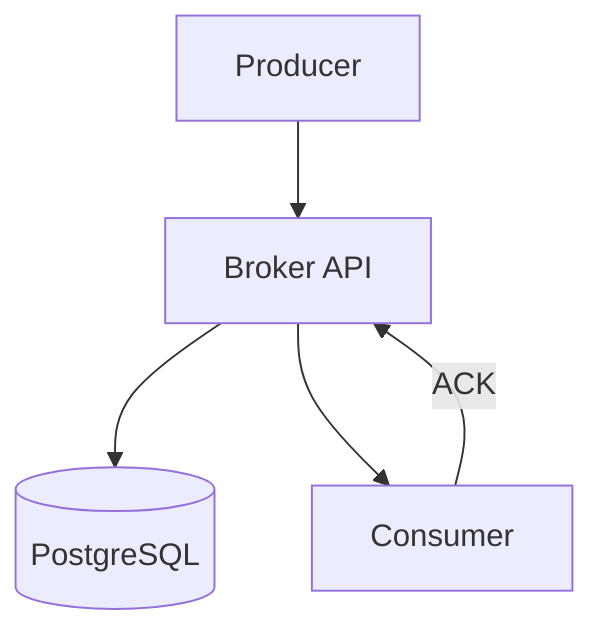

# Designing a SQL-backed Message Broker

## 1. Requirements

### Functional
- Produce messages to named queues
- Consume messages with at-least-once delivery
- Message acknowledgment (ack/nack)
- Dead letter queue for failed messages
- FIFO ordering within a queue

### Non-Functional
- Durable (messages survive broker restarts)
- Moderate throughput (10K msgs/sec)
- Simple operations (no Kafka/RabbitMQ infrastructure needed)

## 2. High-Level Architecture



## 3. Core Implementation

### Database Schema

```sql
CREATE TABLE messages (
    id          BIGSERIAL PRIMARY KEY,
    queue_name  VARCHAR(255) NOT NULL,
    payload     JSONB NOT NULL,
    status      VARCHAR(20) DEFAULT 'pending',  -- pending, processing, done, failed
    created_at  TIMESTAMP DEFAULT NOW(),
    locked_by   VARCHAR(255),
    locked_until TIMESTAMP,
    retry_count INT DEFAULT 0,
    max_retries INT DEFAULT 3
);

CREATE INDEX idx_messages_fetch ON messages (queue_name, status, id)
    WHERE status = 'pending';
```

### Broker Logic

```python
import datetime

class SQLBroker:
    def __init__(self, db):
        self.db = db

    def publish(self, queue_name, payload):
        self.db.execute(
            "INSERT INTO messages (queue_name, payload) VALUES (%s, %s)",
            queue_name, payload
        )

    def consume(self, queue_name, consumer_id, lock_duration_sec=60):
        # Atomically claim the next pending message
        row = self.db.execute("""
            UPDATE messages
            SET status = 'processing',
                locked_by = %s,
                locked_until = NOW() + INTERVAL '%s seconds'
            WHERE id = (
                SELECT id FROM messages
                WHERE queue_name = %s
                  AND status = 'pending'
                ORDER BY id ASC
                LIMIT 1
                FOR UPDATE SKIP LOCKED
            )
            RETURNING *
        """, consumer_id, lock_duration_sec, queue_name)
        return row

    def ack(self, message_id):
        self.db.execute(
            "UPDATE messages SET status = 'done' WHERE id = %s",
            message_id
        )

    def nack(self, message_id):
        self.db.execute("""
            UPDATE messages SET
                status = CASE
                    WHEN retry_count >= max_retries THEN 'failed'
                    ELSE 'pending'
                END,
                retry_count = retry_count + 1,
                locked_by = NULL,
                locked_until = NULL
            WHERE id = %s
        """, message_id)
```

## 4. Design Choices

| Decision | Choice | Why |
|----------|--------|-----|
| Locking | `FOR UPDATE SKIP LOCKED` | PostgreSQL-native row-level locking; multiple consumers can poll concurrently without blocking each other |
| Ordering | `ORDER BY id ASC` | BIGSERIAL ID guarantees FIFO |
| Timeout | `locked_until` timestamp | If a consumer crashes, the lock expires and the message becomes available again |
| Dead letter | `status = 'failed'` after max retries | Failed messages are preserved for debugging without blocking the queue |

## 5. Scope for Improvement
- Partition by queue_name for horizontal scaling
- NOTIFY/LISTEN for push-based consumption instead of polling
- Archive old `done` messages to cold storage

---

## Quiz

import MCQ from '@/components/mcq/MCQ'

<MCQ
  question="What does `FOR UPDATE SKIP LOCKED` do in the consume query?"
  options={[
    "It locks the entire table.",
    "It locks the selected row for the current transaction. If another consumer runs the same query, it skips already-locked rows and picks the next available one — enabling parallel consumption without conflicts.",
    "It skips the update if the row is already pending.",
    "It deletes locked rows."
  ]}
  correctAnswerIndex={1}
  explanation="SKIP LOCKED is the key to concurrent consumers. Without it, consumers would block each other waiting for the same row. With it, each consumer atomically claims a different message."
/>

<MCQ
  question="Why is a SQL-backed message broker preferred over Kafka in some situations?"
  options={[
    "SQL databases are faster than Kafka.",
    "When the team already runs PostgreSQL and needs simple queuing (< 10K msgs/sec), adding Kafka's operational complexity (ZooKeeper, topic management, consumer groups) is overkill.",
    "SQL databases support more programming languages.",
    "Kafka cannot store messages."
  ]}
  correctAnswerIndex={1}
  explanation="For moderate throughput needs, a SQL-backed broker eliminates the operational overhead of running a separate Kafka cluster. PostgreSQL is already reliable, ACID-compliant, and monitored — adding a messages table is trivial."
/>
