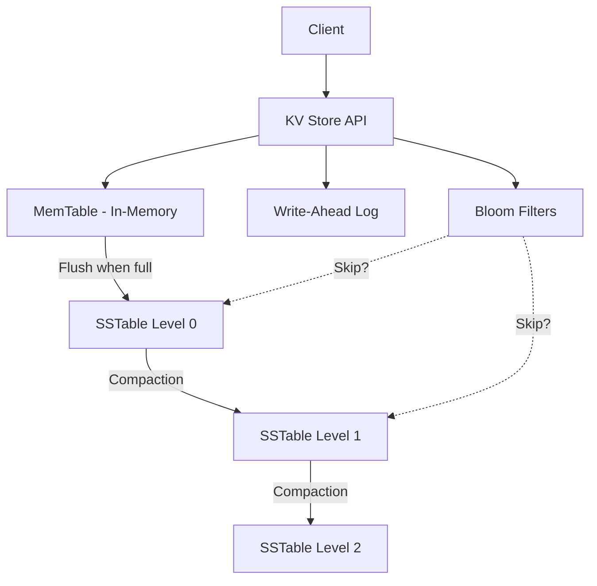

# Designing a Superfast KV Store

## 1. Requirements

### Functional
- `put(key, value)` — store a key-value pair
- `get(key)` — retrieve a value by key
- `delete(key)` — remove a key-value pair
- Support values up to 1MB

### Non-Functional
- p99 read latency < 1ms
- p99 write latency < 5ms
- Handle 1M+ ops/sec
- Data must survive process restarts

## 2. High-Level Architecture



## 3. Core Implementation

```python
import time, hashlib, bisect

class MemTable:
    """Sorted in-memory buffer using a balanced BST (simplified as sorted list)."""
    def __init__(self, max_size=1_000_000):
        self.data = {}   # key -> (value, timestamp)
        self.max_size = max_size

    def put(self, key, value):
        self.data[key] = (value, time.time())

    def get(self, key):
        entry = self.data.get(key)
        return entry[0] if entry else None

    def is_full(self):
        return len(self.data) >= self.max_size

    def flush_to_sstable(self):
        sorted_data = sorted(self.data.items())
        self.data.clear()
        return sorted_data  # write to disk as SSTable


class KVStore:
    def __init__(self):
        self.memtable = MemTable()
        self.wal = []       # write-ahead log (simplified)
        self.sstables = []  # list of flushed SSTables

    def put(self, key, value):
        self.wal.append(('PUT', key, value))
        self.memtable.put(key, value)
        if self.memtable.is_full():
            sstable = self.memtable.flush_to_sstable()
            self.sstables.append(sstable)

    def get(self, key):
        # Check MemTable first (fastest)
        result = self.memtable.get(key)
        if result is not None:
            return result
        # Check SSTables from newest to oldest
        for sstable in reversed(self.sstables):
            result = self._binary_search(sstable, key)
            if result is not None:
                return result
        return None

    def _binary_search(self, sstable, key):
        keys = [entry[0] for entry in sstable]
        idx = bisect.bisect_left(keys, key)
        if idx < len(keys) and keys[idx] == key:
            return sstable[idx][1][0]
        return None
```

## 4. Design Choices

| Decision | Choice | Why |
|----------|--------|-----|
| Write path | MemTable + WAL + LSM Tree | Converts random writes to sequential writes; WAL ensures durability |
| Read path | MemTable -> Bloom Filter -> SSTables | Bloom filter skips SSTables that definitely don't contain the key |
| Compaction | Leveled compaction | Limits read amplification by ensuring non-overlapping key ranges at each level |
| Encoding | Variable-length prefix compression | Keys in an SSTable often share prefixes; compress them |

## 5. Scope for Improvement
- Block cache for hot SSTable blocks
- Rate-limited compaction to avoid I/O spikes
- Range queries using SSTable iterators

---

## Quiz

import MCQ from '@/components/mcq/MCQ'

<MCQ
  question="Why does the KV store check the MemTable before the SSTables during a read?"
  options={[
    "The MemTable is alphabetically sorted.",
    "The MemTable contains the most recent writes. Since newer data overwrites older data, checking it first ensures we return the latest value.",
    "SSTables don't support read operations.",
    "The MemTable is compressed for faster access."
  ]}
  correctAnswerIndex={1}
  explanation="The MemTable holds all recent writes that haven't been flushed yet. Since a key might have been written to the MemTable after being flushed to an SSTable, always check the MemTable first for the freshest data."
/>

<MCQ
  question="What is 'write amplification' in an LSM Tree-based KV store?"
  options={[
    "Writing data takes more CPU cycles than reading.",
    "Each piece of data is written to disk multiple times: once to WAL, once to SSTable Level 0, and again during each level of compaction.",
    "The write buffer is too large.",
    "Multiple clients write the same key simultaneously."
  ]}
  correctAnswerIndex={1}
  explanation="A single logical write can result in 10-30x actual disk writes due to WAL logging, MemTable flush, and multiple rounds of compaction. This is the primary trade-off of LSM Trees: fast ingestion at the cost of background write amplification."
/>

<MCQ
  question="RocksDB (used by Facebook) uses a 'Block Cache' to speed up reads. What does it cache?"
  options={[
    "The entire MemTable.",
    "Frequently accessed SSTable data blocks in RAM, avoiding repeated disk reads for hot keys.",
    "The WAL entries.",
    "Network packets."
  ]}
  correctAnswerIndex={1}
  explanation="SSTables are stored on disk. The block cache keeps recently/frequently accessed SSTable blocks in memory, providing in-memory read performance for hot data without storing the entire database in RAM."
/>
