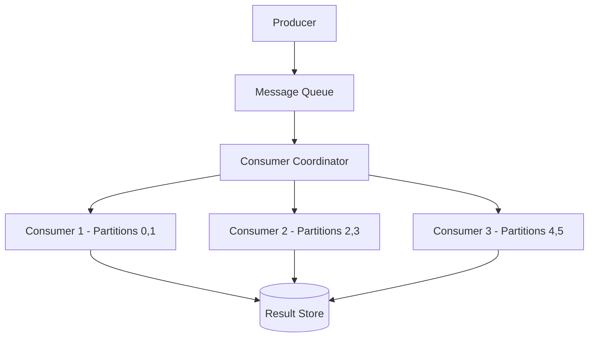

# Designing Synchronized Queue Consumers

## 1. Requirements

### Functional
- Multiple consumer instances process messages from a shared queue
- Each message is processed by exactly one consumer (no duplicates)
- Maintain ordering within logical partitions
- Handle consumer failures gracefully (rebalance work)

### Non-Functional
- Scale consumers horizontally as load increases
- At-least-once processing guarantee
- Minimal coordination overhead between consumers

## 2. High-Level Architecture



## 3. Core Implementation

```python
import threading
import time
from collections import defaultdict

class ConsumerCoordinator:
    def __init__(self, num_partitions):
        self.num_partitions = num_partitions
        self.consumers = {}          # consumer_id -> set of partitions
        self.heartbeats = {}         # consumer_id -> last_heartbeat
        self.lock = threading.Lock()
        self.heartbeat_timeout = 10  # seconds

    def register(self, consumer_id):
        with self.lock:
            self.consumers[consumer_id] = set()
            self.heartbeats[consumer_id] = time.time()
            self._rebalance()

    def deregister(self, consumer_id):
        with self.lock:
            del self.consumers[consumer_id]
            del self.heartbeats[consumer_id]
            self._rebalance()

    def heartbeat(self, consumer_id):
        self.heartbeats[consumer_id] = time.time()

    def _rebalance(self):
        """Assign partitions evenly across active consumers."""
        active = list(self.consumers.keys())
        if not active:
            return
        for cid in active:
            self.consumers[cid] = set()
        for p in range(self.num_partitions):
            owner = active[p % len(active)]
            self.consumers[owner].add(p)

    def check_health(self):
        now = time.time()
        dead = [cid for cid, ts in self.heartbeats.items()
                if now - ts > self.heartbeat_timeout]
        if dead:
            with self.lock:
                for cid in dead:
                    del self.consumers[cid]
                    del self.heartbeats[cid]
                self._rebalance()


class Consumer:
    def __init__(self, consumer_id, coordinator, queue):
        self.id = consumer_id
        self.coordinator = coordinator
        self.queue = queue
        self.offsets = defaultdict(int)

    def poll(self):
        partitions = self.coordinator.consumers.get(self.id, set())
        messages = []
        for p in partitions:
            msgs = self.queue.read(p, self.offsets[p], batch_size=10)
            messages.extend(msgs)
            self.offsets[p] += len(msgs)
        self.coordinator.heartbeat(self.id)
        return messages
```

## 4. Design Choices

| Decision | Choice | Why |
|----------|--------|-----|
| Partition assignment | Round-robin across consumers | Simple, even distribution; same approach as Kafka consumer groups |
| Failure detection | Heartbeat with timeout | If a consumer stops sending heartbeats, its partitions are reassigned |
| Rebalancing | Stop-the-world rebalance | Simple but causes brief pause; Kafka uses cooperative rebalancing to minimize disruption |
| Ordering | Per-partition ordering | Messages within a partition are processed in order; global ordering would prevent parallelism |

## 5. Scope for Improvement
- Cooperative (incremental) rebalancing to avoid stop-the-world pauses
- Sticky assignment (minimize partition movement during rebalance)
- Consumer lag monitoring and auto-scaling

---

## Quiz

import MCQ from '@/components/mcq/MCQ'

<MCQ
  question="You have 6 partitions and 3 consumers. Consumer 2 crashes. What happens?"
  options={[
    "Messages on Consumer 2's partitions are lost.",
    "The coordinator detects the missed heartbeat, removes Consumer 2, and rebalances: Consumer 1 gets partitions 0,1,2 and Consumer 3 gets partitions 3,4,5.",
    "All consumers restart from the beginning.",
    "The producer stops sending messages."
  ]}
  correctAnswerIndex={1}
  explanation="The coordinator's health check detects Consumer 2's missed heartbeat. It removes Consumer 2 and redistributes its partitions (2,3) among the remaining consumers. Messages are replayed from the last committed offset."
/>

<MCQ
  question="Why is it important that each partition is assigned to exactly one consumer in a group?"
  options={[
    "To save bandwidth.",
    "If two consumers process the same partition, messages would be processed twice (violating exactly-once semantics) and ordering within the partition would be lost.",
    "Databases don't support concurrent writes.",
    "It's not important — multiple consumers per partition is fine."
  ]}
  correctAnswerIndex={1}
  explanation="Single-consumer-per-partition ensures both ordering and no-duplicate-processing guarantees. If you need more parallelism, add more partitions — not more consumers per partition."
/>
