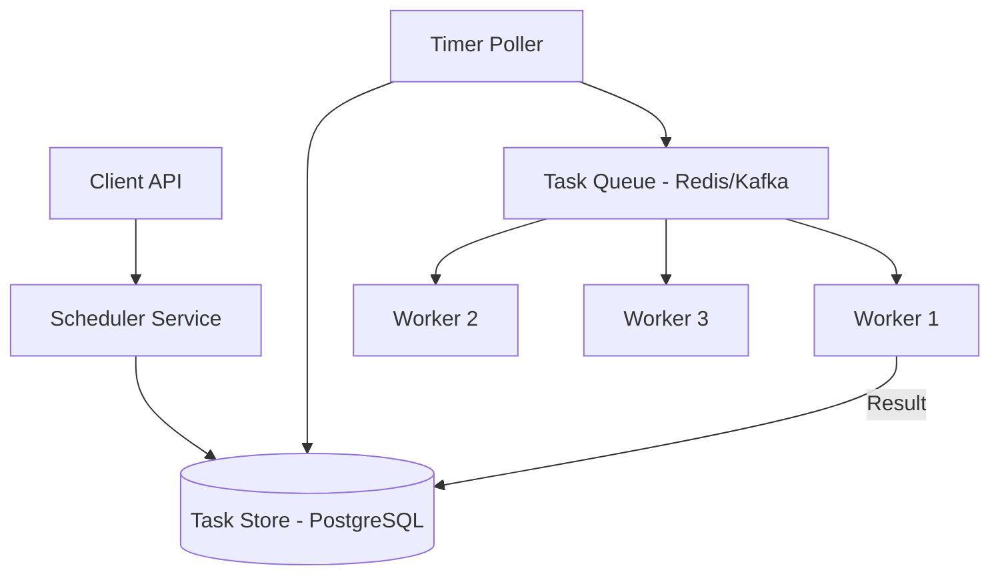

# Designing a Distributed Task Scheduler

## 1. Requirements

### Functional
- Schedule tasks to run at a specific time or on a recurring schedule (cron)
- Distribute task execution across worker nodes
- Retry failed tasks with exponential backoff
- Guarantee at-least-once execution

### Non-Functional
- Handle millions of scheduled tasks
- Accurate timing (execute within 1 second of scheduled time)
- Fault-tolerant (no task lost if a worker dies)

## 2. High-Level Architecture



## 3. Core Implementation

```python
import time, heapq
from threading import Thread

class TaskScheduler:
    def __init__(self):
        self.task_heap = []  # min-heap by execution_time
        self.task_store = {}

    def schedule(self, task_id, execute_at, callback, max_retries=3):
        task = {
            'id': task_id,
            'execute_at': execute_at,
            'callback': callback,
            'retries': 0,
            'max_retries': max_retries,
            'status': 'scheduled'
        }
        self.task_store[task_id] = task
        heapq.heappush(self.task_heap, (execute_at, task_id))

    def run_poller(self):
        while True:
            now = time.time()
            while self.task_heap and self.task_heap[0][0] <= now:
                _, task_id = heapq.heappop(self.task_heap)
                task = self.task_store.get(task_id)
                if task and task['status'] == 'scheduled':
                    self._execute(task)
            time.sleep(0.1)

    def _execute(self, task):
        try:
            task['status'] = 'running'
            task['callback']()
            task['status'] = 'completed'
        except Exception:
            task['retries'] += 1
            if task['retries'] <= task['max_retries']:
                backoff = 2 ** task['retries']
                task['execute_at'] = time.time() + backoff
                task['status'] = 'scheduled'
                heapq.heappush(self.task_heap,
                    (task['execute_at'], task['id']))
            else:
                task['status'] = 'failed'
```

### Database Schema

```sql
CREATE TABLE scheduled_tasks (
    id          UUID PRIMARY KEY,
    execute_at  TIMESTAMP NOT NULL,
    payload     JSONB,
    status      VARCHAR(20) DEFAULT 'scheduled',
    retries     INT DEFAULT 0,
    max_retries INT DEFAULT 3,
    worker_id   VARCHAR(255),
    created_at  TIMESTAMP DEFAULT NOW()
);

CREATE INDEX idx_tasks_due ON scheduled_tasks (execute_at)
    WHERE status = 'scheduled';
```

## 4. Design Choices

| Decision | Choice | Why |
|----------|--------|-----|
| Task discovery | Poller queries DB every second for due tasks | Simple, reliable; database is the source of truth |
| Distribution | Push due tasks to a queue; workers pull | Decouples scheduling from execution; workers scale independently |
| Exactly-once | Claim task with `FOR UPDATE SKIP LOCKED` | Prevents two workers from executing the same task |
| Retry | Exponential backoff (2^retries seconds) | Avoids hammering a failing downstream service |

---

## Quiz

import MCQ from '@/components/mcq/MCQ'

<MCQ
  question="Why use a min-heap for the task scheduler's in-memory data structure?"
  options={[
    "Min-heaps sort data alphabetically.",
    "The task with the earliest execution time is always at the top (O(1) peek). Polling only needs to check the top element to decide if anything is due.",
    "Min-heaps use less memory than arrays.",
    "Min-heaps support string keys."
  ]}
  correctAnswerIndex={1}
  explanation="A min-heap ordered by execute_at time gives O(1) access to the next due task and O(log N) insertion. The poller peeks at the top — if it's not due yet, nothing is, and we can sleep."
/>

<MCQ
  question="A worker picks up a task but crashes before completing it. How is this handled?"
  options={[
    "The task is lost forever.",
    "The task has a lock timeout (e.g., locked_until timestamp). If the worker doesn't ack within the timeout, the task reverts to 'scheduled' and another worker picks it up.",
    "All tasks are re-run from the beginning.",
    "The client must re-submit the task manually."
  ]}
  correctAnswerIndex={1}
  explanation="Each claimed task has a locked_until timestamp. A background sweeper checks for tasks where locked_until has passed but status is still 'running', and resets them to 'scheduled' for reprocessing."
/>
