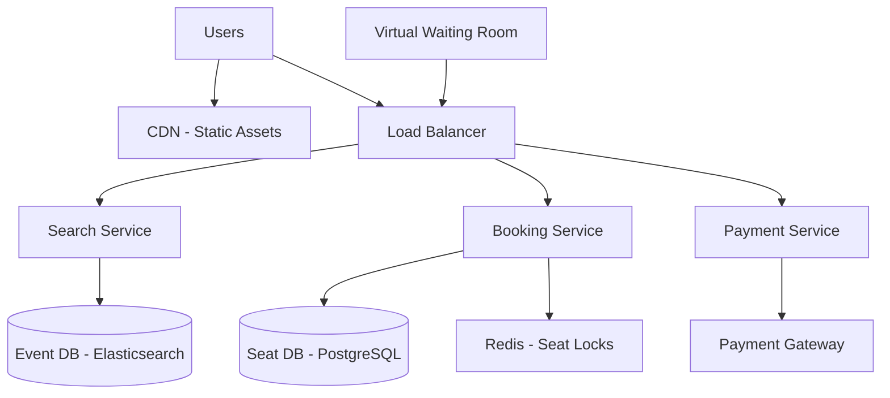

# Design Ticketmaster

## 1. Requirements

### Functional
- Browse events (concerts, sports) with search and filters
- View venue seat map and select seats
- Reserve seats temporarily during checkout (hold for 10 minutes)
- Complete purchase (integrate with payment gateway)
- Prevent double-booking of the same seat

### Non-Functional
- Handle extreme traffic spikes (e.g., Taylor Swift concert: 14 million users in queue)
- Strong consistency for seat reservations
- Low latency for seat availability checks

## 2. High-Level Architecture



## 3. Core Implementation

```python
import time
import uuid

class TicketBookingService:
    def __init__(self, db, lock_store):
        self.db = db
        self.lock = lock_store
        self.hold_duration = 600  # 10 minutes

    def get_available_seats(self, event_id, section=None):
        query = """
            SELECT seat_id, section, row, number, price
            FROM seats
            WHERE event_id = %s AND status = 'available'
        """
        if section:
            query += " AND section = %s"
            return self.db.execute(query, event_id, section)
        return self.db.execute(query, event_id)

    def hold_seats(self, event_id, seat_ids, user_id):
        reservation_id = str(uuid.uuid4())
        held = []

        for seat_id in seat_ids:
            lock_key = f"seat:{event_id}:{seat_id}"
            acquired = self.lock.set(
                lock_key, reservation_id,
                nx=True, ex=self.hold_duration)

            if not acquired:
                self._release_held(event_id, held, reservation_id)
                raise Exception(f"Seat {seat_id} is already held")

            self.db.execute("""
                UPDATE seats SET status = 'held',
                    held_by = %s, held_until = NOW() + INTERVAL '10 min'
                WHERE event_id = %s AND seat_id = %s
                  AND status = 'available'
            """, reservation_id, event_id, seat_id)
            held.append(seat_id)

        return reservation_id

    def confirm_purchase(self, reservation_id, payment_token):
        # Verify payment
        payment_ok = self._process_payment(payment_token)
        if not payment_ok:
            raise Exception("Payment failed")

        # Mark seats as sold
        self.db.execute("""
            UPDATE seats SET status = 'sold'
            WHERE held_by = %s
        """, reservation_id)

        return {"status": "confirmed", "reservation": reservation_id}

    def _release_held(self, event_id, seat_ids, reservation_id):
        for sid in seat_ids:
            self.lock.delete(f"seat:{event_id}:{sid}")
            self.db.execute("""
                UPDATE seats SET status = 'available',
                    held_by = NULL, held_until = NULL
                WHERE event_id = %s AND seat_id = %s
                  AND held_by = %s
            """, event_id, sid, reservation_id)
```

## 4. Design Choices

| Decision | Choice | Why |
|----------|--------|-----|
| Seat lock | Redis SETNX with TTL | Atomic, distributed lock with automatic expiry. If user abandons checkout, lock auto-releases |
| Virtual queue | Waiting room during surges | Instead of letting 14M users hit the booking API simultaneously, a queue meters traffic at controlled rate |
| Consistency | Pessimistic lock on seat row | Prevents two users from reserving the same seat |
| Search | Elasticsearch for events | Full-text search with geo-filtering and faceted browsing |

## 5. Scope for Improvement
- Dynamic pricing based on demand
- Fraud detection (bot prevention, CAPTCHA)
- Waitlist for sold-out events with auto-notification

---

## Quiz

import MCQ from '@/components/mcq/MCQ'

<MCQ
  question="14 million users try to buy Taylor Swift tickets at the same time. How does a virtual waiting room help?"
  options={[
    "It blocks all users equally.",
    "It assigns each user a random position in a queue and lets users through at a controlled rate (e.g., 10,000/min). This prevents the backend from being overwhelmed while providing a fair ordering.",
    "It redirects users to a different website.",
    "It increases server capacity automatically."
  ]}
  correctAnswerIndex={1}
  explanation="A virtual waiting room absorbs the traffic spike. Users see their position and estimated wait time. The system admits users at a rate the booking backend can handle, preventing crashes and ensuring fairness."
/>

<MCQ
  question="Why use Redis SETNX with TTL for seat holds instead of a database lock?"
  options={[
    "Redis is free.",
    "SETNX is atomic and the TTL auto-releases the hold if the user abandons checkout. A database lock would require a separate cleanup job and risks holding connections open.",
    "Redis is the only distributed system that supports locks.",
    "Database locks don't support TTL."
  ]}
  correctAnswerIndex={1}
  explanation="Redis SETNX provides an atomic 'lock only if not locked' operation. The TTL ensures automatic cleanup — no abandoned carts holding seats forever. This is much simpler than managing database-level pessimistic locks with timeout logic."
/>
