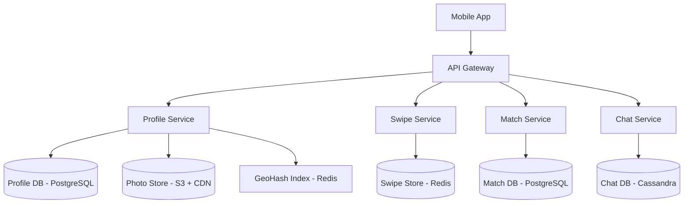

# Design Tinder

## 1. Requirements

### Functional
- User creates a profile with photos and preferences (age range, distance, gender)
- Swipe right (like) or left (pass) on profiles
- Mutual like triggers a "match" and opens a chat
- Show profiles within a distance radius

### Non-Functional
- Low latency card loading (< 200ms to load next batch)
- Handle 50M+ daily active users
- Geospatial queries for nearby users

## 2. High-Level Architecture



## 3. Core Implementation

```python
class RecommendationEngine:
    def __init__(self, profile_db, swipe_store, geo_index):
        self.profile_db = profile_db
        self.swipe_store = swipe_store
        self.geo = geo_index

    def get_feed(self, user_id, limit=20):
        user = self.profile_db.get(user_id)

        # Step 1: Find nearby users using GeoHash
        nearby_ids = self.geo.georadius(
            user['location'], user['max_distance_km'])

        # Step 2: Filter by preferences
        candidates = self.profile_db.filter(
            ids=nearby_ids,
            gender=user['preferred_gender'],
            age_min=user['age_min'],
            age_max=user['age_max'],
            active_within_hours=24
        )

        # Step 3: Remove already swiped users
        swiped = self.swipe_store.smembers(f"swiped:{user_id}")
        unseen = [c for c in candidates if c['id'] not in swiped]

        # Step 4: Rank by compatibility score
        ranked = sorted(unseen,
            key=lambda c: self._score(user, c), reverse=True)

        return ranked[:limit]

    def _score(self, user, candidate):
        distance_score = 1.0 / (1 + candidate['distance_km'])
        activity_score = 1.0 if candidate['active_recently'] else 0.5
        common_interests = len(
            set(user['interests']) & set(candidate['interests']))
        return distance_score + activity_score + common_interests * 0.3


class SwipeService:
    def __init__(self, swipe_store, match_db):
        self.store = swipe_store
        self.match_db = match_db

    def swipe(self, user_id, target_id, direction):
        # Record the swipe
        self.store.sadd(f"swiped:{user_id}", target_id)

        if direction == 'right':
            self.store.sadd(f"likes:{user_id}", target_id)
            # Check if mutual like
            if self.store.sismember(f"likes:{target_id}", user_id):
                self._create_match(user_id, target_id)
                return {"matched": True}
        return {"matched": False}

    def _create_match(self, user_a, user_b):
        self.match_db.insert({
            'user_a': user_a,
            'user_b': user_b,
            'matched_at': 'NOW()'
        })
```

## 4. Design Choices

| Decision | Choice | Why |
|----------|--------|-----|
| Swipe storage | Redis Sets | O(1) SISMEMBER for "did I already swipe?" and "did they like me?" checks |
| Location | Redis GeoHash (GEOADD/GEORADIUS) | Sub-millisecond radius search for nearby users |
| Photo storage | S3 + CDN | Large binary files served from edge locations for fast loading |
| Match detection | Check reverse like on every right-swipe | Instant match detection without batch processing |

## 5. Scope for Improvement
- Recommendation ML model (collaborative filtering)
- Pre-compute and cache feed batches
- Elo-like scoring for profile ranking

---

## Quiz

import MCQ from '@/components/mcq/MCQ'

<MCQ
  question="Tinder has 50M daily active users. If each user swipes 100 times/day, how many swipe records are created daily?"
  options={[
    "50 million",
    "500 million",
    "5 billion",
    "50 billion"
  ]}
  correctAnswerIndex={2}
  explanation="50M users * 100 swipes = 5 billion swipe records per day. This is why Redis Sets (in-memory, O(1) operations) are used instead of a relational database for swipe tracking."
/>

<MCQ
  question="How is match detection done efficiently?"
  options={[
    "A batch job runs every hour to find mutual likes.",
    "When User A swipes right on User B, immediately check if User B has already liked User A using SISMEMBER on Redis. If yes, it's a match.",
    "Both users must be online simultaneously.",
    "Matches are detected by the recommendation engine."
  ]}
  correctAnswerIndex={1}
  explanation="Redis SISMEMBER is O(1). When User A likes User B, checking likes:B for User A is instant. Matches are detected in real-time at swipe time, enabling immediate notification."
/>

<MCQ
  question="Why is the recommendation feed pre-computed in batches rather than generated on every app open?"
  options={[
    "Pre-computation is simpler to code.",
    "Computing the feed requires geo queries, preference filtering, and ranking across millions of profiles. Pre-computing and caching a batch of 100 profiles avoids doing this expensive computation on every request.",
    "Users don't need fresh profiles.",
    "Pre-computation uses less storage."
  ]}
  correctAnswerIndex={1}
  explanation="Generating a feed involves querying millions of nearby profiles, filtering by preferences, excluding already-swiped users, and ranking. Doing this on every app open would take seconds. Pre-computing batches and caching them makes the experience instant."
/>
