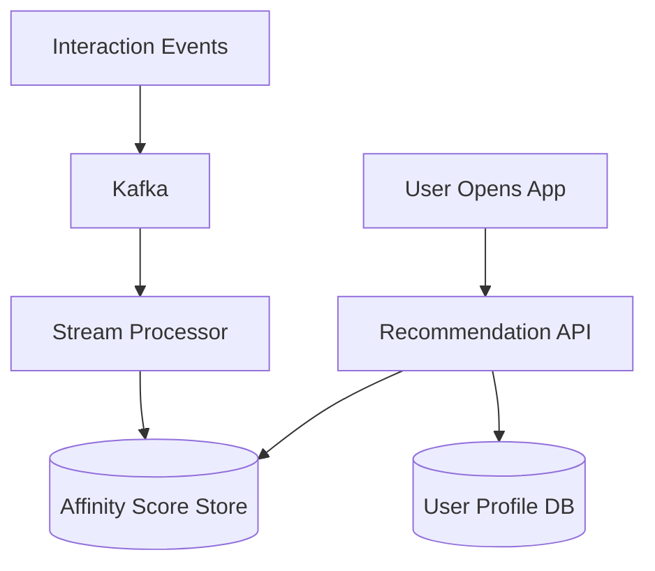

# Designing User Affinity

## 1. Requirements

### Functional
- Compute affinity scores between users based on interactions (likes, comments, messages, shared interests)
- Power features: "People You May Know", content ranking, friend suggestions
- Update scores as new interactions occur

### Non-Functional
- Scores must be pre-computed for low-latency serving (< 50ms)
- Handle billions of interaction events
- Incremental updates (don't recompute from scratch)

## 2. High-Level Architecture



## 3. Core Algorithm

```python
class AffinityCalculator:
    WEIGHTS = {
        'message': 5.0,
        'comment': 3.0,
        'like': 1.0,
        'profile_view': 0.5,
        'share': 4.0,
    }
    DECAY_FACTOR = 0.95  # daily decay

    def __init__(self):
        self.scores = {}  # (user_a, user_b) -> score

    def record_interaction(self, user_a, user_b, interaction_type):
        pair = tuple(sorted([user_a, user_b]))
        current = self.scores.get(pair, 0.0)
        weight = self.WEIGHTS.get(interaction_type, 1.0)
        self.scores[pair] = current + weight

    def get_affinity(self, user_a, user_b):
        pair = tuple(sorted([user_a, user_b]))
        return self.scores.get(pair, 0.0)

    def get_top_affinities(self, user_id, limit=10):
        results = []
        for (a, b), score in self.scores.items():
            if a == user_id:
                results.append((b, score))
            elif b == user_id:
                results.append((a, score))
        results.sort(key=lambda x: -x[1])
        return results[:limit]

    def apply_time_decay(self):
        for pair in self.scores:
            self.scores[pair] *= self.DECAY_FACTOR
```

## 4. Design Choices

| Decision | Choice | Why |
|----------|--------|-----|
| Score computation | Weighted sum with time decay | Recent interactions matter more; different actions have different signal strength |
| Storage | Pre-computed top-K per user in Redis | O(1) lookup at serving time; updated incrementally via stream processing |
| Event processing | Kafka + Flink | Real-time incremental updates as interactions happen |
| Decay | Exponential time decay | Gradually reduces old interaction scores so stale affinities fade out |

---

## Quiz

import MCQ from '@/components/mcq/MCQ'

<MCQ
  question="Why use time decay in affinity scores?"
  options={[
    "To save memory.",
    "So that a friendship from 5 years ago that has had no recent interaction doesn't rank higher than a current active friendship.",
    "To comply with data regulations.",
    "Time decay makes the algorithm faster."
  ]}
  correctAnswerIndex={1}
  explanation="Without decay, historical interactions accumulate indefinitely. A college roommate you haven't talked to in 10 years could outrank your current coworker. Exponential decay ensures recent interactions dominate the score."
/>

<MCQ
  question="For 500 million users, storing all pairwise affinity scores is infeasible. What optimization is used?"
  options={[
    "Store all pairs but compress them.",
    "Only store the top-K (e.g., top 500) affinities per user. Most pairs have zero or negligible affinity.",
    "Use a single global ranking.",
    "Compute affinities on-the-fly for every request."
  ]}
  correctAnswerIndex={1}
  explanation="500M users would produce 2.5 * 10^17 pairs — impossible to store. In practice, > 99.99% of pairs have zero interaction. Only maintain the top-K scores per user, evicting low-score entries."
/>
