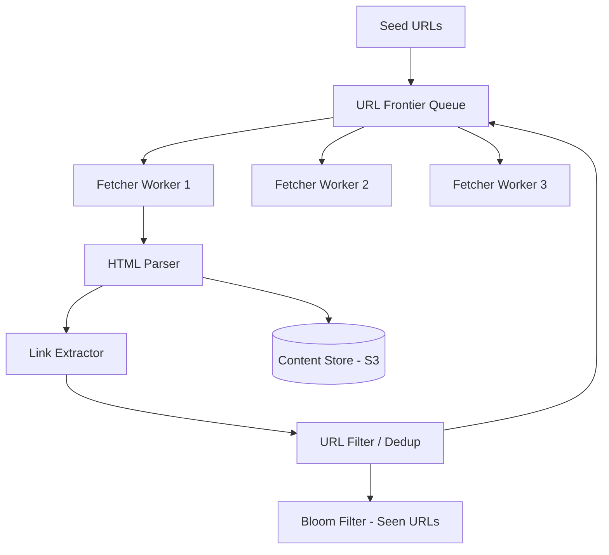

# Designing a Web Crawler

## 1. Requirements

### Functional
- Start from a set of seed URLs
- Download web pages, extract links, and follow them recursively
- Store the content of each crawled page
- Respect robots.txt and crawl politeness (rate limiting per domain)

### Non-Functional
- Crawl billions of pages
- Handle duplicates (don't re-crawl the same URL)
- Distributed across many machines
- Fault-tolerant (resume after crashes)

## 2. High-Level Architecture



## 3. Core Implementation

```python
from collections import deque
import hashlib
import time

class WebCrawler:
    def __init__(self, max_pages=1_000_000):
        self.frontier = deque()        # URL queue
        self.seen_urls = set()         # Bloom filter at scale
        self.domain_last_access = {}   # rate limiting
        self.max_pages = max_pages
        self.crawled = 0
        self.politeness_delay = 1.0    # seconds between requests to same domain

    def add_seed(self, url):
        if url not in self.seen_urls:
            self.seen_urls.add(url)
            self.frontier.append(url)

    def crawl(self):
        while self.frontier and self.crawled < self.max_pages:
            url = self.frontier.popleft()
            domain = self._extract_domain(url)

            # Politeness: rate limit per domain
            last = self.domain_last_access.get(domain, 0)
            wait = self.politeness_delay - (time.time() - last)
            if wait > 0:
                self.frontier.append(url)  # re-enqueue
                continue

            html = self._fetch(url)
            if html is None:
                continue

            self.domain_last_access[domain] = time.time()
            self.crawled += 1

            # Store content
            self._store(url, html)

            # Extract and enqueue new URLs
            links = self._extract_links(html)
            for link in links:
                normalized = self._normalize(link)
                if normalized not in self.seen_urls:
                    self.seen_urls.add(normalized)
                    self.frontier.append(normalized)

    def _fetch(self, url):
        # HTTP GET with timeout, handle redirects
        return "<html>...</html>"  # simplified

    def _extract_links(self, html):
        # Parse <a href="..."> tags
        return []  # simplified

    def _normalize(self, url):
        # Remove fragments, normalize encoding, resolve relative URLs
        return url.lower().rstrip('/')

    def _extract_domain(self, url):
        return url.split('/')[2]

    def _store(self, url, content):
        # Store in S3 with URL hash as key
        key = hashlib.md5(url.encode()).hexdigest()
        # s3.put_object(key, content)
```

## 4. Design Choices

| Decision | Choice | Why |
|----------|--------|-----|
| URL deduplication | Bloom filter | Billions of URLs; exact set would consume too much memory |
| Frontier | Priority queue with domain-based partitioning | Ensures politeness and lets important domains be crawled first |
| Content storage | S3 with URL hash as key | Content-addressable, cheap, durable |
| Distribution | Partition URLs by domain hash to workers | Each worker handles specific domains, maintaining per-domain rate limits |

## 5. Scope for Improvement
- DNS resolution cache (avoid repeated DNS lookups)
- URL priority scoring (PageRank-like signals)
- Incremental re-crawling based on page change frequency
- Content fingerprinting (SimHash) for near-duplicate detection

---

## Quiz

import MCQ from '@/components/mcq/MCQ'

<MCQ
  question="Why use a Bloom filter for URL deduplication instead of a hash set?"
  options={[
    "Bloom filters are exact.",
    "With billions of URLs averaging 100 bytes each, a hash set would need ~100GB+ of RAM. A Bloom filter achieves < 0.01% false positive rate in ~1GB for 10 billion URLs.",
    "Hash sets don't support string keys.",
    "Bloom filters are faster to iterate."
  ]}
  correctAnswerIndex={1}
  explanation="A Bloom filter trades a tiny false positive rate (occasionally skipping a URL we haven't actually seen) for a massive reduction in memory. Re-crawling a few extra pages is acceptable; running out of memory is not."
/>

<MCQ
  question="What is 'crawl politeness' and why is it important?"
  options={[
    "It means only crawling polite websites.",
    "It means rate-limiting requests to each domain (e.g., max 1 request/second) to avoid overwhelming the website's servers. Aggressive crawling can cause a denial-of-service and get your IP banned.",
    "It means asking permission before crawling.",
    "It means only crawling during off-peak hours."
  ]}
  correctAnswerIndex={1}
  explanation="Web servers have limited capacity. A crawler that sends thousands of requests per second to one domain could crash it. robots.txt specifies the Crawl-delay and disallowed paths. Respectful crawlers honor these limits."
/>

<MCQ
  question="How do you handle the 'spider trap' problem where a website generates infinite URLs (e.g., /page/1, /page/2, ... /page/999999)?"
  options={[
    "Crawl all of them.",
    "Set a maximum depth limit per domain and a maximum number of URLs per domain. Also detect URL patterns with incrementing numbers and cap them.",
    "Ignore all URLs with numbers.",
    "Only crawl the homepage of each domain."
  ]}
  correctAnswerIndex={1}
  explanation="Spider traps are common (e.g., calendars with infinite past dates, session IDs in URLs). Defenses include: max URL count per domain, max crawl depth, URL pattern detection, and blacklisting known trap domains."
/>
