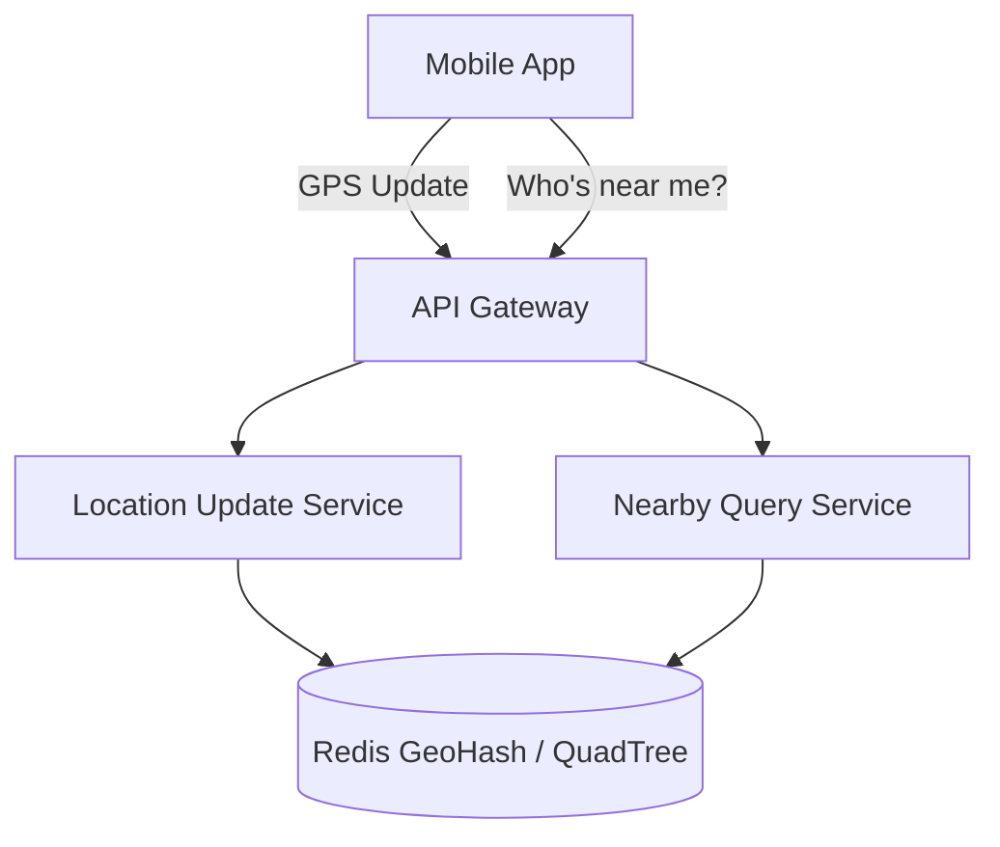

# Designing Who's Near Me

## 1. Requirements

### Functional
- Users share their location and see other users within a configurable radius
- Real-time updates as users move
- Privacy controls (opt-in/opt-out)

### Non-Functional
- Low latency (< 500ms to see nearby users)
- Handle millions of concurrent location updates
- Geospatial queries must be efficient

### Clarifying Questions
- How frequently do users update their location? (Every 10 seconds?)
- What is the maximum search radius? (5km? 50km?)
- Should we show exact distance or approximate zones?

## 2. High-Level Architecture



## 3. Core Algorithm: GeoHash

```python
class NearbyService:
    def __init__(self):
        self.user_locations = {}  # user_id -> (lat, lng)
        self.geohash_index = {}   # geohash_prefix -> set(user_ids)

    def update_location(self, user_id, lat, lng):
        old_hash = self._geohash(
            *self.user_locations[user_id]) if user_id in self.user_locations else None
        new_hash = self._geohash(lat, lng)

        if old_hash and old_hash in self.geohash_index:
            self.geohash_index[old_hash].discard(user_id)

        self.user_locations[user_id] = (lat, lng)
        if new_hash not in self.geohash_index:
            self.geohash_index[new_hash] = set()
        self.geohash_index[new_hash].add(user_id)

    def find_nearby(self, user_id, radius_km):
        lat, lng = self.user_locations[user_id]
        my_hash = self._geohash(lat, lng)
        neighbors = self._get_neighbor_hashes(my_hash)

        nearby = []
        for gh in [my_hash] + neighbors:
            for uid in self.geohash_index.get(gh, []):
                if uid != user_id:
                    dist = self._haversine(lat, lng,
                        *self.user_locations[uid])
                    if dist <= radius_km:
                        nearby.append((uid, dist))
        return sorted(nearby, key=lambda x: x[1])

    def _geohash(self, lat, lng, precision=6):
        # Simplified: encode lat/lng into a geohash string
        return f"{int(lat*100)}:{int(lng*100)}"

    def _get_neighbor_hashes(self, gh):
        # Return the 8 surrounding geohash cells
        return []  # simplified

    def _haversine(self, lat1, lng1, lat2, lng2):
        # Compute great-circle distance in km
        from math import radians, sin, cos, sqrt, atan2
        R = 6371
        dlat = radians(lat2 - lat1)
        dlng = radians(lng2 - lng1)
        a = sin(dlat/2)**2 + cos(radians(lat1)) * \
            cos(radians(lat2)) * sin(dlng/2)**2
        return R * 2 * atan2(sqrt(a), sqrt(1-a))
```

## 4. Design Choices

| Decision | Choice | Why |
|----------|--------|-----|
| Spatial Index | GeoHash with Redis GEOADD | O(log N) add, O(log N + M) radius search; built into Redis |
| Update frequency | Every 10 seconds | Balances freshness vs server load |
| Push updates | WebSocket | Nearby list changes are pushed in real-time |
| Privacy | Fuzzy location (round to nearest 100m) | Users see approximate, not exact, positions |

## 5. Scope for Improvement
- QuadTree for variable-density areas (cities vs rural)
- Geofencing for location-triggered notifications
- S2 Geometry (Google's spatial library) for better precision

---

## Quiz

import MCQ from '@/components/mcq/MCQ'

<MCQ
  question="What is a GeoHash and why is it useful for 'nearby' queries?"
  options={[
    "It encrypts GPS coordinates for security.",
    "It encodes a 2D coordinate (lat, lng) into a 1D string. Points that are geographically close share a common GeoHash prefix, enabling efficient spatial queries using a standard string index.",
    "It converts addresses to coordinates.",
    "It compresses GPS data for storage."
  ]}
  correctAnswerIndex={1}
  explanation="GeoHash transforms a 2D point into a 1D string where proximity in 2D space maps to shared prefixes in the string. This lets you use a B-Tree or hash index to find nearby points by matching prefixes."
/>

<MCQ
  question="GeoHash has a known edge case at cell boundaries. Two users 1 meter apart could be in different GeoHash cells. How is this solved?"
  options={[
    "Use a finer GeoHash precision.",
    "Query the target cell AND all 8 neighboring cells, then filter results by actual distance.",
    "Ignore users at boundaries.",
    "Use a different coordinate system."
  ]}
  correctAnswerIndex={1}
  explanation="A radius search must check the user's cell plus all 8 neighboring cells to account for boundary effects. After collecting candidates from these 9 cells, compute the exact Haversine distance to filter out users outside the actual radius."
/>

<MCQ
  question="With 10 million users each sending location updates every 10 seconds, what is the write QPS to the location store?"
  options={[
    "10,000 writes/sec",
    "100,000 writes/sec",
    "1,000,000 writes/sec",
    "10,000,000 writes/sec"
  ]}
  correctAnswerIndex={2}
  explanation="10 million users / 10 seconds = 1 million writes per second. This is why an in-memory store like Redis is essential — a relational database cannot handle this write volume."
/>
