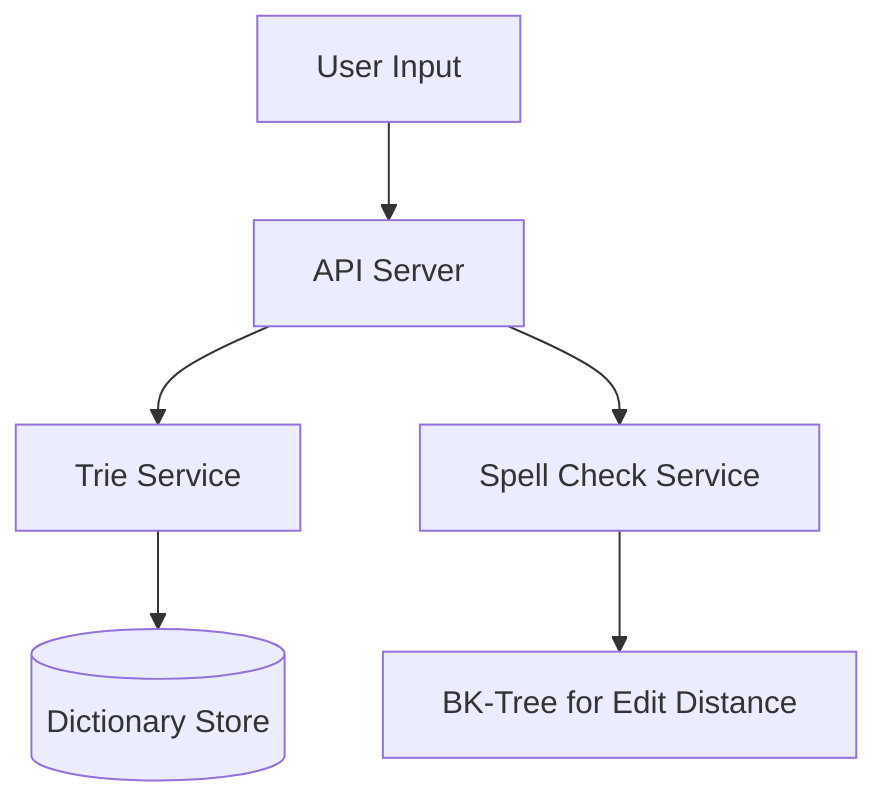

# Designing a Word Dictionary

## 1. Requirements

### Functional
- `search(word)` — check if a word exists
- `autocomplete(prefix)` — return all words starting with a prefix
- `spellcheck(word)` — suggest corrections for misspelled words

### Non-Functional
- Sub-10ms latency for search and autocomplete
- Support 500k+ words in the dictionary
- Low memory footprint

## 2. High-Level Architecture



## 3. Core Algorithm: Trie

```python
class TrieNode:
    def __init__(self):
        self.children = {}
        self.is_end = False

class Trie:
    def __init__(self):
        self.root = TrieNode()

    def insert(self, word):
        node = self.root
        for ch in word:
            if ch not in node.children:
                node.children[ch] = TrieNode()
            node = node.children[ch]
        node.is_end = True

    def search(self, word):
        node = self.root
        for ch in word:
            if ch not in node.children:
                return False
            node = node.children[ch]
        return node.is_end

    def autocomplete(self, prefix):
        node = self.root
        for ch in prefix:
            if ch not in node.children:
                return []
            node = node.children[ch]
        results = []
        self._dfs(node, prefix, results)
        return results

    def _dfs(self, node, path, results):
        if node.is_end:
            results.append(path)
        for ch, child in node.children.items():
            self._dfs(child, path + ch, results)
```

## 4. Design Choices

| Decision | Choice | Why |
|----------|--------|-----|
| Data Structure | Trie (Prefix Tree) | O(L) search where L is word length; natural prefix matching for autocomplete |
| Spell Check | BK-Tree with Levenshtein distance | Efficiently finds all words within edit distance k |
| Memory | Compressed Trie (Radix Tree) | Merges single-child chains into one node, reducing memory by 50%+ |
| Ranking | Frequency-weighted results | Return most common words first in autocomplete |

## 5. Scope for Improvement
- N-gram indexing for phrase search
- Phonetic matching (Soundex, Metaphone) for "sounds like" queries
- Distributed Trie sharded by first character for scale

---

## Quiz

import MCQ from '@/components/mcq/MCQ'

<MCQ
  question="What is the time complexity of searching for a word in a Trie?"
  options={[
    "O(N) where N is the number of words in the dictionary",
    "O(L) where L is the length of the search word",
    "O(log N) where N is the number of words",
    "O(1)"
  ]}
  correctAnswerIndex={1}
  explanation="A Trie traverses one node per character. The time complexity depends only on the length of the word being searched, not the total dictionary size."
/>

<MCQ
  question="What is the Levenshtein (edit) distance between 'kitten' and 'sitting'?"
  options={[
    "1",
    "2",
    "3",
    "5"
  ]}
  correctAnswerIndex={2}
  explanation="kitten -> sitten (substitute k with s), sitten -> sittin (substitute e with i), sittin -> sitting (insert g). Three operations = edit distance 3."
/>

<MCQ
  question="Why would you use a BK-Tree instead of comparing the misspelled word against every word in the dictionary?"
  options={[
    "BK-Trees are simpler to implement.",
    "BK-Trees use the triangle inequality property of edit distance to prune large portions of the search space, reducing comparisons from O(N) to approximately O(N^0.6).",
    "BK-Trees guarantee O(1) lookup.",
    "BK-Trees work with any distance metric, not just edit distance."
  ]}
  correctAnswerIndex={1}
  explanation="A BK-Tree organizes words by edit distance. When searching for words within distance k of a query, most branches of the tree can be pruned using the triangle inequality, dramatically reducing the number of comparisons."
/>
