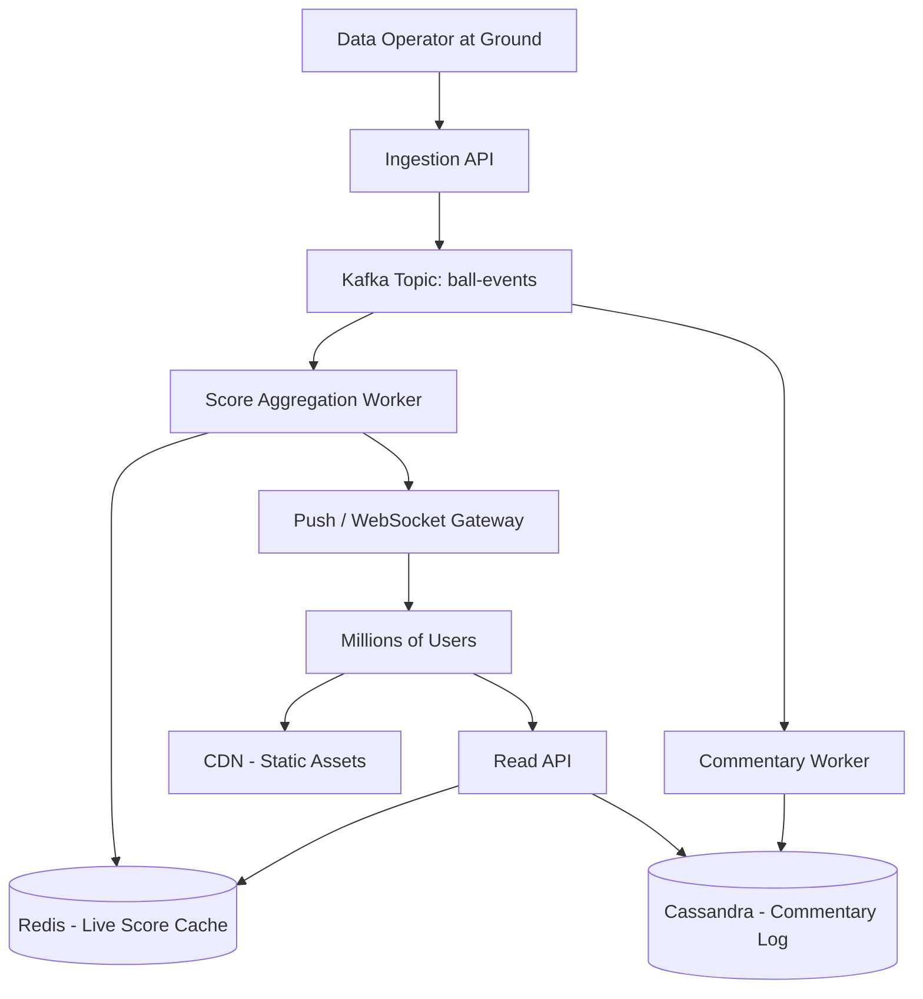

# Design ESPN Cric Info

Designing a live cricket scoreboard system like ESPN Cricinfo involves real-time data ingestion, low-latency reads, and a massive concurrent audience during match events.

## Requirements

### Functional
1. Display live ball-by-ball score updates.
2. Show match summary, scorecard, and player statistics.
3. Support live text commentary.
4. Historical match data and search.

### Non-Functional
- **Read-Heavy**: Millions of concurrent readers, very few writers (data operators at the ground).
- **Low Latency**: Score updates should reach the user within 1-2 seconds.
- **High Availability**: System must not go down during a World Cup final.

## High-Level Architecture



## Data Model

### Ball Event (Kafka Message)
```json
{
  "match_id": "IND_v_AUS_2024_01",
  "innings": 1,
  "over": 14,
  "ball": 3,
  "runs": 4,
  "wicket": false,
  "batsman_id": "VK18",
  "bowler_id": "PS25",
  "timestamp": "2024-01-15T14:32:10Z"
}
```

### Live Score (Redis Hash)
- Key: `live:IND_v_AUS_2024_01`
- Fields: `total_runs`, `wickets`, `overs`, `current_batsman`, `current_bowler`, `run_rate`

### Commentary (Cassandra)
- Primary Key: `(match_id, innings)`, Clustering Key: `(over DESC, ball DESC)`
- This allows fetching the latest commentary in reverse chronological order efficiently.

## Key Design Decisions

1. **Kafka for Decoupling**: The data operator publishes ball events to Kafka. Multiple consumers (score aggregator, commentary writer, push notification service) process independently. This prevents a slow consumer from blocking others.
2. **Redis for Live Scores**: The aggregated score is a small, hot dataset. Redis serves it from memory with sub-millisecond latency.
3. **WebSockets for Push**: Instead of millions of users polling the API every second, a WebSocket gateway pushes updates to connected clients instantly.
4. **CDN for Static Content**: Player photos, team logos, and historical scorecard HTML are served from a CDN.

import MCQ from '@/components/mcq/MCQ'

<MCQ
  question="Why is Kafka used between the Data Operator and the Score Aggregation Worker instead of a direct API call?"
  options={[
    "Kafka is faster than HTTP.",
    "Kafka decouples producers from consumers, allowing multiple independent consumers (score, commentary, push) to process events at their own pace without blocking each other.",
    "Kafka encrypts the data automatically.",
    "Kafka is a database that stores the final score."
  ]}
  correctAnswerIndex={1}
  explanation="Kafka acts as a durable, distributed log. Multiple consumers can read from the same topic independently. If the commentary service is slow, it does not affect the live score aggregation or the push notification service."
/>

<MCQ
  question="What is the primary advantage of using Cassandra with a clustering key of (over DESC, ball DESC) for the commentary table?"
  options={[
    "It compresses data more efficiently.",
    "It allows efficient retrieval of the most recent commentary first without needing a separate sort operation.",
    "It prevents duplicate ball events.",
    "It stores data in a B-Tree for fast random lookups."
  ]}
  correctAnswerIndex={1}
  explanation="Cassandra stores rows physically sorted by the clustering key on disk. By using DESC ordering, the most recent ball commentary is physically first, making the common query pattern (show latest commentary) a fast sequential read."
/>
