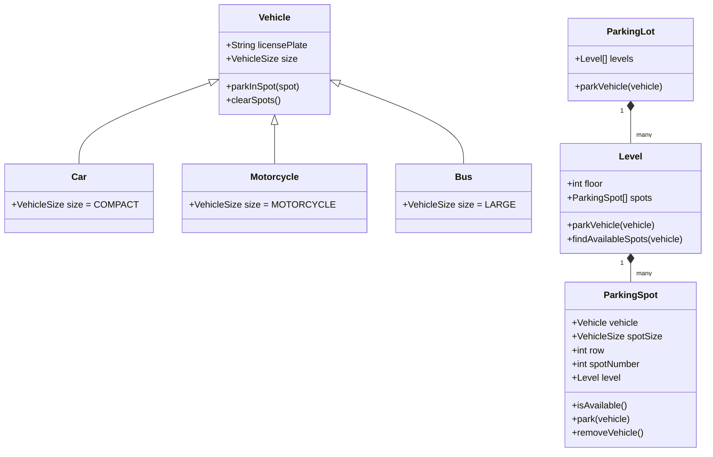

# Design a Parking Lot System

Designing a parking lot is a classic Object-Oriented Design (OOD) and System Design interview question.

## Requirements

1. The parking lot has multiple levels. Each level has multiple rows of spots.
2. The parking lot can park motorcycles, cars, and buses.
3. The parking lot has motorcycle spots, compact spots, and large spots.
4. A motorcycle can park in any spot.
5. A car can park in either a single compact spot or a single large spot.
6. A bus can park in five large spots that are consecutive and within the same row. It cannot park in small spots.

## Class Diagram

## Interactive Visualizer

import ParkingLotVisualizer from '@/components/visualizer/ParkingLotVisualizer'

<ParkingLotVisualizer />

import MCQ from '@/components/mcq/MCQ'

<MCQ 
  question="In this parking lot design, which of the following is true about a Bus?"
  options={[
    "It can park in any available spot.",
    "It can park in 5 consecutive compact spots.",
    "It can park in 5 consecutive large spots.",
    "It can park in a single large spot."
  ]}
  correctAnswerIndex={2}
  explanation="According to the requirements, a bus can park in five large spots that are consecutive and within the same row."
/>

<MCQ
  question="If the parking lot system needs to support finding the nearest available spot on a given level, which data structure would be most efficient?"
  options={[
    "Array with linear scan",
    "Min-Heap (priority queue) ordered by spot number within each level",
    "Hash Map of spot IDs",
    "Stack (LIFO)"
  ]}
  correctAnswerIndex={1}
  explanation="A Min-Heap keyed by spot number allows O(log N) insertion/removal and O(1) peek to find the nearest (lowest-numbered) available spot on a level. When a car leaves, its spot is added back to the heap."
/>

<MCQ
  question="How would you handle the scenario where the parking lot needs to calculate fees based on how long a vehicle was parked?"
  options={[
    "Store the entry time in the Vehicle object when it parks, compute the fee as (exit_time - entry_time) * rate when it leaves.",
    "Ask the driver how long they were parked.",
    "Charge a flat rate regardless of duration.",
    "Use a separate billing microservice that is not part of the parking lot system."
  ]}
  correctAnswerIndex={0}
  explanation="The system should record a timestamp when parkInSpot() is called. When removeVehicle() is called, the duration is calculated and the fee is computed based on a rate strategy (which can vary by vehicle type using the Strategy pattern)."
/>
