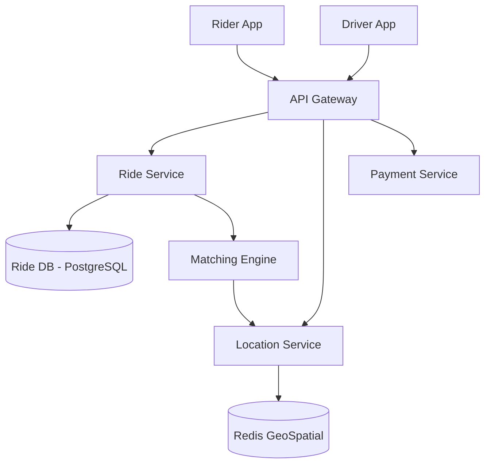

# Design Uber

Designing a ride-sharing service like Uber is a comprehensive high-level system design problem.

## Requirements

1. **Riders** can request a ride.
2. **Drivers** can accept a ride.
3. The system should match a rider with a nearby driver.
4. Real-time location tracking of the driver.
5. Payment processing after the ride.

## High-Level Architecture

## Core Components

- **Location Service**: Needs to handle high write throughput as drivers update their location every few seconds. Redis Geospatial or a QuadTree-based custom solution is often used.
- **Matching Engine**: Finds the nearest available drivers using the Location Service and sends push notifications to them.
- **Ride Service**: Manages the state machine of a ride (REQUESTED -> ACCEPTED -> IN_PROGRESS -> COMPLETED).

import MCQ from '@/components/mcq/MCQ'

<MCQ 
  question="Which data structure or database feature is most optimal for storing and querying driver locations in real-time?"
  options={[
    "Standard Relational Database (MySQL)",
    "Document Database (MongoDB)",
    "Geospatial Indexing (e.g., Redis Geo or QuadTrees)",
    "Graph Database (Neo4j)"
  ]}
  correctAnswerIndex={2}
  explanation="Geospatial indexes like Redis Geo or custom QuadTrees are optimized for spatial queries, allowing the system to quickly find drivers within a specific radius of a rider."
/>

<MCQ
  question="Uber has 5 million active drivers sending GPS updates every 4 seconds. What is the approximate write QPS for the Location Service?"
  options={[
    "5,000 writes/sec",
    "50,000 writes/sec",
    "1,250,000 writes/sec",
    "20,000,000 writes/sec"
  ]}
  correctAnswerIndex={2}
  explanation="5 million drivers / 4 seconds = 1.25 million writes per second. This is why an in-memory store like Redis is needed — a traditional relational database could never handle this write throughput."
/>

<MCQ
  question="When a rider requests a ride, the Matching Engine needs to find drivers within a 5km radius. What is the time complexity of a QuadTree radius search?"
  options={[
    "O(N) where N is total drivers",
    "O(log N) where N is total drivers",
    "O(1)",
    "O(N log N)"
  ]}
  correctAnswerIndex={1}
  explanation="A QuadTree recursively partitions 2D space. A radius search prunes branches that do not overlap with the search circle, resulting in an average O(log N) traversal to find nearby points."
/>
