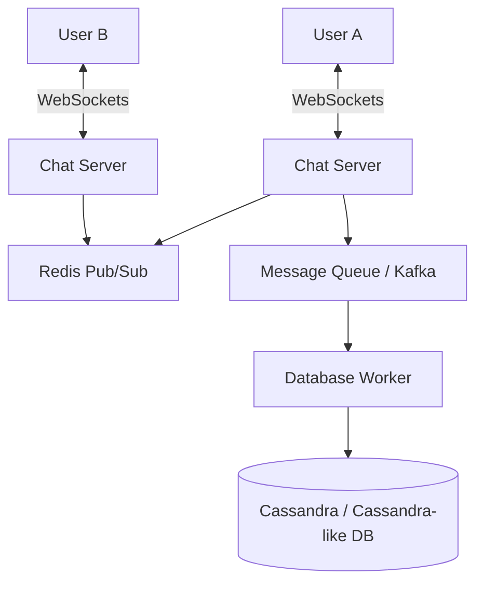

# Design WhatsApp

Designing a chat application like WhatsApp focuses heavily on real-time communication, low latency, and message persistence.

## Requirements

1. 1-on-1 chat between users.
2. Group chats.
3. Message delivery status (Sent, Delivered, Read).
4. Push notifications for offline users.
5. End-to-end encryption (optional for basic scope, but expected in real life).

## High-Level Architecture

## Core Concepts

- **WebSockets**: Used for persistent, bi-directional communication between the client and the server.
- **Session Management**: The system needs to know which Chat Server a user is connected to. A distributed cache (like Redis) is used to map `UserID -> ChatServer_IP`.
- **Message Storage**: Cassandra or HBase is often chosen for message storage due to their high write throughput and ability to handle time-series data effectively.

import MCQ from '@/components/mcq/MCQ'

<MCQ 
  question="Why are WebSockets preferred over standard HTTP polling for a chat application?"
  options={[
    "WebSockets use less bandwidth per message because they don't send HTTP headers every time.",
    "WebSockets allow the server to push messages to the client instantly without the client asking.",
    "WebSockets maintain a persistent connection.",
    "All of the above."
  ]}
  correctAnswerIndex={3}
  explanation="WebSockets maintain a persistent, bi-directional connection, allowing for instant server-to-client push events with minimal overhead compared to HTTP polling."
/>

<MCQ
  question="User A sends a message to User B, but User B is offline. How should the system handle this?"
  options={[
    "Drop the message and notify User A that delivery failed.",
    "Store the message persistently in the database. When User B comes online and establishes a WebSocket connection, deliver all unread messages and send push notifications.",
    "Keep retrying the WebSocket push every second until User B connects.",
    "Forward the message to User B's email instead."
  ]}
  correctAnswerIndex={1}
  explanation="Messages must be persisted regardless of the recipient's online status. A separate push notification service (APNs/FCM) alerts the offline user. When they reconnect, the chat server fetches and delivers all stored unread messages."
/>

<MCQ
  question="WhatsApp uses end-to-end encryption. What does this mean for the server?"
  options={[
    "The server encrypts messages before storing them.",
    "The server can read messages but chooses not to.",
    "Messages are encrypted on the sender's device and can only be decrypted by the recipient's device. The server cannot read the message content at all.",
    "Encryption happens at the network layer (TLS) only."
  ]}
  correctAnswerIndex={2}
  explanation="End-to-end encryption means the server only relays encrypted blobs. It has no access to the encryption keys and physically cannot read the message content. The keys are exchanged directly between devices using the Signal Protocol."
/>
