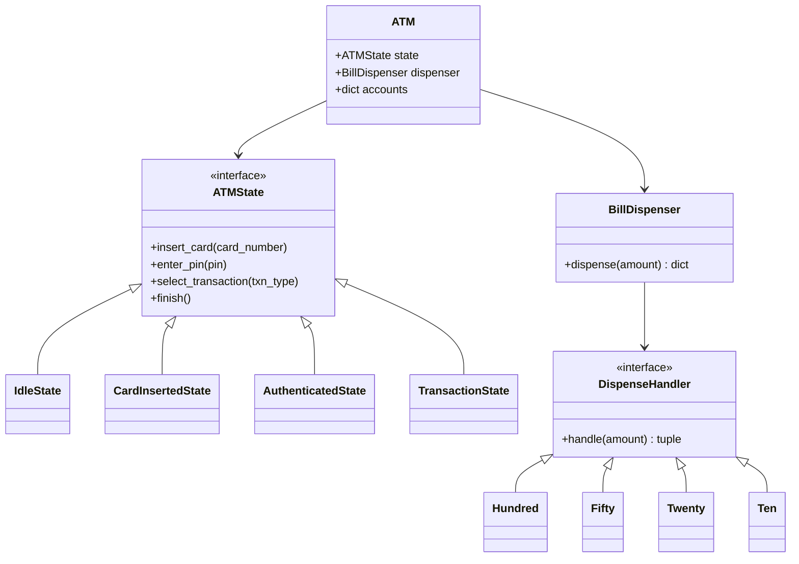

# Design an ATM System

## Requirements

**Functional:**
- Authenticate user with card + PIN.
- Support operations: balance inquiry, cash withdrawal, deposit.
- Dispense bills in optimal denominations ($100, $50, $20, $10).
- Transition through clear states: Idle → Card Inserted → Authenticated → Transaction → Idle.

**Non-functional:**
- Bills should be dispensed from largest to smallest denomination.
- Easily add new denominations or change dispensing logic.

---

## Class Diagram



---

## Full Python Implementation

```python
from abc import ABC, abstractmethod


# ========== Chain of Responsibility — Bill Dispensing ==========

class DispenseHandler(ABC):
    def __init__(self, denomination: int, next_handler: "DispenseHandler" = None):
        self.denomination = denomination
        self.next_handler = next_handler

    def handle(self, amount: int) -> dict:
        result = {}
        if amount >= self.denomination:
            count = amount // self.denomination
            remainder = amount % self.denomination
            result[self.denomination] = count
        else:
            remainder = amount

        if remainder > 0 and self.next_handler:
            result.update(self.next_handler.handle(remainder))
        elif remainder > 0:
            raise ValueError(f"Cannot dispense ${remainder} — no smaller denomination")
        return result


class Hundred(DispenseHandler):
    def __init__(self, next_h=None):
        super().__init__(100, next_h)

class Fifty(DispenseHandler):
    def __init__(self, next_h=None):
        super().__init__(50, next_h)

class Twenty(DispenseHandler):
    def __init__(self, next_h=None):
        super().__init__(20, next_h)

class Ten(DispenseHandler):
    def __init__(self, next_h=None):
        super().__init__(10, next_h)


class BillDispenser:
    def __init__(self):
        self.chain = Hundred(Fifty(Twenty(Ten())))

    def dispense(self, amount: int) -> dict:
        if amount % 10 != 0:
            raise ValueError("Amount must be a multiple of $10")
        return self.chain.handle(amount)


# ========== State Pattern — ATM Flow ==========

class ATMState(ABC):
    def __init__(self, atm: "ATM"):
        self.atm = atm

    @abstractmethod
    def insert_card(self, card_number: str): pass

    @abstractmethod
    def enter_pin(self, pin: str): pass

    @abstractmethod
    def select_transaction(self, txn_type: str, amount: float = 0): pass

    @abstractmethod
    def finish(self): pass


class IdleState(ATMState):
    def insert_card(self, card_number):
        if card_number not in self.atm.accounts:
            print("Card not recognized.")
            return
        self.atm.current_card = card_number
        print(f"Card {card_number} inserted. Please enter PIN.")
        self.atm.set_state(CardInsertedState(self.atm))

    def enter_pin(self, pin):
        print("Please insert a card first.")

    def select_transaction(self, txn_type, amount=0):
        print("Please insert a card first.")

    def finish(self):
        print("No active session.")


class CardInsertedState(ATMState):
    def __init__(self, atm):
        super().__init__(atm)
        self.attempts = 0

    def insert_card(self, card_number):
        print("Card already inserted.")

    def enter_pin(self, pin):
        account = self.atm.accounts[self.atm.current_card]
        if pin == account["pin"]:
            print("PIN accepted.")
            self.atm.set_state(AuthenticatedState(self.atm))
        else:
            self.attempts += 1
            if self.attempts >= 3:
                print("Too many failed attempts. Ejecting card.")
                self.atm.current_card = None
                self.atm.set_state(IdleState(self.atm))
            else:
                print(f"Incorrect PIN. {3 - self.attempts} attempts remaining.")

    def select_transaction(self, txn_type, amount=0):
        print("Please enter your PIN first.")

    def finish(self):
        print("Ejecting card.")
        self.atm.current_card = None
        self.atm.set_state(IdleState(self.atm))


class AuthenticatedState(ATMState):
    def insert_card(self, card_number):
        print("Session in progress.")

    def enter_pin(self, pin):
        print("Already authenticated.")

    def select_transaction(self, txn_type, amount=0):
        account = self.atm.accounts[self.atm.current_card]

        if txn_type == "balance":
            print(f"Current balance: ${account['balance']:.2f}")

        elif txn_type == "withdraw":
            if amount > account["balance"]:
                print("Insufficient funds.")
                return
            try:
                bills = self.atm.dispenser.dispense(int(amount))
                account["balance"] -= amount
                print(f"Dispensing ${amount:.0f}: {bills}")
                print(f"Remaining balance: ${account['balance']:.2f}")
            except ValueError as e:
                print(f"Cannot dispense: {e}")

        elif txn_type == "deposit":
            account["balance"] += amount
            print(f"Deposited ${amount:.2f}. New balance: ${account['balance']:.2f}")

        else:
            print(f"Unknown transaction: {txn_type}")

    def finish(self):
        print("Thank you. Ejecting card.")
        self.atm.current_card = None
        self.atm.set_state(IdleState(self.atm))


# ========== ATM Context ==========

class ATM:
    def __init__(self):
        self.accounts = {}
        self.current_card = None
        self.dispenser = BillDispenser()
        self._state = IdleState(self)

    def add_account(self, card_number, pin, balance):
        self.accounts[card_number] = {"pin": pin, "balance": balance}

    def set_state(self, state: ATMState):
        self._state = state

    def insert_card(self, card_number):
        self._state.insert_card(card_number)

    def enter_pin(self, pin):
        self._state.enter_pin(pin)

    def select_transaction(self, txn_type, amount=0):
        self._state.select_transaction(txn_type, amount)

    def finish(self):
        self._state.finish()


# ---------- Demo ----------
if __name__ == "__main__":
    atm = ATM()
    atm.add_account("4111-1111", "1234", 5000.00)

    atm.insert_card("4111-1111")
    atm.enter_pin("1234")
    atm.select_transaction("balance")
    atm.select_transaction("withdraw", 270)
    # Dispensing $270: {100: 2, 50: 1, 20: 1}
    atm.finish()
```

---

## Design Patterns Used

| Pattern | Where |
|---------|-------|
| **State** | ATM states: `IdleState → CardInsertedState → AuthenticatedState` control valid operations at each step |
| **Chain of Responsibility** | Bill dispensing: `$100 → $50 → $20 → $10` — each handler tries its denomination and passes the remainder down |

---

## Quiz

import MCQ from '@/components/mcq/MCQ'

<MCQ
  question="An ATM must dispense $270. The chain is $100 → $50 → $20 → $10. What bills are dispensed?"
  options={[
    "27 × $10 bills",
    "2 × $100, 1 × $50, 1 × $20",
    "1 × $100, 1 × $50, 6 × $20",
    "5 × $50, 1 × $20"
  ]}
  correctAnswerIndex={1}
  explanation="Chain of Responsibility processes from largest to smallest: 270 ÷ 100 = 2 (remainder 70), 70 ÷ 50 = 1 (remainder 20), 20 ÷ 20 = 1. Result: {100: 2, 50: 1, 20: 1}."
/>

<MCQ
  question="Why is the State pattern better than a single `if self.state == 'idle'` check in every method?"
  options={[
    "State objects are faster than string comparisons.",
    "Each state class encapsulates its own behavior, so adding a new state (e.g., LockedState) requires zero changes to existing states.",
    "Python doesn't support enums for states.",
    "The State pattern uses less memory."
  ]}
  correctAnswerIndex={1}
  explanation="With the State pattern, each state's logic is self-contained. Adding LockedState means creating one new class — no if/elif chains to modify in existing code. This follows the Open/Closed Principle."
/>

<MCQ
  question="You want to add $5 bills to the ATM. How many existing handler classes need modification?"
  options={[
    "All 4 handlers need changes.",
    "Only the Ten handler needs changes.",
    "Zero — create a Five handler and insert it in the chain after Ten.",
    "The BillDispenser class only."
  ]}
  correctAnswerIndex={2}
  explanation="Chain of Responsibility is open for extension: create Five(DispenseHandler) and wire it as Ten(Five()). No existing handler classes change — only the BillDispenser chain composition."
/>
