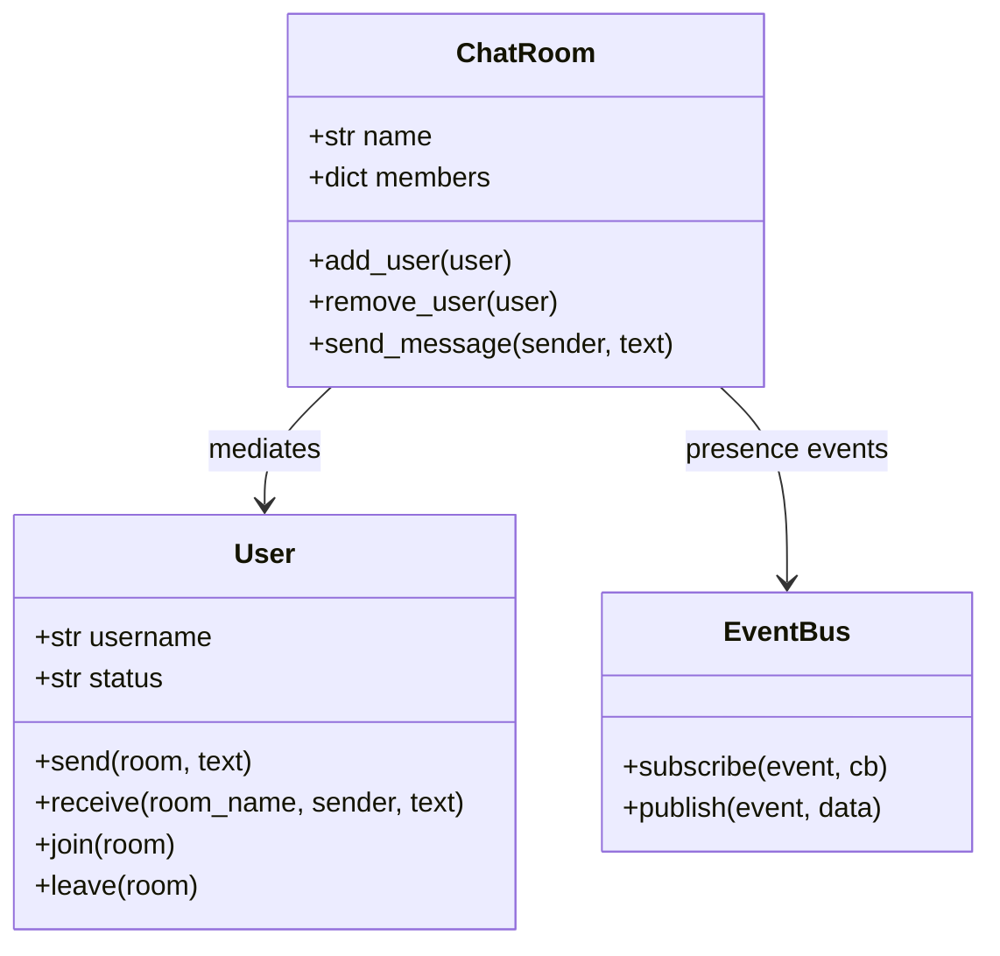

# Design a Chat Room System

## Requirements

**Functional:**
- Users join and leave chat rooms.
- Messages sent by one user are delivered to all other users in the room.
- Users can be in multiple rooms simultaneously.
- Presence tracking: notify when users join or go offline.

**Non-functional:**
- Users should not send messages to each other directly — the chat room mediates all communication.
- Adding features (message history, profanity filter) should not require changing User or ChatRoom classes.

---

## Class Diagram



---

## Full Python Implementation

```python
from collections import defaultdict
from datetime import datetime


# ---------- Observer ----------

class EventBus:
    def __init__(self):
        self._listeners = defaultdict(list)

    def subscribe(self, event, callback):
        self._listeners[event].append(callback)

    def publish(self, event, data=None):
        for cb in self._listeners.get(event, []):
            cb(data)


# ---------- Mediator — ChatRoom ----------

class ChatRoom:
    """Mediator that manages communication between users."""

    def __init__(self, name: str):
        self.name = name
        self.members: dict[str, "User"] = {}
        self.history: list[dict] = []
        self.bus = EventBus()

    def add_user(self, user: "User"):
        self.members[user.username] = user
        self.bus.publish("user_joined", {
            "room": self.name, "user": user.username
        })
        # Deliver recent history to the new user
        for msg in self.history[-10:]:
            user.receive(self.name, msg["sender"], msg["text"])

    def remove_user(self, user: "User"):
        if user.username in self.members:
            del self.members[user.username]
            self.bus.publish("user_left", {
                "room": self.name, "user": user.username
            })

    def send_message(self, sender: "User", text: str):
        timestamp = datetime.now().strftime("%H:%M:%S")
        message = {"sender": sender.username, "text": text, "time": timestamp}
        self.history.append(message)

        for username, member in self.members.items():
            if username != sender.username:
                member.receive(self.name, sender.username, text)

    def get_members(self) -> list[str]:
        return list(self.members.keys())


# ---------- User (Colleague) ----------

class User:
    def __init__(self, username: str):
        self.username = username
        self.status = "online"
        self._rooms: dict[str, ChatRoom] = {}

    def join(self, room: ChatRoom):
        self._rooms[room.name] = room
        room.add_user(self)
        print(f"[{self.username}] joined #{room.name}")

    def leave(self, room: ChatRoom):
        room.remove_user(self)
        del self._rooms[room.name]
        print(f"[{self.username}] left #{room.name}")

    def send(self, room: ChatRoom, text: str):
        if room.name not in self._rooms:
            print(f"[{self.username}] not in #{room.name}")
            return
        print(f"[{self.username} → #{room.name}] {text}")
        room.send_message(self, text)

    def receive(self, room_name: str, sender: str, text: str):
        print(f"  [{self.username} ← #{room_name}] {sender}: {text}")

    def go_offline(self):
        self.status = "offline"
        for room in list(self._rooms.values()):
            room.remove_user(self)
        self._rooms.clear()

    def __repr__(self):
        return f"User({self.username}, {self.status})"


# ---------- Demo ----------
if __name__ == "__main__":
    general = ChatRoom("general")
    random_ch = ChatRoom("random")

    # Presence observer
    general.bus.subscribe("user_joined",
        lambda d: print(f"  >>> {d['user']} joined #{d['room']}"))
    general.bus.subscribe("user_left",
        lambda d: print(f"  >>> {d['user']} left #{d['room']}"))

    alice = User("Alice")
    bob = User("Bob")
    charlie = User("Charlie")

    alice.join(general)
    bob.join(general)
    charlie.join(general)

    alice.send(general, "Hey everyone!")
    # Bob and Charlie receive the message

    bob.send(general, "Hi Alice!")
    # Alice and Charlie receive

    charlie.leave(general)
    # Presence notification: Charlie left

    print(f"\nMembers in #general: {general.get_members()}")
```

---

## Design Patterns Used

| Pattern | Where |
|---------|-------|
| **Mediator** | `ChatRoom` mediates all communication between `User` objects. Users don't know about each other — they only interact with the room. |
| **Observer** | `EventBus` on the ChatRoom publishes presence events (`user_joined`, `user_left`) to subscribers like logging or notification services. |

**Why Mediator?** Without it, each user would need references to all other users — an N×N dependency graph. The Mediator centralizes communication: users only know about the room, and the room dispatches messages. Adding a new feature (e.g., profanity filter) means modifying only the ChatRoom.

---

## Quiz

import MCQ from '@/components/mcq/MCQ'

<MCQ
  question="Alice sends a message in #general with 5 members. Without the Mediator pattern, how many direct references would Alice need?"
  options={[
    "1 — just the room.",
    "4 — a reference to every other user in the room.",
    "5 — all members including herself.",
    "0 — messages are fire-and-forget."
  ]}
  correctAnswerIndex={1}
  explanation="Without a Mediator, Alice would need direct references to Bob, Charlie, Dave, Eve — 4 connections. With N users, each user needs N-1 references (N×(N-1) total). The Mediator replaces this with N connections to the room."
/>

<MCQ
  question="You want to add a profanity filter that blocks messages containing banned words. Where should this logic go?"
  options={[
    "In each User's send() method.",
    "In ChatRoom.send_message() — the mediator is the single point for all message routing, so filtering goes here. No user changes needed.",
    "In a global filter function called by every class.",
    "In User.receive()."
  ]}
  correctAnswerIndex={1}
  explanation="The Mediator centralizes communication. Adding filtering in send_message() means ONE change point. Users don't know about filters — they just call send(), and the mediator handles everything."
/>

<MCQ
  question="ChatRoom stores the last 10 messages and delivers them to new joiners. What design benefit does this demonstrate?"
  options={[
    "Caching pattern.",
    "The Mediator owns shared state (message history). Users don't need to replicate or synchronize history — the mediator is the single source of truth.",
    "The Observer pattern stores history.",
    "This violates the Single Responsibility Principle."
  ]}
  correctAnswerIndex={1}
  explanation="A core benefit of Mediator: shared state lives in one place. Users only know how to send/receive — the room manages history, member lists, and delivery."
/>
