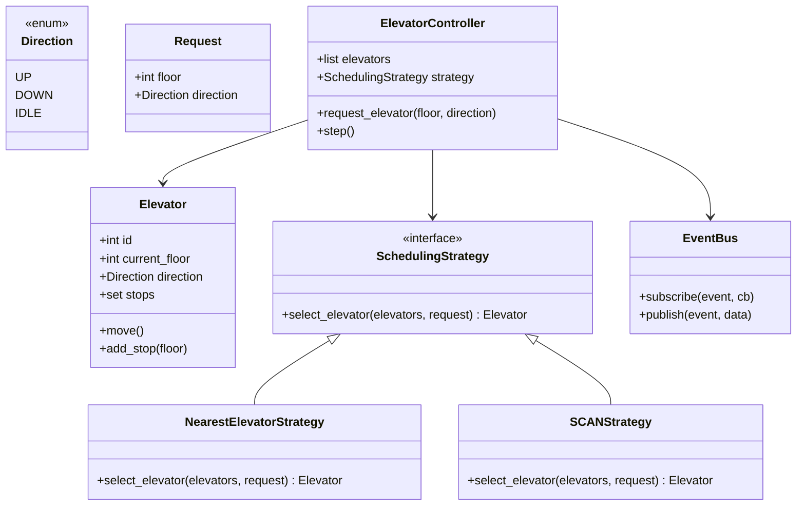

# Design an Elevator System

## Requirements

**Functional:**
- Multiple elevators serve N floors.
- Users press UP/DOWN buttons on each floor; select destination inside the elevator.
- Scheduler assigns the best elevator to each request.
- Elevators move, stop at requested floors, open/close doors.

**Non-functional:**
- Pluggable scheduling algorithm (SCAN, shortest-seek, nearest elevator).
- Notify displays on each floor when an elevator arrives.

---

## Class Diagram



---

## Full Python Implementation

```python
from abc import ABC, abstractmethod
from enum import Enum
from collections import defaultdict


class Direction(Enum):
    UP = 1
    DOWN = -1
    IDLE = 0


class Request:
    def __init__(self, floor: int, direction: Direction):
        self.floor = floor
        self.direction = direction

    def __repr__(self):
        return f"Request(floor={self.floor}, dir={self.direction.name})"


# ---------- Observer ----------

class EventBus:
    def __init__(self):
        self._listeners = defaultdict(list)

    def subscribe(self, event, callback):
        self._listeners[event].append(callback)

    def publish(self, event, data=None):
        for cb in self._listeners.get(event, []):
            cb(data)


# ---------- Elevator ----------

class Elevator:
    def __init__(self, elevator_id: int, total_floors: int):
        self.id = elevator_id
        self.total_floors = total_floors
        self.current_floor = 0
        self.direction = Direction.IDLE
        self.stops: set[int] = set()

    def add_stop(self, floor: int):
        self.stops.add(floor)
        if self.direction == Direction.IDLE:
            if floor > self.current_floor:
                self.direction = Direction.UP
            elif floor < self.current_floor:
                self.direction = Direction.DOWN

    def move(self) -> list[str]:
        events = []
        if not self.stops:
            self.direction = Direction.IDLE
            return events

        if self.current_floor in self.stops:
            self.stops.discard(self.current_floor)
            events.append(f"Elevator {self.id} stopped at floor {self.current_floor}")

        if not self.stops:
            self.direction = Direction.IDLE
            return events

        if self.direction == Direction.UP:
            above = [f for f in self.stops if f > self.current_floor]
            if above:
                self.current_floor += 1
            else:
                self.direction = Direction.DOWN
                self.current_floor -= 1
        elif self.direction == Direction.DOWN:
            below = [f for f in self.stops if f < self.current_floor]
            if below:
                self.current_floor -= 1
            else:
                self.direction = Direction.UP
                self.current_floor += 1

        return events

    def __repr__(self):
        return (f"Elevator({self.id}, floor={self.current_floor}, "
                f"dir={self.direction.name}, stops={sorted(self.stops)})")


# ---------- Strategy — Scheduling ----------

class SchedulingStrategy(ABC):
    @abstractmethod
    def select_elevator(self, elevators: list[Elevator], request: Request) -> Elevator:
        pass


class NearestElevatorStrategy(SchedulingStrategy):
    def select_elevator(self, elevators, request):
        return min(elevators,
                   key=lambda e: abs(e.current_floor - request.floor))


class SCANStrategy(SchedulingStrategy):
    """Prefer an elevator already moving in the right direction."""
    def select_elevator(self, elevators, request):
        candidates = []
        for e in elevators:
            if e.direction == Direction.IDLE:
                score = abs(e.current_floor - request.floor)
            elif e.direction == request.direction:
                if (request.direction == Direction.UP and e.current_floor <= request.floor):
                    score = request.floor - e.current_floor
                elif (request.direction == Direction.DOWN and e.current_floor >= request.floor):
                    score = e.current_floor - request.floor
                else:
                    score = 1000 + abs(e.current_floor - request.floor)
            else:
                score = 2000 + abs(e.current_floor - request.floor)
            candidates.append((score, e))
        candidates.sort(key=lambda x: x[0])
        return candidates[0][1]


# ---------- Controller ----------

class ElevatorController:
    def __init__(self, num_elevators: int, total_floors: int,
                 strategy: SchedulingStrategy = None):
        self.elevators = [Elevator(i, total_floors) for i in range(num_elevators)]
        self.strategy = strategy or NearestElevatorStrategy()
        self.bus = EventBus()

    def request_elevator(self, floor: int, direction: Direction):
        req = Request(floor, direction)
        elevator = self.strategy.select_elevator(self.elevators, req)
        elevator.add_stop(floor)
        print(f"Assigned {req} → Elevator {elevator.id}")

    def press_floor_button(self, elevator_id: int, floor: int):
        self.elevators[elevator_id].add_stop(floor)

    def step(self):
        for elevator in self.elevators:
            events = elevator.move()
            for event in events:
                print(f"  {event}")
                self.bus.publish("elevator_arrived", {
                    "elevator_id": elevator.id,
                    "floor": elevator.current_floor
                })


# ---------- Demo ----------
if __name__ == "__main__":
    controller = ElevatorController(
        num_elevators=3, total_floors=10,
        strategy=SCANStrategy()
    )
    controller.bus.subscribe("elevator_arrived",
        lambda d: print(f"    [Display] Elevator {d['elevator_id']} at floor {d['floor']}"))

    controller.request_elevator(5, Direction.UP)
    controller.request_elevator(2, Direction.DOWN)

    for _ in range(8):
        controller.step()
        for e in controller.elevators:
            print(f"    {e}")
```

---

## Design Patterns Used

| Pattern | Where |
|---------|-------|
| **Strategy** | `SchedulingStrategy` — swap `NearestElevatorStrategy` for `SCANStrategy` without changing the controller |
| **Observer** | `EventBus` publishes `elevator_arrived` events to floor displays |

---

## Quiz

import MCQ from '@/components/mcq/MCQ'

<MCQ
  question="Elevator 0 is at floor 3 moving UP with stops at {5, 7}. Elevator 1 is idle at floor 4. A request comes from floor 6 going UP. Using SCAN strategy, which elevator is assigned?"
  options={[
    "Elevator 1 — it's closer to floor 6.",
    "Elevator 0 — it's already moving UP and will pass floor 6 on the way to 7.",
    "Both elevators are assigned.",
    "A new elevator is created."
  ]}
  correctAnswerIndex={1}
  explanation="SCAN prefers an elevator already moving in the right direction. Elevator 0 is heading UP and is below floor 6, so it will pick up the request on the way — more efficient than redirecting the idle elevator."
/>

<MCQ
  question="You want to add a 'VIP Priority' scheduling strategy that always sends the least-loaded elevator. How many existing classes change?"
  options={[
    "The ElevatorController must be rewritten.",
    "All existing strategy classes.",
    "Zero — create VIPStrategy implementing SchedulingStrategy and inject it into the controller.",
    "The Elevator class needs a load counter."
  ]}
  correctAnswerIndex={2}
  explanation="The Strategy pattern means new algorithms are new classes. The controller depends on the SchedulingStrategy interface, so no existing code changes — just inject the new strategy."
/>

<MCQ
  question="The Observer pattern is used for floor displays. What is the main advantage over having each elevator directly update displays?"
  options={[
    "Observers are faster than direct calls.",
    "Decoupling — elevators don't know about displays. Adding a logging subscriber or a mobile notification requires zero elevator code changes.",
    "The Observer pattern uses less memory.",
    "Direct calls would cause deadlocks."
  ]}
  correctAnswerIndex={1}
  explanation="Observer decouples publishers (elevators) from subscribers (displays, loggers, notifications). This follows the Dependency Inversion Principle — high-level modules don't depend on low-level modules."
/>
