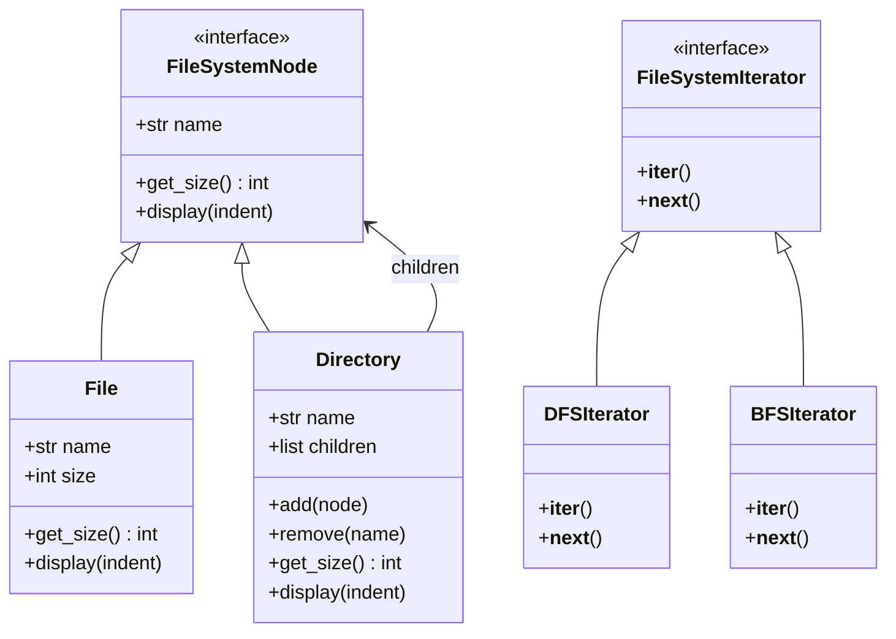

# Design a File System

## Requirements

**Functional:**
- Support files and directories. Directories can contain files and other directories (tree structure).
- Calculate the total size of a directory (recursively includes all children).
- List contents of a directory, search for files by name.
- Support traversal in different orders (DFS, BFS).

**Non-functional:**
- Adding new node types (e.g., symlinks) should not require modifying traversal or size logic.
- Uniform treatment of files and directories via a common interface.

---

## Class Diagram



---

## Full Python Implementation

```python
from abc import ABC, abstractmethod
from collections import deque


# ---------- Composite Pattern ----------

class FileSystemNode(ABC):
    def __init__(self, name: str):
        self.name = name

    @abstractmethod
    def get_size(self) -> int:
        pass

    @abstractmethod
    def display(self, indent: int = 0):
        pass


class File(FileSystemNode):
    def __init__(self, name: str, size: int):
        super().__init__(name)
        self.size = size

    def get_size(self) -> int:
        return self.size

    def display(self, indent=0):
        print(" " * indent + f"📄 {self.name} ({self.size} bytes)")


class Directory(FileSystemNode):
    def __init__(self, name: str):
        super().__init__(name)
        self.children: list[FileSystemNode] = []

    def add(self, node: FileSystemNode):
        self.children.append(node)

    def remove(self, name: str):
        self.children = [c for c in self.children if c.name != name]

    def get_child(self, name: str) -> FileSystemNode:
        for c in self.children:
            if c.name == name:
                return c
        return None

    def get_size(self) -> int:
        return sum(child.get_size() for child in self.children)

    def display(self, indent=0):
        print(" " * indent + f"📁 {self.name}/ ({self.get_size()} bytes)")
        for child in self.children:
            child.display(indent + 2)


# ---------- Iterator Pattern ----------

class DFSIterator:
    """Depth-first traversal of the file system tree."""

    def __init__(self, root: FileSystemNode):
        self._stack = [root]

    def __iter__(self):
        return self

    def __next__(self) -> FileSystemNode:
        if not self._stack:
            raise StopIteration
        node = self._stack.pop()
        if isinstance(node, Directory):
            self._stack.extend(reversed(node.children))
        return node


class BFSIterator:
    """Breadth-first traversal of the file system tree."""

    def __init__(self, root: FileSystemNode):
        self._queue = deque([root])

    def __iter__(self):
        return self

    def __next__(self) -> FileSystemNode:
        if not self._queue:
            raise StopIteration
        node = self._queue.popleft()
        if isinstance(node, Directory):
            self._queue.extend(node.children)
        return node


# ---------- Search Utility ----------

def search(root: FileSystemNode, query: str) -> list[FileSystemNode]:
    results = []
    for node in DFSIterator(root):
        if query.lower() in node.name.lower():
            results.append(node)
    return results


# ---------- Demo ----------
if __name__ == "__main__":
    root = Directory("home")
    docs = Directory("documents")
    pics = Directory("pictures")

    docs.add(File("resume.pdf", 250_000))
    docs.add(File("notes.txt", 1_200))

    vacation = Directory("vacation")
    vacation.add(File("beach.jpg", 3_500_000))
    vacation.add(File("sunset.jpg", 2_800_000))
    pics.add(vacation)
    pics.add(File("profile.png", 500_000))

    root.add(docs)
    root.add(pics)
    root.add(File(".bashrc", 450))

    root.display()
    # 📁 home/ (7051650 bytes)
    #   📁 documents/ (251200 bytes)
    #     📄 resume.pdf (250000 bytes)
    #     📄 notes.txt (1200 bytes)
    #   📁 pictures/ (6800000 bytes)
    #     📁 vacation/ (6300000 bytes)
    #       📄 beach.jpg (3500000 bytes)
    #       📄 sunset.jpg (2800000 bytes)
    #     📄 profile.png (500000 bytes)
    #   📄 .bashrc (450 bytes)

    print(f"\nTotal size: {root.get_size():,} bytes")

    print("\nDFS traversal:")
    for node in DFSIterator(root):
        prefix = "DIR " if isinstance(node, Directory) else "FILE"
        print(f"  {prefix}: {node.name}")

    print("\nSearch for 'jpg':")
    for node in search(root, "jpg"):
        print(f"  Found: {node.name}")
```

---

## Design Patterns Used

| Pattern | Where |
|---------|-------|
| **Composite** | `File` and `Directory` share `FileSystemNode` interface. `Directory.get_size()` recursively sums children — client code treats files and directories uniformly |
| **Iterator** | `DFSIterator` and `BFSIterator` provide different traversal strategies over the composite tree without exposing its internal structure |

**Why Composite?** Without it, every operation (size, display, search) would need `isinstance` checks scattered throughout. Composite lets `get_size()` work identically on a single file or an entire directory tree.

---

## Quiz

import MCQ from '@/components/mcq/MCQ'

<MCQ
  question="In the Composite pattern, what is the key relationship between File and Directory?"
  options={[
    "Directory inherits from File.",
    "File and Directory both implement FileSystemNode. Directory contains a list of FileSystemNode children — so it can hold Files AND other Directories.",
    "File contains a reference to its parent Directory.",
    "They are unrelated classes."
  ]}
  correctAnswerIndex={1}
  explanation="The Composite pattern has a common interface (FileSystemNode) for both leaf (File) and composite (Directory) nodes. Directory holds children of type FileSystemNode, enabling recursive tree structures."
/>

<MCQ
  question="You need to add SymbolicLink — a node that points to another node and delegates get_size() to the target. Which classes need modification?"
  options={[
    "File and Directory both need changes.",
    "Zero — create SymbolicLink extending FileSystemNode. It holds a reference to the target and delegates calls. Existing code works unchanged.",
    "The DFSIterator needs special symlink handling.",
    "FileSystemNode needs a new method."
  ]}
  correctAnswerIndex={1}
  explanation="OCP: SymbolicLink implements FileSystemNode with a target reference. get_size() returns target.get_size(). Iterators and search already work with any FileSystemNode."
/>

<MCQ
  question="Why is the Iterator pattern better than exposing Directory.children directly?"
  options={[
    "Iterators are faster.",
    "It hides the internal structure. You can provide DFS, BFS, or filtered traversal without changing Directory. Callers don't need to know about the tree implementation.",
    "Python requires iterators for all collections.",
    "Exposing children would cause memory leaks."
  ]}
  correctAnswerIndex={1}
  explanation="The Iterator pattern encapsulates traversal logic. Adding a new traversal order (e.g., sorted by size) means creating a new iterator class — Directory remains unchanged."
/>
