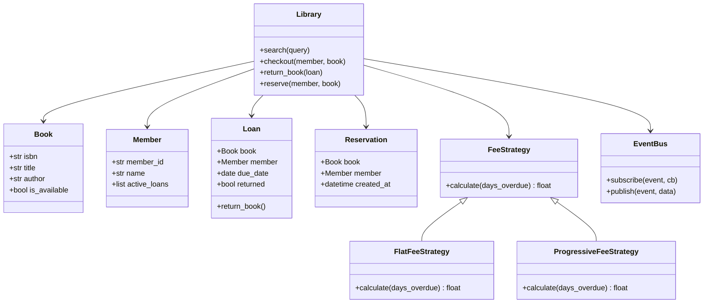

# Design a Library Management System

## Requirements

**Functional:**
- Members can search for books by title, author, or ISBN.
- Members can borrow and return books.
- Track due dates; calculate overdue fines.
- Reserve a book that is currently checked out.
- Notify members when a reserved book becomes available.

**Non-functional:**
- Support concurrent checkouts (thread safety).
- Extensible fee-calculation strategy.

---

## Class Diagram



---

## Full Python Implementation

```python
from abc import ABC, abstractmethod
from collections import defaultdict
from datetime import date, timedelta
from typing import Optional

# ---------- Observer ----------

class EventBus:
    def __init__(self):
        self._listeners = defaultdict(list)

    def subscribe(self, event, callback):
        self._listeners[event].append(callback)

    def publish(self, event, data=None):
        for cb in self._listeners.get(event, []):
            cb(data)


# ---------- Strategy (fee calculation) ----------

class FeeStrategy(ABC):
    @abstractmethod
    def calculate(self, days_overdue: int) -> float:
        pass

class FlatFeeStrategy(FeeStrategy):
    def __init__(self, rate_per_day=1.0):
        self.rate = rate_per_day

    def calculate(self, days_overdue):
        return max(0, days_overdue * self.rate)

class ProgressiveFeeStrategy(FeeStrategy):
    def calculate(self, days_overdue):
        if days_overdue <= 0:
            return 0.0
        if days_overdue <= 7:
            return days_overdue * 0.50
        return 3.50 + (days_overdue - 7) * 1.50


# ---------- Domain Models ----------

class Book:
    def __init__(self, isbn, title, author):
        self.isbn = isbn
        self.title = title
        self.author = author
        self.is_available = True

    def __repr__(self):
        return f"Book({self.title!r})"

class Member:
    def __init__(self, member_id, name):
        self.member_id = member_id
        self.name = name
        self.active_loans = []

    def __repr__(self):
        return f"Member({self.name!r})"

class Loan:
    LOAN_PERIOD_DAYS = 14

    def __init__(self, book: Book, member: Member):
        self.book = book
        self.member = member
        self.checkout_date = date.today()
        self.due_date = self.checkout_date + timedelta(days=self.LOAN_PERIOD_DAYS)
        self.returned = False

    def days_overdue(self) -> int:
        if self.returned:
            return 0
        return max(0, (date.today() - self.due_date).days)

class Reservation:
    def __init__(self, book: Book, member: Member):
        self.book = book
        self.member = member


# ---------- Library ----------

class Library:
    def __init__(self, fee_strategy: FeeStrategy = None):
        self.catalog: dict[str, Book] = {}
        self.members: dict[str, Member] = {}
        self.loans: list[Loan] = []
        self.reservations: list[Reservation] = []
        self.fee_strategy = fee_strategy or FlatFeeStrategy()
        self.bus = EventBus()

    def add_book(self, book: Book):
        self.catalog[book.isbn] = book

    def register_member(self, member: Member):
        self.members[member.member_id] = member

    def search(self, query: str) -> list[Book]:
        q = query.lower()
        return [b for b in self.catalog.values()
                if q in b.title.lower() or q in b.author.lower() or q in b.isbn.lower()]

    def checkout(self, member: Member, book: Book) -> Loan:
        if not book.is_available:
            raise ValueError(f"{book.title} is not available")
        book.is_available = False
        loan = Loan(book, member)
        member.active_loans.append(loan)
        self.loans.append(loan)
        return loan

    def return_book(self, loan: Loan) -> float:
        loan.returned = True
        loan.book.is_available = True
        loan.member.active_loans.remove(loan)
        fee = self.fee_strategy.calculate(loan.days_overdue())

        # Check if anyone has a reservation for this book
        for res in self.reservations:
            if res.book.isbn == loan.book.isbn:
                self.reservations.remove(res)
                self.bus.publish("book_available", {
                    "book": loan.book, "member": res.member
                })
                break
        return fee

    def reserve(self, member: Member, book: Book):
        if book.is_available:
            raise ValueError("Book is available — just check it out.")
        self.reservations.append(Reservation(book, member))


# ---------- Demo ----------
if __name__ == "__main__":
    lib = Library(fee_strategy=ProgressiveFeeStrategy())

    lib.bus.subscribe("book_available",
        lambda d: print(f"  Notification: {d['book'].title} is now available for {d['member'].name}"))

    b1 = Book("978-0-13-235088-4", "Clean Code", "Robert Martin")
    lib.add_book(b1)

    alice = Member("M001", "Alice")
    bob = Member("M002", "Bob")
    lib.register_member(alice)
    lib.register_member(bob)

    loan = lib.checkout(alice, b1)
    lib.reserve(bob, b1)

    fee = lib.return_book(loan)
    print(f"Fee: ${fee:.2f}")
    # Notification: Clean Code is now available for Bob
```

---

## Design Patterns Used

| Pattern | Where |
|---------|-------|
| **Observer** | `EventBus` notifies members when a reserved book becomes available |
| **Strategy** | `FeeStrategy` — swap between `FlatFeeStrategy` and `ProgressiveFeeStrategy` without changing Library |

---

## Quiz

import MCQ from '@/components/mcq/MCQ'

<MCQ
  question="A library charges $0.50/day for the first week overdue and $1.50/day after that. Which pattern lets you swap this calculation without changing the Library class?"
  options={[
    "Observer",
    "Strategy — inject a different FeeStrategy implementation",
    "Singleton",
    "Factory Method"
  ]}
  correctAnswerIndex={1}
  explanation="The Strategy pattern encapsulates interchangeable algorithms (fee calculations) behind a common interface. The Library depends only on the FeeStrategy abstraction."
/>

<MCQ
  question="When a returned book has a pending reservation, the system notifies the waiting member. What pattern handles this?"
  options={[
    "Factory Method",
    "Command",
    "Observer — EventBus publishes 'book_available' and the reservation handler subscribes to it",
    "Builder"
  ]}
  correctAnswerIndex={2}
  explanation="The EventBus (Observer/Pub-Sub pattern) decouples the return-book logic from the notification logic. Subscribers are notified without the Library knowing who they are."
/>

<MCQ
  question="Which SOLID principle is violated if `Library.return_book()` directly sends an email instead of publishing an event?"
  options={[
    "Liskov Substitution — subtypes aren't interchangeable",
    "Single Responsibility — Library would handle both loan management AND notifications",
    "Interface Segregation",
    "Dependency Inversion"
  ]}
  correctAnswerIndex={1}
  explanation="If Library directly handles email sending, it has two reasons to change: loan logic changes and notification logic changes. The Observer pattern keeps SRP intact."
/>
