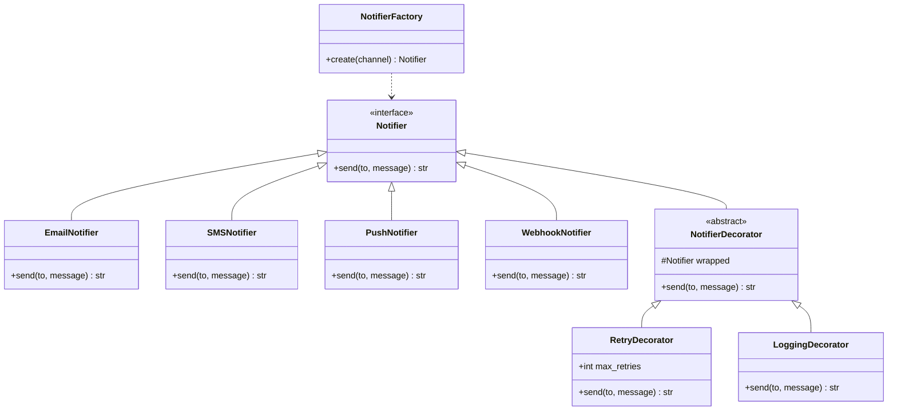

# Design a Notification System

## Requirements

**Functional:**
- Send notifications via multiple channels: Email, SMS, Push, Webhook.
- Each notification may need retry logic, logging, or rate limiting — applied independently.
- Support priority levels (low, normal, urgent).
- Easily add new channels without modifying existing code.

**Non-functional:**
- Decorators are composable: wrap any channel with retry, then logging, or vice versa.
- Channel creation should be driven by configuration, not hard-coded.

---

## Class Diagram



---

## Full Python Implementation

```python
from abc import ABC, abstractmethod
import time
import random


# ---------- Strategy / Interface ----------

class Notifier(ABC):
    @abstractmethod
    def send(self, to: str, message: str) -> str:
        pass


# ---------- Concrete Notifiers ----------

class EmailNotifier(Notifier):
    def send(self, to, message):
        return f"EMAIL → {to}: {message}"

class SMSNotifier(Notifier):
    def send(self, to, message):
        return f"SMS → {to}: {message}"

class PushNotifier(Notifier):
    def send(self, to, message):
        return f"PUSH → {to}: {message}"

class WebhookNotifier(Notifier):
    def send(self, to, message):
        return f"WEBHOOK → {to}: {message}"


# ---------- Factory ----------

class NotifierFactory:
    _registry = {
        "email": EmailNotifier,
        "sms": SMSNotifier,
        "push": PushNotifier,
        "webhook": WebhookNotifier,
    }

    @classmethod
    def register(cls, name, klass):
        cls._registry[name] = klass

    @classmethod
    def create(cls, channel: str) -> Notifier:
        klass = cls._registry.get(channel)
        if not klass:
            raise ValueError(f"Unknown channel: {channel}")
        return klass()


# ---------- Decorator ----------

class NotifierDecorator(Notifier):
    def __init__(self, wrapped: Notifier):
        self._wrapped = wrapped

    def send(self, to, message):
        return self._wrapped.send(to, message)


class RetryDecorator(NotifierDecorator):
    def __init__(self, wrapped: Notifier, max_retries: int = 3,
                 backoff: float = 0.1):
        super().__init__(wrapped)
        self.max_retries = max_retries
        self.backoff = backoff

    def send(self, to, message):
        for attempt in range(1, self.max_retries + 1):
            try:
                # Simulate ~30% failure rate
                if random.random() < 0.3:
                    raise ConnectionError("Network timeout")
                return self._wrapped.send(to, message)
            except ConnectionError as e:
                if attempt == self.max_retries:
                    return f"FAILED after {self.max_retries} retries: {e}"
                time.sleep(self.backoff * attempt)
        return "FAILED"


class LoggingDecorator(NotifierDecorator):
    def send(self, to, message):
        result = self._wrapped.send(to, message)
        timestamp = time.strftime("%H:%M:%S")
        print(f"[{timestamp}] LOG: {result}")
        return result


class RateLimitDecorator(NotifierDecorator):
    def __init__(self, wrapped: Notifier, max_per_minute: int = 60):
        super().__init__(wrapped)
        self.max_per_minute = max_per_minute
        self._timestamps: list[float] = []

    def send(self, to, message):
        now = time.time()
        self._timestamps = [t for t in self._timestamps if now - t < 60]
        if len(self._timestamps) >= self.max_per_minute:
            return f"RATE LIMITED: {to} — try again later"
        self._timestamps.append(now)
        return self._wrapped.send(to, message)


# ---------- Notification Service ----------

class NotificationService:
    def __init__(self, channels: list[str], decorators: list[str] = None):
        self.notifiers = []
        for ch in channels:
            notifier = NotifierFactory.create(ch)
            if decorators:
                for dec in decorators:
                    if dec == "retry":
                        notifier = RetryDecorator(notifier)
                    elif dec == "logging":
                        notifier = LoggingDecorator(notifier)
                    elif dec == "rate_limit":
                        notifier = RateLimitDecorator(notifier)
            self.notifiers.append(notifier)

    def notify(self, to: str, message: str):
        results = []
        for n in self.notifiers:
            results.append(n.send(to, message))
        return results


# ---------- Demo ----------
if __name__ == "__main__":
    # Email with retry + logging, SMS with logging only
    email = LoggingDecorator(RetryDecorator(EmailNotifier()))
    sms = LoggingDecorator(SMSNotifier())

    email.send("alice@example.com", "Your package shipped!")
    sms.send("+1-555-0100", "Your package shipped!")

    # Using NotificationService
    svc = NotificationService(
        channels=["email", "push"],
        decorators=["retry", "logging"]
    )
    svc.notify("bob@example.com", "Welcome aboard!")
```

---

## Design Patterns Used

| Pattern | Where |
|---------|-------|
| **Factory** | `NotifierFactory` creates channel-specific notifiers from a string |
| **Strategy** | Each `Notifier` subclass is an interchangeable sending strategy |
| **Decorator** | `RetryDecorator`, `LoggingDecorator`, `RateLimitDecorator` wrap any notifier to add behavior without modifying the original class |

**Why Decorator?** Without it, you'd need `RetryEmailNotifier`, `RetryLoggingSMSNotifier`, etc. — a combinatorial explosion. Decorators compose: `LoggingDecorator(RetryDecorator(EmailNotifier()))` adds both behaviors to any channel.

---

## Quiz

import MCQ from '@/components/mcq/MCQ'

<MCQ
  question="You need Email with retry + logging, and SMS with just logging. Without the Decorator pattern, how many classes would you need?"
  options={[
    "2 (one for each channel)",
    "4 — RetryLoggingEmailNotifier, LoggingSMSNotifier, plus the base classes. And every new combination needs another class.",
    "1 — just add if-else flags to each notifier.",
    "3"
  ]}
  correctAnswerIndex={1}
  explanation="Without decorators, each combination of channel × behaviors requires a dedicated class. With decorators, you compose: LoggingDecorator(RetryDecorator(EmailNotifier())) — no new classes needed."
/>

<MCQ
  question="LoggingDecorator wraps a Notifier. Should it extend Notifier or contain a Notifier?"
  options={[
    "Only extend — decorators are subclasses.",
    "Only contain — decorators use composition.",
    "Both — it extends Notifier (same interface) AND contains a Notifier instance (wraps it). This is the key structural property of the Decorator pattern.",
    "Neither — decorators use multiple inheritance."
  ]}
  correctAnswerIndex={2}
  explanation="The Decorator pattern's power comes from IS-A + HAS-A: the decorator is a Notifier (so it can replace one) and has a Notifier (so it can delegate and add behavior)."
/>

<MCQ
  question="You want to add a 'Slack' channel. Which existing classes need changes?"
  options={[
    "NotifierFactory and all decorators.",
    "Only create SlackNotifier extending Notifier and register it in NotifierFactory — decorators automatically work with it.",
    "The NotificationService class.",
    "RetryDecorator needs a Slack-specific retry."
  ]}
  correctAnswerIndex={1}
  explanation="OCP + Decorator: Create SlackNotifier, register it. All existing decorators wrap any Notifier, so RetryDecorator(SlackNotifier()) works immediately."
/>
