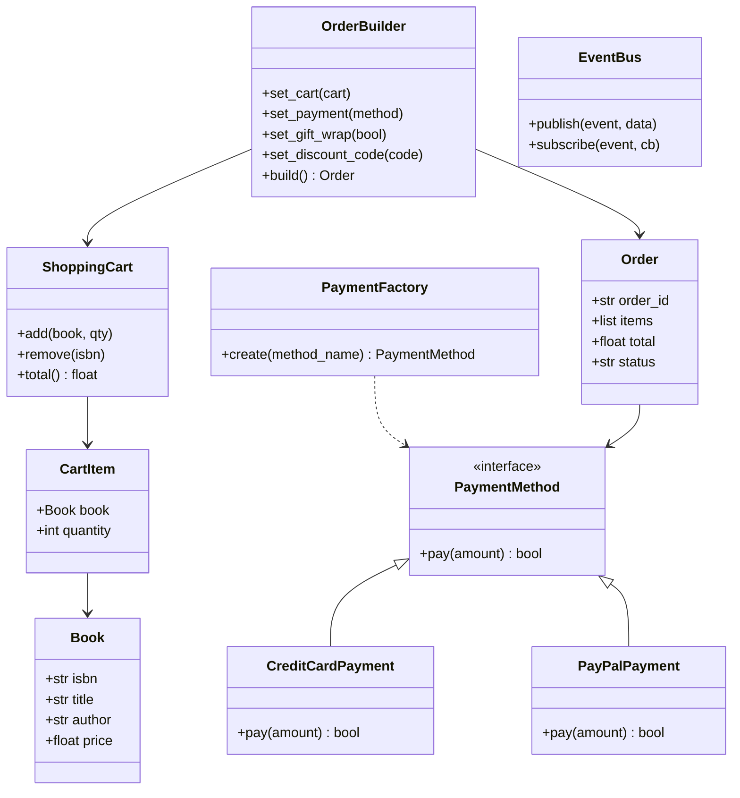

# Design an Online Bookstore

## Requirements

**Functional:**
- Users browse a catalog, search by title/author/genre.
- Add items to a shopping cart; adjust quantities.
- Checkout: build an order from the cart, select payment method, apply discounts.
- Notify user via email/SMS on order confirmation and shipping.

**Non-functional:**
- Support multiple payment methods (credit card, PayPal, crypto) without changing checkout logic.
- Order construction should handle optional fields cleanly (gift wrapping, special instructions, discount codes).

---

## Class Diagram



---

## Full Python Implementation

```python
from abc import ABC, abstractmethod
from collections import defaultdict
import uuid


# ---------- Observer ----------

class EventBus:
    def __init__(self):
        self._listeners = defaultdict(list)

    def subscribe(self, event, callback):
        self._listeners[event].append(callback)

    def publish(self, event, data=None):
        for cb in self._listeners.get(event, []):
            cb(data)


# ---------- Domain Models ----------

class Book:
    def __init__(self, isbn, title, author, price):
        self.isbn = isbn
        self.title = title
        self.author = author
        self.price = price

    def __repr__(self):
        return f"{self.title} (${self.price:.2f})"


class CartItem:
    def __init__(self, book: Book, quantity: int = 1):
        self.book = book
        self.quantity = quantity

    @property
    def subtotal(self):
        return self.book.price * self.quantity


class ShoppingCart:
    def __init__(self):
        self.items: dict[str, CartItem] = {}

    def add(self, book: Book, quantity: int = 1):
        if book.isbn in self.items:
            self.items[book.isbn].quantity += quantity
        else:
            self.items[book.isbn] = CartItem(book, quantity)

    def remove(self, isbn: str):
        self.items.pop(isbn, None)

    def total(self) -> float:
        return sum(item.subtotal for item in self.items.values())

    def get_items(self) -> list[CartItem]:
        return list(self.items.values())


# ---------- Factory — Payment Methods ----------

class PaymentMethod(ABC):
    @abstractmethod
    def pay(self, amount: float) -> bool:
        pass

class CreditCardPayment(PaymentMethod):
    def __init__(self, card_number="**** **** **** 1234"):
        self.card_number = card_number

    def pay(self, amount):
        print(f"Charged ${amount:.2f} to credit card {self.card_number}")
        return True

class PayPalPayment(PaymentMethod):
    def __init__(self, email="user@paypal.com"):
        self.email = email

    def pay(self, amount):
        print(f"Charged ${amount:.2f} to PayPal {self.email}")
        return True

class CryptoPayment(PaymentMethod):
    def __init__(self, wallet="0xABC..."):
        self.wallet = wallet

    def pay(self, amount):
        print(f"Sent ${amount:.2f} equivalent in crypto to {self.wallet}")
        return True


class PaymentFactory:
    _registry = {
        "credit_card": CreditCardPayment,
        "paypal": PayPalPayment,
        "crypto": CryptoPayment,
    }

    @classmethod
    def create(cls, method_name: str, **kwargs) -> PaymentMethod:
        klass = cls._registry.get(method_name)
        if not klass:
            raise ValueError(f"Unknown payment method: {method_name}")
        return klass(**kwargs)


# ---------- Builder — Order Construction ----------

class Order:
    def __init__(self):
        self.order_id = str(uuid.uuid4())[:8].upper()
        self.items: list[CartItem] = []
        self.subtotal = 0.0
        self.discount = 0.0
        self.gift_wrap = False
        self.gift_wrap_fee = 0.0
        self.special_instructions = ""
        self.payment_method: PaymentMethod = None
        self.status = "created"

    @property
    def total(self):
        return self.subtotal - self.discount + self.gift_wrap_fee

    def __repr__(self):
        return (f"Order({self.order_id}, items={len(self.items)}, "
                f"total=${self.total:.2f}, status={self.status})")


class OrderBuilder:
    DISCOUNT_CODES = {"SAVE10": 0.10, "HALF": 0.50}
    GIFT_WRAP_FEE = 3.99

    def __init__(self):
        self._order = Order()

    def set_cart(self, cart: ShoppingCart):
        self._order.items = cart.get_items()
        self._order.subtotal = cart.total()
        return self

    def set_payment(self, method_name: str, **kwargs):
        self._order.payment_method = PaymentFactory.create(method_name, **kwargs)
        return self

    def set_gift_wrap(self, enabled: bool = True):
        self._order.gift_wrap = enabled
        self._order.gift_wrap_fee = self.GIFT_WRAP_FEE if enabled else 0.0
        return self

    def set_discount_code(self, code: str):
        pct = self.DISCOUNT_CODES.get(code.upper(), 0)
        self._order.discount = self._order.subtotal * pct
        return self

    def set_special_instructions(self, text: str):
        self._order.special_instructions = text
        return self

    def build(self) -> Order:
        if not self._order.items:
            raise ValueError("Cart is empty")
        if not self._order.payment_method:
            raise ValueError("Payment method required")
        return self._order


# ---------- Checkout Service ----------

class CheckoutService:
    def __init__(self, bus: EventBus):
        self.bus = bus

    def checkout(self, order: Order) -> bool:
        success = order.payment_method.pay(order.total)
        if success:
            order.status = "confirmed"
            self.bus.publish("order_confirmed", {
                "order_id": order.order_id,
                "total": order.total,
                "items": len(order.items)
            })
        return success


# ---------- Demo ----------
if __name__ == "__main__":
    bus = EventBus()
    bus.subscribe("order_confirmed",
        lambda d: print(f"  Email: Order {d['order_id']} confirmed — ${d['total']:.2f}"))
    bus.subscribe("order_confirmed",
        lambda d: print(f"  SMS: Your order {d['order_id']} is being processed."))

    cart = ShoppingCart()
    cart.add(Book("978-1", "Design Patterns", "GoF", 49.99), 1)
    cart.add(Book("978-2", "Clean Code", "R. Martin", 39.99), 2)

    order = (OrderBuilder()
        .set_cart(cart)
        .set_payment("credit_card")
        .set_gift_wrap(True)
        .set_discount_code("SAVE10")
        .build())

    print(order)

    svc = CheckoutService(bus)
    svc.checkout(order)
```

---

## Design Patterns Used

| Pattern | Where |
|---------|-------|
| **Factory** | `PaymentFactory` creates the right `PaymentMethod` from a string name |
| **Builder** | `OrderBuilder` fluently constructs complex `Order` objects with optional fields |
| **Observer** | `EventBus` publishes `order_confirmed` to email and SMS subscribers |

---

## Quiz

import MCQ from '@/components/mcq/MCQ'

<MCQ
  question="An Order has optional fields: gift wrap, discount code, special instructions. Without the Builder pattern, what's the main problem?"
  options={[
    "You can't have optional fields in Python.",
    "The Order constructor would need many optional parameters — a 'telescoping constructor' anti-pattern that's hard to read and maintain.",
    "Python doesn't support method chaining.",
    "Optional fields require a database."
  ]}
  correctAnswerIndex={1}
  explanation="The Builder pattern solves the telescoping constructor problem by using fluent methods to set optional fields. The build() method validates and returns the final object."
/>

<MCQ
  question="CheckoutService calls `order.payment_method.pay()` without knowing if it's CreditCard, PayPal, or Crypto. Which principle is this?"
  options={[
    "Single Responsibility",
    "Dependency Inversion — CheckoutService depends on the PaymentMethod abstraction, not concrete classes",
    "Interface Segregation",
    "Don't Repeat Yourself"
  ]}
  correctAnswerIndex={1}
  explanation="CheckoutService depends on the PaymentMethod interface (abstraction), not on CreditCardPayment or PayPalPayment (details). This is the Dependency Inversion Principle."
/>

<MCQ
  question="You need to add Apple Pay. Which classes need modification?"
  options={[
    "PaymentFactory and CheckoutService.",
    "Only create ApplePayPayment and register it in PaymentFactory._registry — no other changes.",
    "Order and OrderBuilder.",
    "All payment classes need a refactor."
  ]}
  correctAnswerIndex={1}
  explanation="Factory + OCP: Create the new class and register it. The factory's create() method, CheckoutService, and OrderBuilder remain unchanged."
/>
