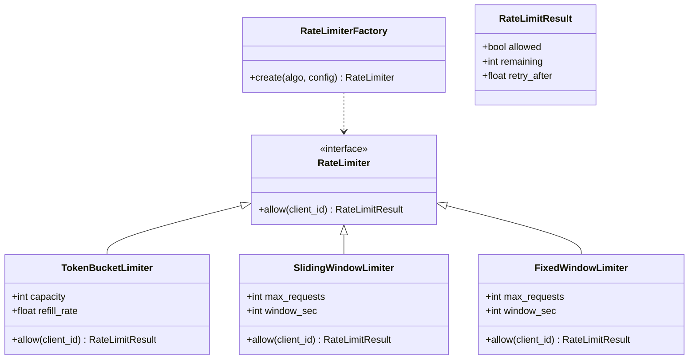

# Design a Rate Limiter

## Requirements

**Functional:**
- Limit API requests per client to a configurable threshold within a time window.
- Support multiple algorithms: Token Bucket, Sliding Window Log, Fixed Window Counter.
- Return allow/deny decision with remaining quota info.
- Support per-route and per-user limits.

**Non-functional:**
- Pluggable algorithm — swap without changing client code.
- Factory-driven creation from configuration.

---

## Class Diagram



---

## Full Python Implementation

```python
from abc import ABC, abstractmethod
from dataclasses import dataclass
from collections import defaultdict
import time


@dataclass
class RateLimitResult:
    allowed: bool
    remaining: int
    retry_after: float = 0.0


# ---------- Strategy — Rate Limiting Algorithms ----------

class RateLimiter(ABC):
    @abstractmethod
    def allow(self, client_id: str) -> RateLimitResult:
        pass


class TokenBucketLimiter(RateLimiter):
    """Tokens refill at a steady rate. Each request consumes one token.
    Allows short bursts up to bucket capacity."""

    def __init__(self, capacity: int = 10, refill_rate: float = 1.0):
        self.capacity = capacity
        self.refill_rate = refill_rate  # tokens per second
        self._buckets: dict[str, dict] = {}

    def _get_bucket(self, client_id: str) -> dict:
        now = time.time()
        if client_id not in self._buckets:
            self._buckets[client_id] = {
                "tokens": self.capacity,
                "last_refill": now
            }
        bucket = self._buckets[client_id]
        elapsed = now - bucket["last_refill"]
        refill = elapsed * self.refill_rate
        bucket["tokens"] = min(self.capacity, bucket["tokens"] + refill)
        bucket["last_refill"] = now
        return bucket

    def allow(self, client_id: str) -> RateLimitResult:
        bucket = self._get_bucket(client_id)
        if bucket["tokens"] >= 1:
            bucket["tokens"] -= 1
            return RateLimitResult(
                allowed=True,
                remaining=int(bucket["tokens"])
            )
        wait = (1 - bucket["tokens"]) / self.refill_rate
        return RateLimitResult(allowed=False, remaining=0, retry_after=wait)


class SlidingWindowLimiter(RateLimiter):
    """Tracks exact timestamps of each request. Counts requests
    within a rolling window."""

    def __init__(self, max_requests: int = 100, window_sec: int = 60):
        self.max_requests = max_requests
        self.window_sec = window_sec
        self._logs: dict[str, list[float]] = defaultdict(list)

    def allow(self, client_id: str) -> RateLimitResult:
        now = time.time()
        cutoff = now - self.window_sec
        log = self._logs[client_id]
        # Evict expired entries
        self._logs[client_id] = [t for t in log if t > cutoff]
        log = self._logs[client_id]

        if len(log) < self.max_requests:
            log.append(now)
            return RateLimitResult(
                allowed=True,
                remaining=self.max_requests - len(log)
            )

        oldest = log[0]
        retry = oldest + self.window_sec - now
        return RateLimitResult(
            allowed=False, remaining=0,
            retry_after=max(0, retry)
        )


class FixedWindowLimiter(RateLimiter):
    """Divides time into fixed windows. Counts requests per window."""

    def __init__(self, max_requests: int = 100, window_sec: int = 60):
        self.max_requests = max_requests
        self.window_sec = window_sec
        self._windows: dict[str, dict] = {}

    def _get_window(self, client_id: str) -> dict:
        now = time.time()
        window_start = int(now // self.window_sec) * self.window_sec
        key = client_id

        if key not in self._windows or self._windows[key]["start"] != window_start:
            self._windows[key] = {"start": window_start, "count": 0}
        return self._windows[key]

    def allow(self, client_id: str) -> RateLimitResult:
        window = self._get_window(client_id)
        if window["count"] < self.max_requests:
            window["count"] += 1
            return RateLimitResult(
                allowed=True,
                remaining=self.max_requests - window["count"]
            )
        now = time.time()
        retry = window["start"] + self.window_sec - now
        return RateLimitResult(
            allowed=False, remaining=0,
            retry_after=max(0, retry)
        )


# ---------- Factory ----------

class RateLimiterFactory:
    _registry = {
        "token_bucket": TokenBucketLimiter,
        "sliding_window": SlidingWindowLimiter,
        "fixed_window": FixedWindowLimiter,
    }

    @classmethod
    def create(cls, algorithm: str, **config) -> RateLimiter:
        klass = cls._registry.get(algorithm)
        if not klass:
            raise ValueError(f"Unknown algorithm: {algorithm}")
        return klass(**config)


# ---------- API Gateway Integration ----------

class APIGateway:
    def __init__(self):
        self._limiters: dict[str, RateLimiter] = {}

    def add_route(self, route: str, algorithm: str, **config):
        self._limiters[route] = RateLimiterFactory.create(algorithm, **config)

    def handle_request(self, route: str, client_id: str) -> dict:
        limiter = self._limiters.get(route)
        if not limiter:
            return {"status": 200, "body": "OK"}

        result = limiter.allow(client_id)
        if result.allowed:
            return {
                "status": 200,
                "headers": {"X-RateLimit-Remaining": result.remaining},
                "body": "OK"
            }
        return {
            "status": 429,
            "headers": {
                "X-RateLimit-Remaining": 0,
                "Retry-After": f"{result.retry_after:.1f}s"
            },
            "body": "Too Many Requests"
        }


# ---------- Demo ----------
if __name__ == "__main__":
    gateway = APIGateway()
    gateway.add_route("/api/search", "token_bucket", capacity=5, refill_rate=1.0)
    gateway.add_route("/api/login", "fixed_window", max_requests=3, window_sec=60)

    # Simulate requests
    for i in range(8):
        resp = gateway.handle_request("/api/search", "user-42")
        status = "OK" if resp["status"] == 200 else "RATE LIMITED"
        remaining = resp["headers"].get("X-RateLimit-Remaining", "?")
        print(f"Request {i+1}: {status} (remaining: {remaining})")

    # Token bucket: first 5 pass, next 3 are rate limited
```

---

## Design Patterns Used

| Pattern | Where |
|---------|-------|
| **Strategy** | `TokenBucketLimiter`, `SlidingWindowLimiter`, `FixedWindowLimiter` — interchangeable rate-limiting algorithms behind a common `RateLimiter` interface |
| **Factory** | `RateLimiterFactory` creates the right limiter from a configuration string |

---

## Algorithm Comparison

| Algorithm | Pros | Cons | Best For |
|-----------|------|------|----------|
| **Token Bucket** | Smooth rate, allows bursts up to capacity | Slight memory per client | General API rate limiting |
| **Sliding Window** | Precise, no boundary bursts | Higher memory (stores all timestamps) | Strict compliance APIs |
| **Fixed Window** | Simple, low memory | Boundary burst problem (2× requests at window edge) | Non-critical endpoints |

---

## Quiz

import MCQ from '@/components/mcq/MCQ'

<MCQ
  question="Token Bucket has capacity=10 and refill_rate=2/sec. A client sends 10 requests instantly (all pass), then waits 3 seconds. How many tokens are available?"
  options={[
    "10 — bucket is refilled.",
    "6 — 3 seconds × 2 tokens/sec = 6 tokens refilled.",
    "0 — tokens don't refill after depletion.",
    "3 — only 1 token per second."
  ]}
  correctAnswerIndex={1}
  explanation="After 10 instant requests, 0 tokens remain. 3 seconds × 2 tokens/sec = 6 new tokens. The bucket caps at capacity (10), but only 6 were generated, so 6 are available."
/>

<MCQ
  question="Fixed Window has max_requests=100 and window_sec=60. A client sends 100 requests at second 59, then 100 more at second 61 (new window). How many total requests pass in a 2-second span?"
  options={[
    "100 — only the first window's requests pass.",
    "200 — this is the 'boundary burst' problem. Both windows allow 100, so 200 requests pass in just 2 seconds despite a 100/minute limit.",
    "101 — one extra leaks through.",
    "150 — the algorithm interpolates."
  ]}
  correctAnswerIndex={1}
  explanation="This is Fixed Window's main weakness: at the boundary between two windows, 2× the limit can pass. Sliding Window solves this by using a rolling time range instead of fixed boundaries."
/>

<MCQ
  question="Your API gateway needs Token Bucket for /api/search and Fixed Window for /api/login. How does the Factory pattern help?"
  options={[
    "It doesn't — you need separate gateway classes.",
    "RateLimiterFactory.create('token_bucket', ...) and .create('fixed_window', ...) return the right limiter from configuration. The gateway doesn't know which algorithm it's using.",
    "The factory creates all limiters at once.",
    "You must subclass the gateway for each algorithm."
  ]}
  correctAnswerIndex={1}
  explanation="The Factory decouples creation from usage. The APIGateway stores RateLimiter references — it doesn't know or care about the concrete algorithm. Configuration drives which strategy is selected."
/>
