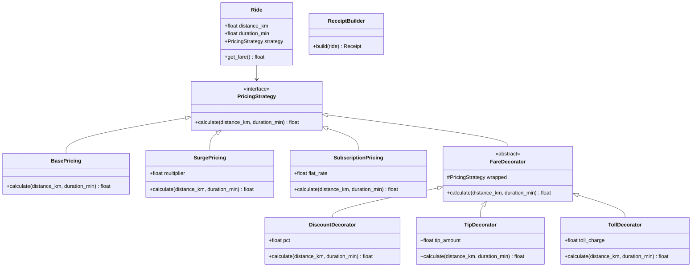

# Design a Ride-Share Billing System

## Requirements

**Functional:**
- Calculate ride fare based on distance and duration.
- Support multiple pricing strategies: base rate, surge pricing, subscription (flat rate).
- Apply optional modifiers: discount codes, tips, toll charges.
- Generate an itemized receipt.

**Non-functional:**
- Adding new pricing strategies or modifiers should not change existing code.
- Modifiers should be composable — stack multiple on a single fare.

---

## Class Diagram



---

## Full Python Implementation

```python
from abc import ABC, abstractmethod
from dataclasses import dataclass, field
from datetime import datetime


# ---------- Strategy — Pricing ----------

class PricingStrategy(ABC):
    @abstractmethod
    def calculate(self, distance_km: float, duration_min: float) -> float:
        pass

    def breakdown(self, distance_km: float, duration_min: float) -> list[str]:
        return [f"Fare: ${self.calculate(distance_km, duration_min):.2f}"]


class BasePricing(PricingStrategy):
    BASE_FARE = 2.50
    PER_KM = 1.20
    PER_MIN = 0.30

    def calculate(self, distance_km, duration_min):
        return self.BASE_FARE + (distance_km * self.PER_KM) + (duration_min * self.PER_MIN)

    def breakdown(self, distance_km, duration_min):
        return [
            f"Base fare: ${self.BASE_FARE:.2f}",
            f"Distance ({distance_km:.1f} km × ${self.PER_KM:.2f}): "
            f"${distance_km * self.PER_KM:.2f}",
            f"Time ({duration_min:.0f} min × ${self.PER_MIN:.2f}): "
            f"${duration_min * self.PER_MIN:.2f}",
        ]


class SurgePricing(PricingStrategy):
    def __init__(self, base: PricingStrategy, multiplier: float = 2.0):
        self._base = base
        self.multiplier = multiplier

    def calculate(self, distance_km, duration_min):
        return self._base.calculate(distance_km, duration_min) * self.multiplier

    def breakdown(self, distance_km, duration_min):
        lines = self._base.breakdown(distance_km, duration_min)
        lines.append(f"Surge multiplier: ×{self.multiplier:.1f}")
        return lines


class SubscriptionPricing(PricingStrategy):
    def __init__(self, flat_rate: float = 9.99):
        self.flat_rate = flat_rate

    def calculate(self, distance_km, duration_min):
        return self.flat_rate

    def breakdown(self, distance_km, duration_min):
        return [f"Subscription flat rate: ${self.flat_rate:.2f}"]


# ---------- Decorator — Modifiers ----------

class FareDecorator(PricingStrategy):
    def __init__(self, wrapped: PricingStrategy):
        self._wrapped = wrapped

    def calculate(self, distance_km, duration_min):
        return self._wrapped.calculate(distance_km, duration_min)

    def breakdown(self, distance_km, duration_min):
        return self._wrapped.breakdown(distance_km, duration_min)


class DiscountDecorator(FareDecorator):
    def __init__(self, wrapped: PricingStrategy, discount_pct: float = 0.10):
        super().__init__(wrapped)
        self.discount_pct = discount_pct

    def calculate(self, distance_km, duration_min):
        base = self._wrapped.calculate(distance_km, duration_min)
        return base * (1 - self.discount_pct)

    def breakdown(self, distance_km, duration_min):
        lines = self._wrapped.breakdown(distance_km, duration_min)
        base = self._wrapped.calculate(distance_km, duration_min)
        discount = base * self.discount_pct
        lines.append(f"Discount ({self.discount_pct*100:.0f}%): -${discount:.2f}")
        return lines


class TipDecorator(FareDecorator):
    def __init__(self, wrapped: PricingStrategy, tip: float = 5.00):
        super().__init__(wrapped)
        self.tip = tip

    def calculate(self, distance_km, duration_min):
        return self._wrapped.calculate(distance_km, duration_min) + self.tip

    def breakdown(self, distance_km, duration_min):
        lines = self._wrapped.breakdown(distance_km, duration_min)
        lines.append(f"Tip: +${self.tip:.2f}")
        return lines


class TollDecorator(FareDecorator):
    def __init__(self, wrapped: PricingStrategy, toll: float = 3.50):
        super().__init__(wrapped)
        self.toll = toll

    def calculate(self, distance_km, duration_min):
        return self._wrapped.calculate(distance_km, duration_min) + self.toll

    def breakdown(self, distance_km, duration_min):
        lines = self._wrapped.breakdown(distance_km, duration_min)
        lines.append(f"Toll charge: +${self.toll:.2f}")
        return lines


# ---------- Ride & Receipt ----------

@dataclass
class Ride:
    rider: str
    driver: str
    distance_km: float
    duration_min: float
    strategy: PricingStrategy

    def get_fare(self) -> float:
        return self.strategy.calculate(self.distance_km, self.duration_min)

    def receipt(self) -> str:
        lines = [
            "=" * 40,
            "       RIDE RECEIPT",
            "=" * 40,
            f"Rider:    {self.rider}",
            f"Driver:   {self.driver}",
            f"Distance: {self.distance_km:.1f} km",
            f"Duration: {self.duration_min:.0f} min",
            "-" * 40,
        ]
        lines.extend(self.strategy.breakdown(self.distance_km, self.duration_min))
        lines.append("-" * 40)
        lines.append(f"TOTAL: ${self.get_fare():.2f}")
        lines.append("=" * 40)
        return "\n".join(lines)


# ---------- Demo ----------
if __name__ == "__main__":
    # Standard ride with discount + tip + toll
    pricing = TipDecorator(
        TollDecorator(
            DiscountDecorator(
                BasePricing(),
                discount_pct=0.15
            ),
            toll=4.00
        ),
        tip=3.00
    )
    ride = Ride("Alice", "Driver Bob", 12.5, 22, pricing)
    print(ride.receipt())
    # TOTAL breakdown:
    #   Base: $2.50, Distance: $15.00, Time: $6.60 = $24.10
    #   Discount 15%: -$3.62 → $20.49
    #   Toll: +$4.00 → $24.49
    #   Tip: +$3.00 → $27.49

    print()

    # Surge ride (2x)
    surge = SurgePricing(BasePricing(), multiplier=2.5)
    ride2 = Ride("Charlie", "Driver Dave", 8.0, 15, surge)
    print(ride2.receipt())
```

---

## Design Patterns Used

| Pattern | Where |
|---------|-------|
| **Strategy** | `BasePricing`, `SurgePricing`, `SubscriptionPricing` — interchangeable pricing algorithms |
| **Decorator** | `DiscountDecorator`, `TipDecorator`, `TollDecorator` — composable modifiers that wrap any pricing strategy |

**Key insight:** Decorators and Strategies can be composed freely. `TipDecorator(DiscountDecorator(SurgePricing(BasePricing())))` applies surge, then discount, then tip — without any class knowing about the others.

---

## Quiz

import MCQ from '@/components/mcq/MCQ'

<MCQ
  question="Base fare for a 10 km, 20 min ride is $2.50 + $12.00 + $6.00 = $20.50. With a 10% DiscountDecorator, what's the fare?"
  options={[
    "$20.50 (discount is ignored)",
    "$18.45 — decorator calculates base then applies 10% off",
    "$2.05",
    "$22.55"
  ]}
  correctAnswerIndex={1}
  explanation="DiscountDecorator delegates to the wrapped strategy ($20.50), then multiplies by (1 - 0.10) = $18.45. The decorator doesn't know or care about the inner strategy's implementation."
/>

<MCQ
  question="You need to add a 'Promo Code' modifier that gives $5 off orders over $15. Which approach follows OCP?"
  options={[
    "Modify BasePricing to check promo codes.",
    "Create PromoCodeDecorator wrapping PricingStrategy — checks the total and subtracts $5 if over $15. No existing classes change.",
    "Add a promo_code field to every strategy class.",
    "Hardcode it in the Ride class."
  ]}
  correctAnswerIndex={1}
  explanation="The Decorator pattern: Create a new decorator class. It wraps any strategy, checks the condition, and adjusts the fare. Zero existing code changes — pure extension."
/>

<MCQ
  question="What's the order of operations if you write TipDecorator(DiscountDecorator(SurgePricing(BasePricing(), 2.0), 0.10), 5.0)?"
  options={[
    "Tip → Discount → Surge → Base",
    "Base → Surge (×2) → Discount (10% off) → Tip (+$5) — innermost calculates first, each decorator wraps the result",
    "All modifiers apply simultaneously.",
    "The order doesn't matter — decorators are commutative."
  ]}
  correctAnswerIndex={1}
  explanation="Decorators are nested: the innermost (BasePricing) runs first. Surge doubles it, Discount takes 10% off the surged amount, Tip adds $5 on top. Order matters — DiscountDecorator(TipDecorator(...)) would discount the tip too."
/>
