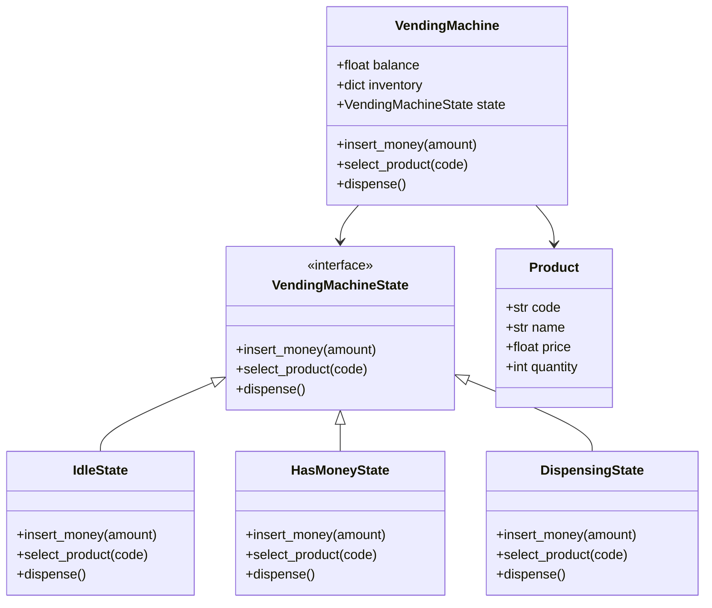

# Design a Vending Machine

## Requirements

**Functional:**
- Accept coins and bills; track inserted amount.
- Display available products with prices.
- Dispense selected product if sufficient money is inserted.
- Return change after dispensing.
- Handle out-of-stock gracefully.

**Non-functional:**
- Clear state transitions — no illegal operations (e.g., dispensing before payment).
- Easy to add new states or products.

---

## Class Diagram



---

## Full Python Implementation

```python
from abc import ABC, abstractmethod


class Product:
    def __init__(self, code: str, name: str, price: float, quantity: int):
        self.code = code
        self.name = name
        self.price = price
        self.quantity = quantity

    def __repr__(self):
        return f"{self.name} (${self.price:.2f}, qty={self.quantity})"


# ---------- State Interface ----------

class VendingMachineState(ABC):
    def __init__(self, machine: "VendingMachine"):
        self.machine = machine

    @abstractmethod
    def insert_money(self, amount: float):
        pass

    @abstractmethod
    def select_product(self, code: str):
        pass

    @abstractmethod
    def dispense(self):
        pass


# ---------- Concrete States ----------

class IdleState(VendingMachineState):
    def insert_money(self, amount):
        self.machine.balance += amount
        print(f"Inserted ${amount:.2f}. Balance: ${self.machine.balance:.2f}")
        self.machine.set_state(HasMoneyState(self.machine))

    def select_product(self, code):
        print("Please insert money first.")

    def dispense(self):
        print("Please insert money and select a product.")


class HasMoneyState(VendingMachineState):
    def insert_money(self, amount):
        self.machine.balance += amount
        print(f"Inserted ${amount:.2f}. Balance: ${self.machine.balance:.2f}")

    def select_product(self, code):
        product = self.machine.inventory.get(code)
        if not product:
            print(f"Invalid product code: {code}")
            return
        if product.quantity <= 0:
            print(f"{product.name} is out of stock.")
            return
        if self.machine.balance < product.price:
            print(f"Insufficient funds. {product.name} costs ${product.price:.2f}, "
                  f"balance is ${self.machine.balance:.2f}")
            return
        self.machine.selected_product = product
        self.machine.set_state(DispensingState(self.machine))
        self.machine.dispense()

    def dispense(self):
        print("Please select a product first.")


class DispensingState(VendingMachineState):
    def insert_money(self, amount):
        print("Please wait, dispensing in progress.")

    def select_product(self, code):
        print("Please wait, dispensing in progress.")

    def dispense(self):
        product = self.machine.selected_product
        self.machine.balance -= product.price
        product.quantity -= 1
        change = self.machine.balance
        print(f"Dispensing {product.name}.")
        if change > 0:
            print(f"Returning change: ${change:.2f}")
        self.machine.balance = 0
        self.machine.selected_product = None
        self.machine.set_state(IdleState(self.machine))


# ---------- Context ----------

class VendingMachine:
    def __init__(self):
        self.inventory: dict[str, Product] = {}
        self.balance = 0.0
        self.selected_product: Product = None
        self._state: VendingMachineState = IdleState(self)

    def set_state(self, state: VendingMachineState):
        self._state = state

    def add_product(self, product: Product):
        self.inventory[product.code] = product

    def insert_money(self, amount: float):
        self._state.insert_money(amount)

    def select_product(self, code: str):
        self._state.select_product(code)

    def dispense(self):
        self._state.dispense()

    def show_products(self):
        for p in self.inventory.values():
            status = "IN STOCK" if p.quantity > 0 else "OUT OF STOCK"
            print(f"  [{p.code}] {p.name} — ${p.price:.2f} ({status})")


# ---------- Demo ----------
if __name__ == "__main__":
    vm = VendingMachine()
    vm.add_product(Product("A1", "Cola", 1.50, 5))
    vm.add_product(Product("A2", "Chips", 1.25, 3))
    vm.add_product(Product("A3", "Water", 1.00, 0))

    vm.show_products()

    vm.insert_money(2.00)
    vm.select_product("A1")
    # Output:
    #   Inserted $2.00. Balance: $2.00
    #   Dispensing Cola.
    #   Returning change: $0.50

    vm.select_product("A1")   # "Please insert money first."
    vm.insert_money(1.00)
    vm.select_product("A3")   # "Water is out of stock."
```

---

## Design Patterns Used

| Pattern | Where |
|---------|-------|
| **State** | `IdleState`, `HasMoneyState`, `DispensingState` — each state encapsulates valid operations and transitions |

**Why State?** Without the State pattern, `VendingMachine` would be full of `if/elif` chains checking a state variable. Each new state (e.g., `MaintenanceState`) would require modifying every method. The State pattern isolates each state's behavior, follows OCP, and makes transitions explicit.

---

## Quiz

import MCQ from '@/components/mcq/MCQ'

<MCQ
  question="In the vending machine design, what happens if a user calls `select_product()` while in IdleState?"
  options={[
    "The machine dispenses the product for free.",
    "A runtime error is thrown.",
    "The state prints 'Please insert money first' — the operation is gracefully rejected.",
    "The machine transitions to DispensingState."
  ]}
  correctAnswerIndex={2}
  explanation="Each State class defines how to handle every action. IdleState.select_product() simply prints a message — no crash, no illegal transition. This is the core benefit of the State pattern."
/>

<MCQ
  question="You need to add a 'MaintenanceState' where all operations print 'Under maintenance'. How many existing classes do you need to modify?"
  options={[
    "All 3 existing state classes",
    "The VendingMachine class and all states",
    "Zero — create a new MaintenanceState class and set it on the machine. Existing code unchanged.",
    "The IdleState class only"
  ]}
  correctAnswerIndex={2}
  explanation="Open/Closed Principle: new states are added by creating new classes, not by modifying existing ones. Just call `machine.set_state(MaintenanceState(machine))`."
/>

<MCQ
  question="What would be a problem with replacing the State pattern with a simple `self.state = 'idle'` string and if/elif checks?"
  options={[
    "Strings are slower than objects.",
    "Every method in VendingMachine would need a growing chain of if/elif for each state, violating SRP and OCP.",
    "Python doesn't support string comparisons.",
    "There is no problem — strings are simpler."
  ]}
  correctAnswerIndex={1}
  explanation="With string-based state, adding a new state means editing every method. The State pattern encapsulates state-specific behavior, keeping each class focused and extensible."
/>
