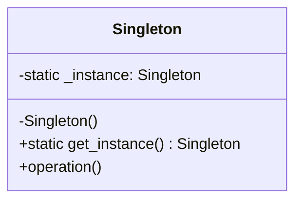
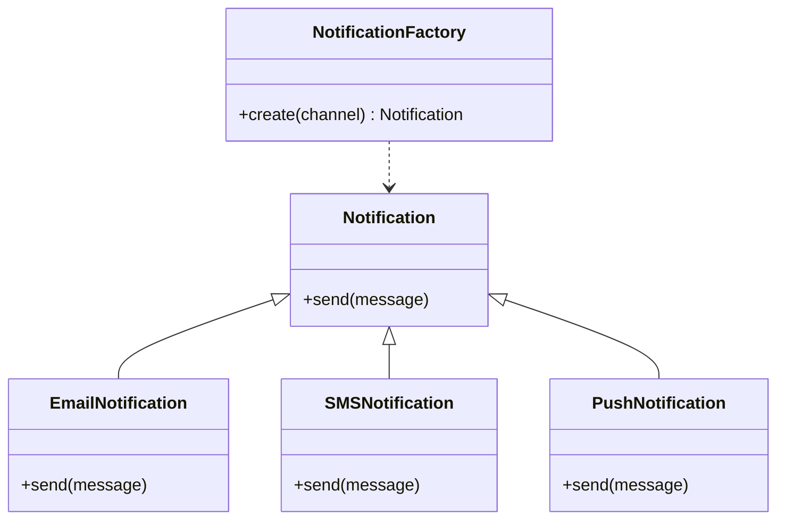
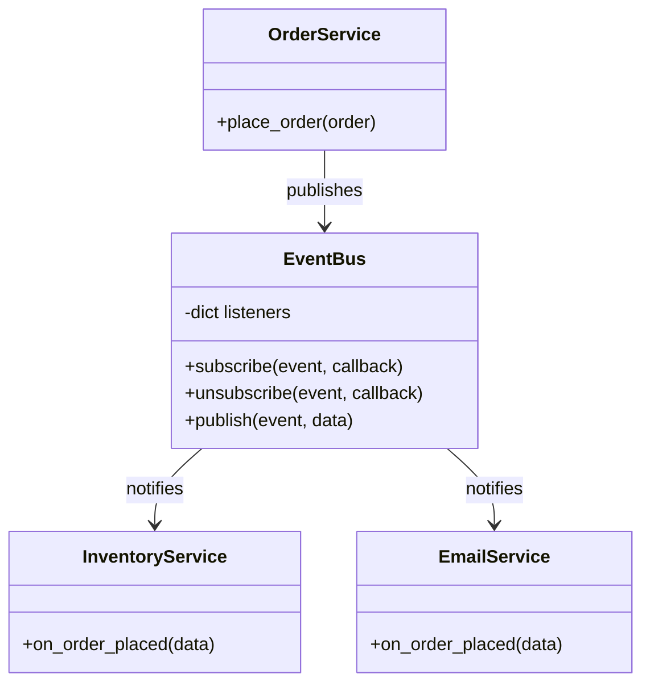
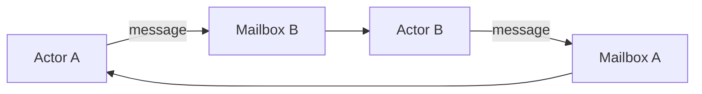

# Design Patterns Deep Dive

Design patterns are reusable solutions to common problems in software design. This page covers the most important patterns with **full Python implementations** you can use to attack any OOD interview question.

## 1. Singleton Pattern

Ensures a class has only one instance and provides a global point of access to it. Used for database connections, configuration managers, and thread pools.



```python
import threading

class DatabaseConnection:
    _instance = None
    _lock = threading.Lock()

    def __new__(cls, *args, **kwargs):
        if cls._instance is None:
            with cls._lock:
                if cls._instance is None:  # double-checked locking
                    cls._instance = super().__new__(cls)
                    cls._instance._initialized = False
        return cls._instance

    def __init__(self, connection_string="localhost:5432"):
        if self._initialized:
            return
        self.connection_string = connection_string
        self.connected = False
        self._initialized = True

    def connect(self):
        if not self.connected:
            print(f"Connecting to {self.connection_string}")
            self.connected = True

    def query(self, sql):
        if not self.connected:
            self.connect()
        return f"Result of: {sql}"


# Both variables point to the SAME instance
db1 = DatabaseConnection("prod-db:5432")
db2 = DatabaseConnection("other-db:3306")  # ignored — already initialized
assert db1 is db2  # True
```

---

## 2. Factory Method Pattern

Defines an interface for creating objects but lets subclasses decide which class to instantiate. Decouples object creation from usage.



```python
from abc import ABC, abstractmethod

class Notification(ABC):
    @abstractmethod
    def send(self, to: str, message: str) -> str:
        pass

class EmailNotification(Notification):
    def send(self, to, message):
        return f"EMAIL to {to}: {message}"

class SMSNotification(Notification):
    def send(self, to, message):
        return f"SMS to {to}: {message}"

class PushNotification(Notification):
    def send(self, to, message):
        return f"PUSH to {to}: {message}"

class WebhookNotification(Notification):
    def send(self, to, message):
        return f"WEBHOOK to {to}: {message}"


class NotificationFactory:
    _registry = {
        "email": EmailNotification,
        "sms": SMSNotification,
        "push": PushNotification,
        "webhook": WebhookNotification,
    }

    @classmethod
    def register(cls, name, notification_cls):
        cls._registry[name] = notification_cls

    @classmethod
    def create(cls, channel: str) -> Notification:
        klass = cls._registry.get(channel)
        if not klass:
            raise ValueError(f"Unknown channel: {channel}")
        return klass()


# Usage
notif = NotificationFactory.create("email")
print(notif.send("alice@example.com", "Your order shipped!"))

# Extensible: register new types without modifying existing code
NotificationFactory.register("slack", WebhookNotification)
```

---

## 3. Observer / Publisher-Subscriber Pattern

Defines a one-to-many dependency so that when one object changes state, all its dependents are notified automatically. The backbone of event-driven architectures.



```python
from collections import defaultdict
from typing import Callable, Any

class EventBus:
    """A generic publish-subscribe event system."""

    def __init__(self):
        self._listeners: dict[str, list[Callable]] = defaultdict(list)

    def subscribe(self, event: str, callback: Callable):
        self._listeners[event].append(callback)

    def unsubscribe(self, event: str, callback: Callable):
        self._listeners[event].remove(callback)

    def publish(self, event: str, data: Any = None):
        for callback in self._listeners.get(event, []):
            callback(data)


class OrderService:
    def __init__(self, bus: EventBus):
        self.bus = bus

    def place_order(self, order_id, items):
        print(f"Order {order_id} placed: {items}")
        self.bus.publish("order_placed", {
            "order_id": order_id, "items": items
        })


class InventoryService:
    def on_order_placed(self, data):
        for item in data["items"]:
            print(f"  Inventory: reserving stock for {item}")

class EmailService:
    def on_order_placed(self, data):
        print(f"  Email: sending confirmation for order {data['order_id']}")


# Wire it up
bus = EventBus()
inventory = InventoryService()
email = EmailService()

bus.subscribe("order_placed", inventory.on_order_placed)
bus.subscribe("order_placed", email.on_order_placed)

orders = OrderService(bus)
orders.place_order("ORD-001", ["Laptop", "Mouse"])
# Output:
#   Order ORD-001 placed: ['Laptop', 'Mouse']
#   Inventory: reserving stock for Laptop
#   Inventory: reserving stock for Mouse
#   Email: sending confirmation for order ORD-001
```

---

## 4. Actor Pattern

Each Actor is an independent unit with its own state and a message queue. Actors communicate exclusively by sending messages — no shared state, no locks. Used in Erlang/OTP, Akka, and distributed systems.



```python
import threading
import queue
from typing import Any

class Actor:
    """Base Actor class with a message queue and processing loop."""

    def __init__(self, name: str):
        self.name = name
        self._mailbox = queue.Queue()
        self._running = False
        self._thread = None

    def start(self):
        self._running = True
        self._thread = threading.Thread(target=self._run, daemon=True)
        self._thread.start()

    def stop(self):
        self._running = False
        self._mailbox.put(None)  # sentinel to unblock

    def send(self, message: Any):
        self._mailbox.put(message)

    def _run(self):
        while self._running:
            message = self._mailbox.get()
            if message is None:
                break
            self.receive(message)

    def receive(self, message: Any):
        raise NotImplementedError


class PrinterActor(Actor):
    def receive(self, message):
        print(f"[{self.name}] received: {message}")


class CounterActor(Actor):
    def __init__(self, name):
        super().__init__(name)
        self.count = 0

    def receive(self, message):
        if message == "increment":
            self.count += 1
        elif message == "get":
            print(f"[{self.name}] count = {self.count}")


# Usage
printer = PrinterActor("Printer")
counter = CounterActor("Counter")
printer.start()
counter.start()

printer.send("Hello from Actor model!")
counter.send("increment")
counter.send("increment")
counter.send("get")  # prints: [Counter] count = 2
```

---

## 5. Builder Pattern

Separates the construction of a complex object from its representation, allowing the same construction process to create different representations. Great for objects with many optional parameters.

```python
class QueryBuilder:
    """Fluent SQL query builder."""

    def __init__(self):
        self._select = "*"
        self._from = None
        self._where = []
        self._order_by = None
        self._limit = None

    def select(self, *columns):
        self._select = ", ".join(columns)
        return self

    def from_table(self, table):
        self._from = table
        return self

    def where(self, condition):
        self._where.append(condition)
        return self

    def order_by(self, column, direction="ASC"):
        self._order_by = f"{column} {direction}"
        return self

    def limit(self, n):
        self._limit = n
        return self

    def build(self) -> str:
        if not self._from:
            raise ValueError("FROM clause is required")
        parts = [f"SELECT {self._select}", f"FROM {self._from}"]
        if self._where:
            parts.append("WHERE " + " AND ".join(self._where))
        if self._order_by:
            parts.append(f"ORDER BY {self._order_by}")
        if self._limit:
            parts.append(f"LIMIT {self._limit}")
        return " ".join(parts)


# Fluent API
query = (QueryBuilder()
    .select("id", "name", "email")
    .from_table("users")
    .where("age > 18")
    .where("status = 'active'")
    .order_by("name")
    .limit(10)
    .build())

print(query)
# SELECT id, name, email FROM users WHERE age > 18 AND status = 'active' ORDER BY name ASC LIMIT 10
```

---

## 6. Command Pattern

Encapsulates a request as an object, allowing you to parameterize clients with different requests, queue or log requests, and support undoable operations.

```python
from abc import ABC, abstractmethod

class Command(ABC):
    @abstractmethod
    def execute(self):
        pass

    @abstractmethod
    def undo(self):
        pass


class TextEditor:
    def __init__(self):
        self.content = ""

    def __repr__(self):
        return f'TextEditor("{self.content}")'


class InsertTextCommand(Command):
    def __init__(self, editor: TextEditor, text: str, position: int):
        self.editor = editor
        self.text = text
        self.position = position

    def execute(self):
        self.editor.content = (
            self.editor.content[:self.position]
            + self.text
            + self.editor.content[self.position:]
        )

    def undo(self):
        self.editor.content = (
            self.editor.content[:self.position]
            + self.editor.content[self.position + len(self.text):]
        )


class CommandHistory:
    def __init__(self):
        self._history = []

    def execute(self, command: Command):
        command.execute()
        self._history.append(command)

    def undo(self):
        if self._history:
            command = self._history.pop()
            command.undo()


# Usage
editor = TextEditor()
history = CommandHistory()

history.execute(InsertTextCommand(editor, "Hello", 0))
print(editor)  # TextEditor("Hello")

history.execute(InsertTextCommand(editor, " World", 5))
print(editor)  # TextEditor("Hello World")

history.undo()
print(editor)  # TextEditor("Hello")
```

---

## 7. Unified System Design Toolkit

Combine Factory, Strategy, and Observer into a single reusable framework for tackling any OOD problem:

```python
from abc import ABC, abstractmethod
from collections import defaultdict

class SystemDesignToolkit:
    """Combines Factory + Strategy + Observer patterns into
    a reusable toolkit for any system design problem."""

    # --- Factory Registry ---
    _registry: dict[str, type] = {}

    @classmethod
    def register(cls, name: str, klass: type):
        cls._registry[name] = klass

    @classmethod
    def create(cls, name: str, *args, **kwargs):
        klass = cls._registry.get(name)
        if not klass:
            raise ValueError(f"Unknown type: {name}")
        return klass(*args, **kwargs)

    # --- Observer / Event Bus ---
    _listeners: dict[str, list] = defaultdict(list)

    @classmethod
    def subscribe(cls, event: str, callback):
        cls._listeners[event].append(callback)

    @classmethod
    def publish(cls, event: str, data=None):
        for cb in cls._listeners.get(event, []):
            cb(data)

    # --- Strategy ---
    _strategies: dict[str, object] = {}

    @classmethod
    def set_strategy(cls, name: str, strategy):
        cls._strategies[name] = strategy

    @classmethod
    def execute_strategy(cls, name: str, *args, **kwargs):
        strategy = cls._strategies.get(name)
        if not strategy:
            raise ValueError(f"No strategy: {name}")
        return strategy.execute(*args, **kwargs)


# --- Example usage for a Notification System ---

class PricingStrategy(ABC):
    @abstractmethod
    def execute(self, base_price): pass

class StandardPricing(PricingStrategy):
    def execute(self, base_price):
        return base_price

class SurgePricing(PricingStrategy):
    def execute(self, base_price):
        return base_price * 2.5

# Register strategies
SystemDesignToolkit.set_strategy("standard", StandardPricing())
SystemDesignToolkit.set_strategy("surge", SurgePricing())

# Register notification types via factory
SystemDesignToolkit.register("email", EmailNotification)
SystemDesignToolkit.register("sms", SMSNotification)

# Subscribe to events
SystemDesignToolkit.subscribe("order_placed",
    lambda data: print(f"Logging order: {data}"))

# Use it
price = SystemDesignToolkit.execute_strategy("surge", 10.0)  # 25.0
notif = SystemDesignToolkit.create("email")
SystemDesignToolkit.publish("order_placed", {"id": "ORD-1", "total": price})
```

---

## Quiz

import MCQ from '@/components/mcq/MCQ'

<MCQ
  question="In the Actor pattern, how do actors communicate?"
  options={[
    "By directly calling methods on each other (shared state).",
    "By sending asynchronous messages to each other's mailboxes — no shared mutable state.",
    "By writing to a shared database.",
    "By using global variables."
  ]}
  correctAnswerIndex={1}
  explanation="The Actor pattern eliminates shared mutable state entirely. Each actor processes messages from its mailbox sequentially, making concurrency safe without locks."
/>

<MCQ
  question="You're designing a text editor with Ctrl+Z undo. Which design pattern is most appropriate?"
  options={[
    "Observer",
    "Factory Method",
    "Command (with execute/undo and a command history stack)",
    "Singleton"
  ]}
  correctAnswerIndex={2}
  explanation="The Command pattern encapsulates each action as an object with execute() and undo(). A history stack stores executed commands. Ctrl+Z pops and undoes the last command."
/>

<MCQ
  question="A NotificationFactory uses a registry dict to map channel names to classes. You add Slack notifications by calling `register('slack', SlackNotification)` — no existing code changes. Which SOLID principle does this follow?"
  options={[
    "Single Responsibility Principle",
    "Open/Closed Principle — open for extension, closed for modification",
    "Liskov Substitution Principle",
    "Interface Segregation Principle"
  ]}
  correctAnswerIndex={1}
  explanation="The Factory's registry pattern allows new notification types to be added (extension) without modifying the factory class itself (closed for modification) — a textbook application of the Open/Closed Principle."
/>
